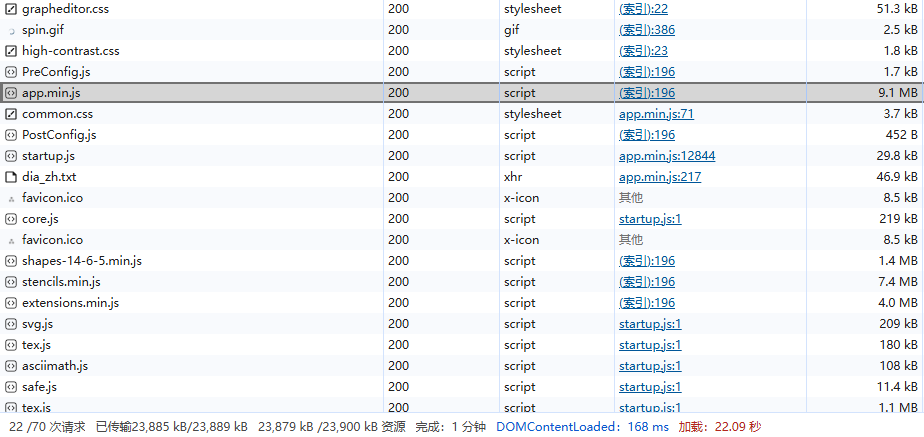
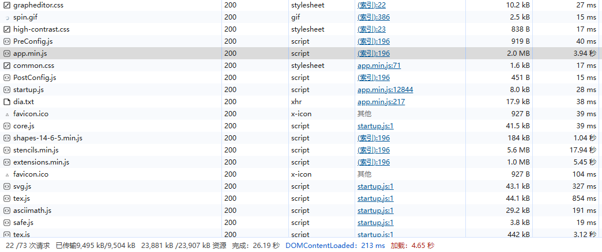

# Drawio

> 官网地址：[draw.io](https://www.drawio.com/)
>
> 在线体验：https://app.diagrams.net/

## 基本使用

docker

```
docker run -dit --name=drawio -p 83:8080 \
  -v drawiohtml:/usr/local/tomcat/webapps/draw/ \
  jgraph/drawio
```

> 其中`/usr/local/tomcat/webapps/draw/`为容器生成的前端的js文件位置

## 请求优化

> drawio为纯前端应用

原始请求：



复制前端文件到指定目录：

```
cp -r /var/lib/docker/volumes/drawiohtml/_data /usr/local/qiqi
```

通过nginx使用gzip进行压缩：

```nginx

server {
   listen       80;
   # 域名，多个以空格分开
   server_name  77.meraki-e.fun www.77.meraki-e.fun qiqi.meraki-e.fun www.qiqi.meraki-e.fun;

   root  /usr/local/qiqi;
   index teams.html;

    gzip on;
    gzip_disable "MSIE [1-6]\.(?!.*SV1)"; #对IE6以下的版本都不进行压缩
    gzip_vary on;
    gzip_proxied any;
    gzip_comp_level 6;
    gzip_buffers 16 8k;
    gzip_http_version 1.1;
    gzip_min_length 256;
    gzip_types
      text/xml application/xml application/atom+xml application/rss+xml application/xhtml+xml image/svg+xml
      text/javascript application/javascript application/x-javascript
      text/x-json application/json application/x-web-app-manifest+json
      text/css text/plain text/x-component
      font/opentype application/x-font-ttf application/vnd.ms-fontobject
      image/x-icon;

    # 配置日志文件路径
    access_log /usr/local/nginx/logs/qiqi.access.log;
    error_log /usr/local/nginx/logs/qiqi.error.log;

   location / {
       index  teams.html;
       try_files $uri $uri/ /teams.html;
   }

}
```

优化后的请求：


