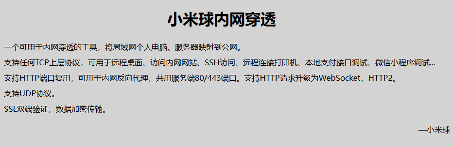
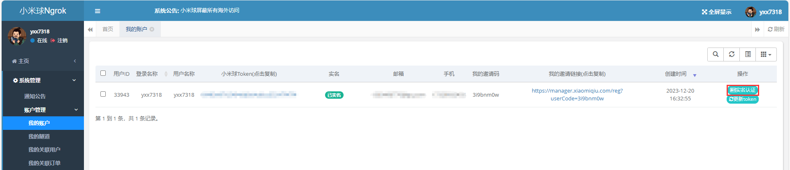
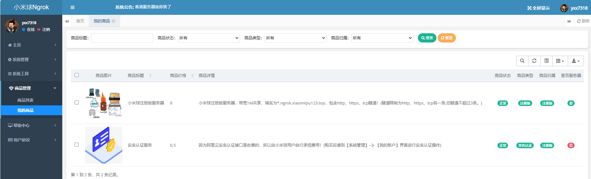
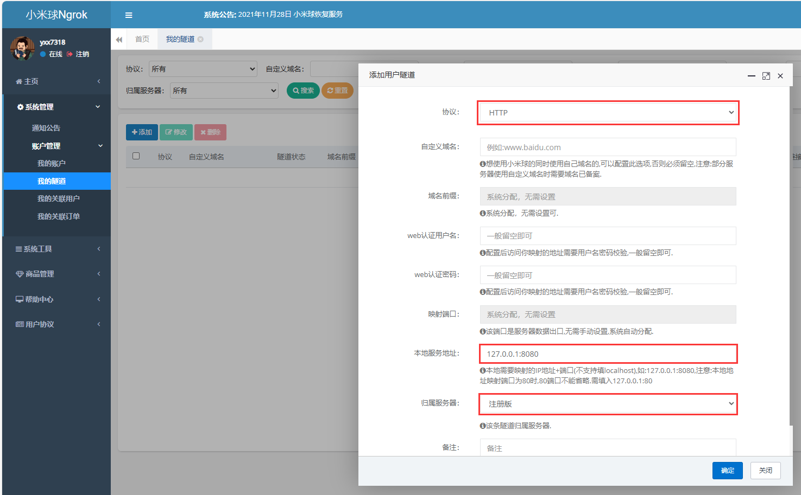
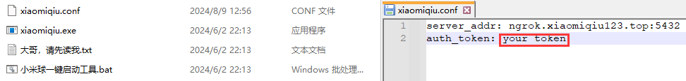
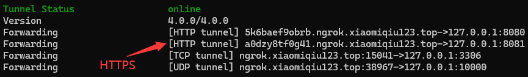
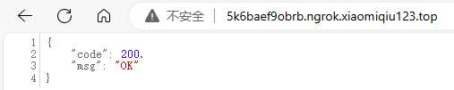

# 小米球Ngrok

> 小米球Ngrok是基于Ngrok1.7开源修改的Ngrok，小米球ngrok服务可以分配一个域名让本地的web项目提供给外网访问，特别适合向别人展示你本机的web demo 以及调试一些远程的API (比如微信公众号，企业号的开发)！

官方网站：https://www.xiaomiqiu.cn/

后台配置：https://manager.xiaomiqiu.com/

Gitee地址：[耿直/xiaomiqiu_repository - 码云 - 开源中国 (gitee.com)](https://gitee.com/ciqiu/xiaomiqiu_repository)

## 使用教程

实名认证：

使用免费服务器：

配置隧道：

配置token：

启动服务：

测试效果：

