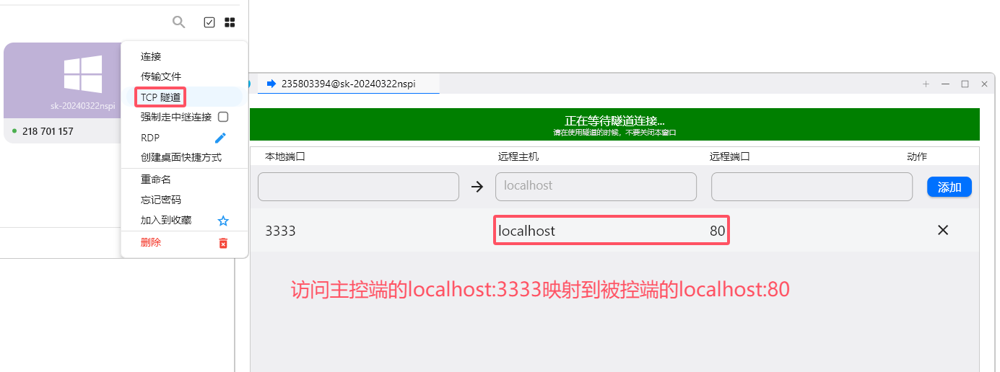

# RustDesk

> 官方文档：[RustDesk Client :: RustDesk文档](https://rustdesk.com/docs/zh-cn/client/)
>
> 官方仓库：[GitHub - rustdesk/rustdesk: An open-source remote desktop application designed for self-hosting, as an alternative to TeamViewer.](https://github.com/rustdesk/rustdesk)
>
> 发行版下载：[Releases · rustdesk/rustdesk (github.com)](https://github.com/rustdesk/rustdesk/releases)

## 被控端

> Mac权限设置：[Mac :: RustDesk文档](https://rustdesk.com/docs/zh-cn/client/mac/)

## 主控端

## TCP隧道

设置TCP隧道：

> `localhost:80`是指定被控端访问的url，所以可以依据被控端的网络情况去进行访问，两者在局域网内是可以指定后访问主控端的服务
>
> 
>
> 这里访问`192.168.9.92`是被控端的ip，`192.168.8.115`是主控端的ip，访问`localhost:3334`实际被转发后是被控端访问主控端的`81`端口服务

访问`localhost:3333`：

## RDP

> Windows自带的远程桌面

相当于TCP隧道3389端口

参考博客：

- [使用RustDesk替换FRP建立RDP连接_frp 平替-CSDN博客](https://blog.csdn.net/hbandhb/article/details/109542352)
- [Win11远程桌面0x904错误代码怎么解决？ (anyviewer.cn)](https://www.anyviewer.cn/how-to/remote-desktop-0x904-2111.html)
- [【亲测有效】错误代码0x904，远程桌面连接异常终端问题-CSDN博客](https://blog.csdn.net/qq_30054403/article/details/129022047)