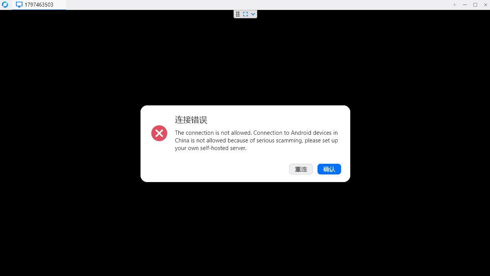
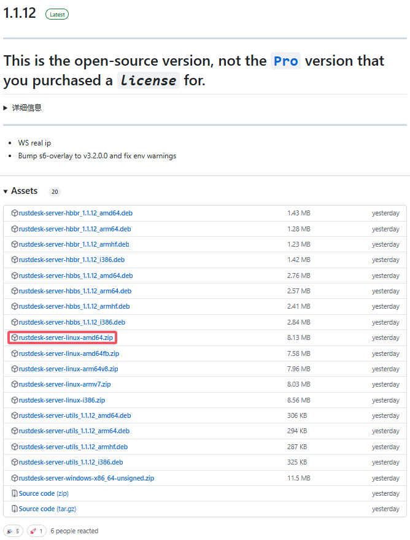
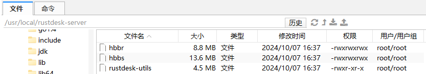
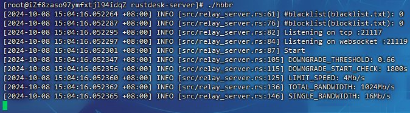
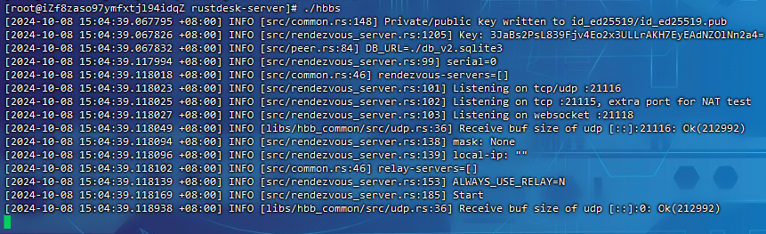
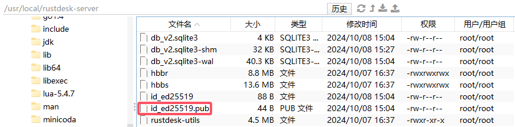
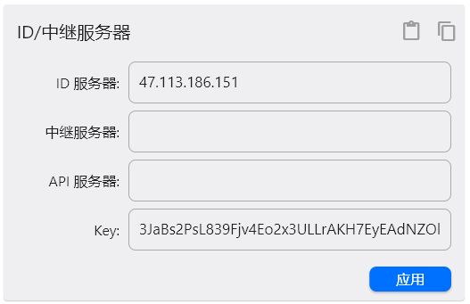
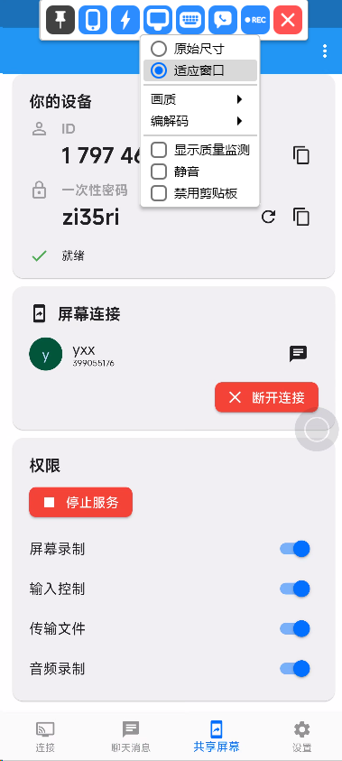

# rustdesk-server

> 如果用户现在通过公共服务器访问国内手机，将会收到被禁止的消息，需要自建服务器才能控制
>
> 
>
> 官方文档(英文)：[Self-host :: Documentation for RustDesk](https://rustdesk.com/docs/en/self-host/)
>
> 官方文档(中文)：[安装 :: RustDesk文档](https://rustdesk.com/docs/zh-cn/self-host/rustdesk-server-oss/install/)
>
> 官方仓库：[GitHub - rustdesk/rustdesk-server: RustDesk Server Program](https://github.com/rustdesk/rustdesk-server)

## 说明

> 服务器要求：硬件要求很低，最低配置的云服务器就可以了，CPU和内存要求都是最小的。关于网络大小，如果TCP打洞直连失败，就要耗费中继流量，一个中继连接的流量在30k-3M每秒之间（1920x1080屏幕），取决于清晰度设置和画面变化。如果只是办公需求，平均在100K/s

默认情况下，hbbs监听21115(tcp)、21116(tcp/udp)、21118(tcp)、hbbr监听21117(tcp)、21119(tcp)。务必在防火墙开启这几个端口，**注意21116同时要开启TCP和UDP**

- 21115是hbbs用作NAT类型测试
- 21116/UDP是hbbs用作ID注册与心跳服务
- 21116/TCP是hbbs用作TCP打洞与连接服务
- 21117是hbbr用作中继服务
- 21118和21119是为了支持网页客户端。如果不需要网页客户端（21118，21119支持，对应端口可以不开）

所有端口

- TCP(**21115, 21116, 21117, 21118, 21119**)
- UDP(**21116**)

如果想选择**自己的端口**，使用`-h`选项查看帮助

开放双协议：


## 二进制启动

> 官网下载：[Releases · rustdesk/rustdesk-server (github.com)](https://github.com/rustdesk/rustdesk-server/releases)
>
> 

文件解压：

```
unzip rustdesk-server-linux-amd64.zip
mv amd64 rustdesk-server
cd rustdesk-server

chmod 777 hbbr
chmod 777 hbbs

```

> 

启动`hbbr`：

```
./hbbr
```

> 

启动`hbbs`：

```
./hbbr
```

> 

获取公钥(删除`id_ed25519`和`id_ed25519.pub`再启动服务可重新生成)：



设置公钥：



控制效果：



### 设置systemctl

**hbbs**

```
vim /etc/systemd/system/RustDeskHbbs.service
```

```ini
[Unit]
Description=RustDesk Hbbs
After=network.target

[Service]
Type=simple
WorkingDirectory=/usr/local/rustdesk-server
ExecStart=/usr/local/rustdesk-server/hbbs -k _
ExecStop=/bin/kill -TERM $MAINPID

[Install]
WantedBy=multi-user.target
```

**hbbr**

```
vim /etc/systemd/system/RustDeskHbbr.service
```

```ini
[Unit]
Description=RustDesk Hbbr
After=network.target

[Service]
Type=simple
WorkingDirectory=/usr/local/rustdesk-server
ExecStart=/usr/local/rustdesk-server/hbbr -k _
ExecStop=/bin/kill -TERM $MAINPID

[Install]
WantedBy=multi-user.target
```

**服务生效**

```
systemctl daemon-reload
```

## Docker启动

> 如果运行docker版本时候，要求注册码，说明下载的是老版本，国内的docker镜像缓存没有更新
>
> 许可证：[RustDesk – 定价](https://rustdesk.com/zh/pricing.html)

安装命令：

```
sudo docker image pull rustdesk/rustdesk-server
sudo docker run --name hbbs -p 21115:21115 -p 21116:21116 -p 21116:21116/udp -p 21118:21118 -v `pwd`:/root -td --net=host rustdesk/rustdesk-server hbbs
sudo docker run --name hbbr -p 21117:21117 -p 21119:21119 -v `pwd`:/root -td --net=host rustdesk/rustdesk-server hbbr
```

Docker Compose

```dockerfile

networks:
  rustdesk-net:
    external: false

services:
  hbbs:
    container_name: hbbs
    ports:
      - 21115:21115
      - <hbbs_port>:21116 # 自定义 hbbs 映射端口
      - <hbbs_port>:21116/udp # 自定义 hbbs 映射端口
    image: rustdesk/rustdesk-server
    command: hbbs 
    volumes:
      - <mount_path>:/root # 自定义挂载目录
    networks:
      - rustdesk-net
    depends_on:
      - hbbr
    restart: unless-stopped
    deploy:
      resources:
        limits:
          memory: 64M

  hbbr:
    container_name: hbbr
    ports:
      - <hbbr_port>:21117 # 自定义 hbbr 映射端口
    image: rustdesk/rustdesk-server
    command: hbbr
    volumes:
      - <mount_path>:/root # 自定义挂载目录
    networks:
      - rustdesk-net
    restart: unless-stopped
    deploy:
      resources:
        limits:
          memory: 64M

```

> - `–net=host`仅适用于 Linux，它让`hbbs/hbbr`可以看到对方真实的ip, 而不是固定的容器ip (172.17.0.1)。 如果`–net=host`运行正常，`-p`选项就不起作用了, 可以去掉
> - 如果在非Linux系统上遇到无法连接的问题，去掉`–net=host`

参考博客：

- [自建远程桌面连接服务，RustDesk搭建教程 - 雨月空间站 (mintimate.cn)](https://mintimate.cn/2023/08/27/guideToHostRustDesk/)
- [RustDesk 自建服务器部署和使用教程 - 米开朗基杨 - 博客园 (cnblogs.com)](https://www.cnblogs.com/ryanyangcs/p/18186163)

参考视频：

- https://www.bilibili.com/video/BV148411i7DR