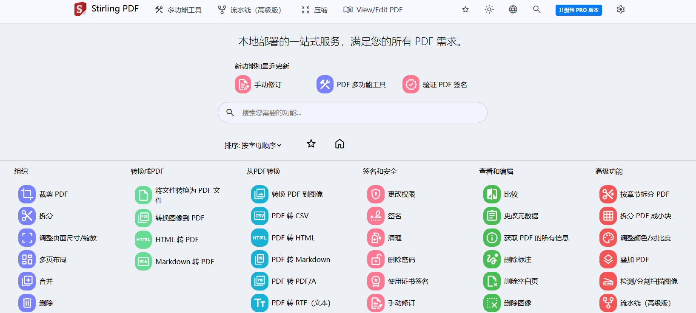
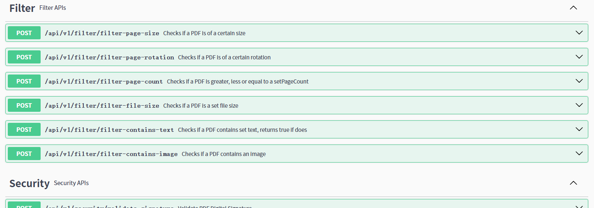

# StirlingPdf

> 自托管的PDF工具，还可以通过api去调用50多种pdf工具方法
>
> 官网链接：[斯特林 PDF：免费的 Adobe Acrobat 替代品（10M+ 下载）](https://www.stirlingpdf.com/)
>
> 官网安装指南：[Docker Guide | Stirling-PDF](https://docs.stirlingpdf.com/Installation/Docker Install)

## 基本安装

docker

```
docker run -d \
  --name stirling-pdf \
  -p 8080:8080 \
  -v "./StirlingPDF/trainingData:/usr/share/tessdata" \
  -v "./StirlingPDF/extraConfigs:/configs" \
  -v "./StirlingPDF/customFiles:/customFiles/" \
  -v "./StirlingPDF/logs:/logs/" \
  -v "./StirlingPDF/pipeline:/pipeline/" \
  -e DOCKER_ENABLE_SECURITY=false \
  -e LANGS=en_GB \
  docker.stirlingpdf.com/stirlingtools/stirling-pdf:latest
```

> 

docker-compose.yml

```yaml
version: '3.3'
services:
  stirling-pdf:
    image: docker.stirlingpdf.com/stirlingtools/stirling-pdf:latest
    ports:
      - '8080:8080'
    volumes:
      - ./StirlingPDF/trainingData:/usr/share/tessdata # Required for extra OCR languages
      - ./StirlingPDF/extraConfigs:/configs
      - ./StirlingPDF/customFiles:/customFiles/
      - ./StirlingPDF/logs:/logs/
      - ./StirlingPDF/pipeline:/pipeline/
    environment:
      - DOCKER_ENABLE_SECURITY=false
      - LANGS=en_GB
```

## 接口访问

> 访问：`/swagger-ui/5.20.1/index.html`

