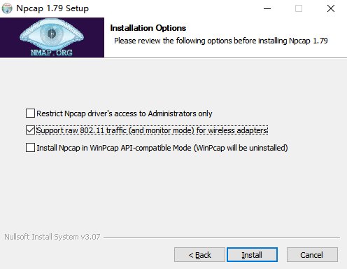
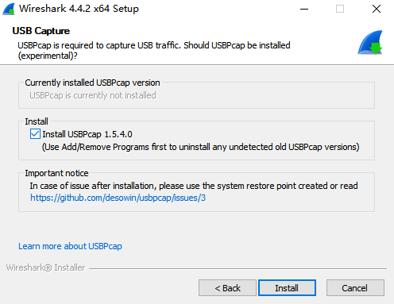
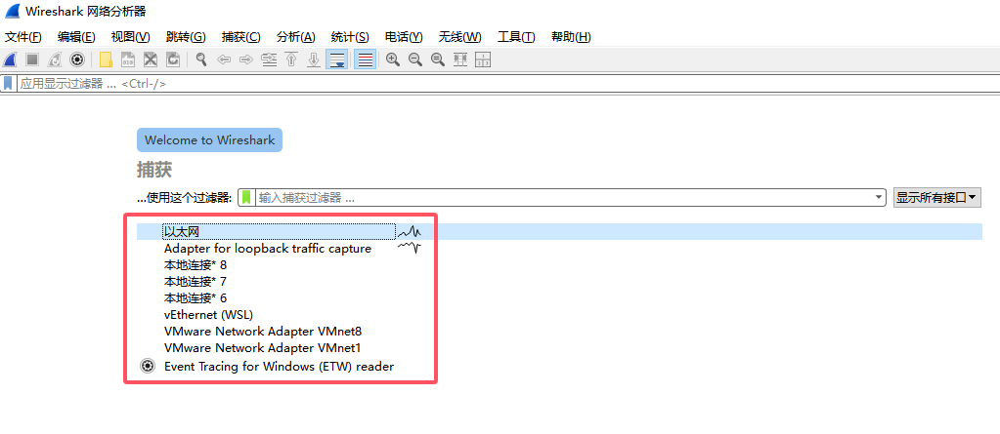

# Wireshark基本使用

> 官网地址：[Wireshark · Go Deep](https://www.wireshark.org/)

## 安装

安装安卓抓包工具：

依据默认要求安装附带的Npcap：

开启无线802.11报文的支持（含监控模式）：

安装usb抓包插件：

## 基本使用

选择网卡：

### 显示过滤器

访问`http://nginx.org/en/`，并对请求进行过滤：

> - `Frame 1`：指整个被捕获的数据单元，也就是一个完整的以太网帧。每一个被捕获的数据包都有一个唯一的编号，这个编号从1开始递增
> - `Ethernet II, Src`：第二层（数据链路层）
> - `Internet Protocol Version 4, Src`：简称`IPv4`，是第三层（网络层）的协议，用于在不同网络之间路由数据包。IPv4使用32位地址
> - `Transmission Control Protocol, Src`：简称`TCP`是第四层（传输层）的一个面向连接的协议，它提供了可靠的、有序的数据传输服务
> - `Hypertext Transfer Protocol`：或`HTTP`是第七层（应用层）的协议，主要用于Web浏览器与Web服务器之间的数据交换

灵活使用过滤器：

> 模糊匹配：`(ip.addr == 52.58.199.22 && http && tcp.port == 80) && (_ws.col.info contains "200 OK")`

### 捕获过滤器

> 只捕获对应ip地址的数据

### DNS捕获

> 电脑默认情况下DNS都是明文传输的

## HTTPS解密

> Wireshark解密HTTPS，需要拿到客户端的`premaster secret`(预主密钥)，由此推断出`session key`

正常情况下对于HTTPS请求，无法解密应用数据：

通过配置环境变量，把预主密钥导出到一个文件里面：

生成的密钥：

Wireshark配置，快捷键打开配置`Ctrl + Shift + p`，在Protocols中找到TLS配置，指向目标文件：

> 先点击“应用”后再点击"确定"

测试效果：

