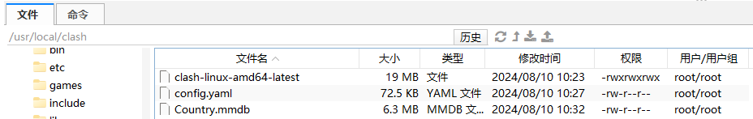
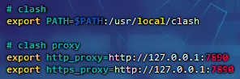
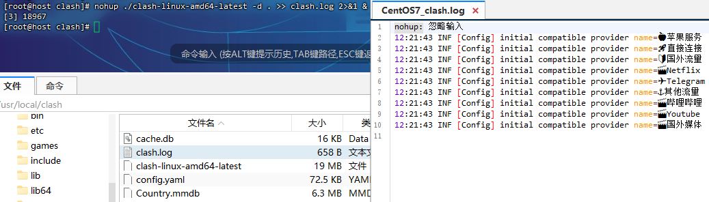
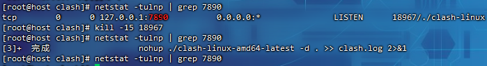
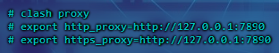

# clash

> Clash代理软件是一种开源的网络代理工具，用于帮助用户管理和配置网络代理服务

机场：[SKY VPN](https://www.skyvpn.one/)

下载地址：[Clash](https://www.clash.la/releases/)

clash中文网：[Clash-Clash中文网 (clashcn.com)](https://clashcn.com/clash-official)

启动后后台地址：

- [Clash (razord.top)](http://clash.razord.top/#/proxies)
- [yacd (haishan.me)](http://yacd.haishan.me/#/configs)

## Linux使用代理

### 文件准备

解压文件：

```
gzip -d clash-linux-amd64-latest.gz
```

下载配置文件：

```
wget -O config.yaml [订阅地址]
```

放入`Country.mmdb`文件：



增加执行权限：

```
chmod 777 clash-linux-amd64-latest
```

修改名称：

```
mv clash-linux-amd64-latest clash
```

### 配置环境

```
vim /etc/profile

# clash
export PATH=$PATH:/usr/local/clash

# clash proxy
export http_proxy=http://127.0.0.1:7890
export https_proxy=http://127.0.0.1:7890

source /etc/profile
```

> 
>
> 

### 启动clash

```
nohup clash -d . > clash.log 2>&1 &
```

> 同等写法：
>
> ```
> nohup clash -d . &> $clash_path/clash.log &
> ```
>
> 在现代的`bash shell`中，`&>`可以更为简洁和现代的方式来合并重定向操作
>
> 

测试请求：

```
curl https://www.google.com.hk/
```

> 


### 关闭clash

查找进程：

```
netstat -tulnp | grep 7890
```

> 

修改配置：

```
vim /etc/profile
```

> 

配置生效：

```
source /etc/profile
```

> 可能需要新建一个命令窗口才会彻底生效

测试效果：

```
curl https://www.google.com.hk/
```

> ```
> [root@host clash]# curl https://www.google.com.hk/
> curl: (7) Failed connect to 127.0.0.1:7890; 拒绝连接
> ```