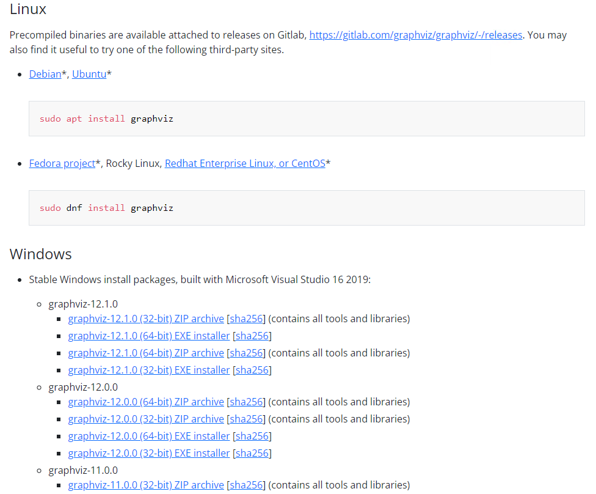
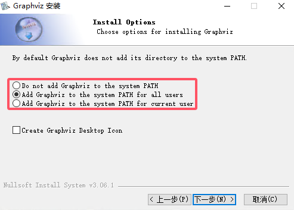
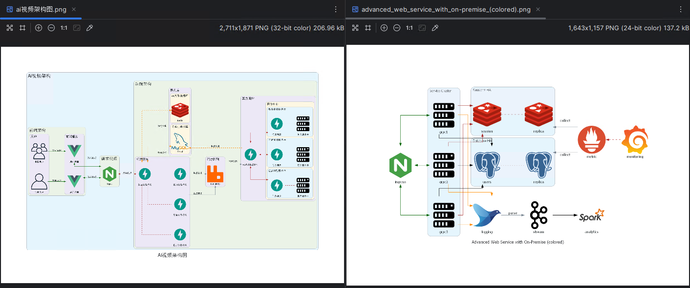

# diagrams

> Diagrams允许在Python代码中绘制云系统架构
>
> 官网：[Diagrams · Diagram as Code (mingrammer.com)](https://diagrams.mingrammer.com/)
>
> 官网节点介绍：[OnPrem · Diagrams (mingrammer.com)](https://diagrams.mingrammer.com/docs/nodes/onprem)
>
> 使用介绍：[Python + Diagrams: 用代码输出高档系统架构图 - 知乎 (zhihu.com)](https://zhuanlan.zhihu.com/p/681247432)
>
> 安装命令
>
> ```
> pip install diagrams -i https://pypi.tuna.tsinghua.edu.cn/simple
> ```

## Graphviz

> 在开始使用Diagrams之前，除了安装Diagrams库本身，还需要安装Graphviz，因为Diagrams库依赖于Graphviz来渲染图表
>
> 下载官网：[Download | Graphviz](https://graphviz.org/download/)
>
> 
>
> 版本信息
>
> ```
> dot -v
> ```

允许添加环境变量



## 示例代码

```python
from diagrams import Cluster, Diagram, Edge
from diagrams.onprem.compute import Server
from diagrams.onprem.inmemory import Redis
from diagrams.onprem.network import Nginx
from diagrams.programming.framework import Vue
from diagrams.programming.framework import FastAPI
from diagrams.onprem.database import Mysql
from diagrams.onprem.queue import RabbitMQ
from diagrams.onprem.client import User
from diagrams.onprem.client import Users

with Diagram(name="Ai视频架构图", show=False, graph_attr={'fontsize': '30'}):
    with Cluster("Ai视频架构", graph_attr={'fontsize': '28'}):
        with Cluster("请求代理", graph_attr={'fontsize': '24'}):
            nginx = Nginx("Nginx")

        with Cluster("前端架构", graph_attr={'fontsize': '24'}):
            with Cluster("用户", graph_attr={'fontsize': '18'}):
                users = Users("目标用户")
                admin = User("管理用户")
                all_user = [
                    users,
                    admin
                ]

            with Cluster("前端服务", graph_attr={'fontsize': '18'}):
                users_vue = Vue("用户界面")
                admin_vue = Vue("后台界面")
                all_vue = [users_vue, admin_vue]
                admin - Edge(color="darkgreen", label="管理系统") >> admin_vue
                users - Edge(color="darkgreen", label="首页官网") >> users_vue

                all_vue >> Edge(color="darkgreen", label="请求数据") << nginx

        with Cluster("后端架构", graph_attr={'fontsize': '24'}):
            with Cluster("数据库", graph_attr={'fontsize': '18'}):
                with Cluster("关系型数据库", graph_attr={'fontsize': '16'}):
                    mysql = Mysql("Mysql")
                with Cluster("非关系数据库", graph_attr={'fontsize': '16'}):
                    redis = Redis("Redis")

            with Cluster("后端服务", graph_attr={'fontsize': '18'}):
                fastapi = FastAPI("数据处理模块")
                nginx << Edge(color="firebrick", label="反向代理") >> fastapi
                fastapi >> Edge(color="darkorange", style="dashed", label="数据交换") << mysql
                fastapi >> Edge(color="darkorange", style="dashed", label="缓存控制") << redis

                log_fastapi = FastAPI("日志记录模块")
                fastapi - Edge(color="brown", style="dashed") - log_fastapi
                admin_fastapi = FastAPI("后台处理模块")
                fastapi - Edge(color="brown", style="dashed") - admin_fastapi
                home_fastapi = FastAPI("首页处理模块")
                fastapi - Edge(color="brown", style="dashed") - home_fastapi

            with Cluster("消息队列", graph_attr={'fontsize': '18'}):
                rabbitMq = RabbitMQ("RabbitMQ")

            with Cluster("算力调控", graph_attr={'fontsize': '18'}):
                ai_fastapi = FastAPI("AI视频生成模块")
                home_fastapi - Edge(label="生成请求") >> rabbitMq
                admin_fastapi - Edge(label="生成请求") >> rabbitMq
                rabbitMq - Edge(label="消耗队列") >> ai_fastapi
                ai_fastapi << Edge(color="darkorange", style="dashed", label="生成结果") - mysql
                with Cluster("算力中心", graph_attr={'fontsize': '16'}):
                    with Cluster("语音识别服务器", graph_attr={'fontsize': '14'}):
                        one_server = Server("算力服务器")
                        one_api = FastAPI("任务调度")
                        one_api - Edge(color="brown", style="dashed") - one_server
                    with Cluster("声音克隆服务器", graph_attr={'fontsize': '14'}):
                        two_server = Server("算力服务器")
                        two_api = FastAPI("任务调度")
                        two_api - Edge(color="brown", style="dashed") - two_server
                    with Cluster("视频合成服务器", graph_attr={'fontsize': '14'}):
                        three_server = Server("算力服务器")
                        three_api = FastAPI("任务调度")
                        three_api - Edge(color="brown", style="dashed") - three_server
                    all_api = [one_api, two_api, three_api]
                    ai_fastapi << Edge(color="firebrick") >> all_api

from diagrams import Cluster, Diagram, Edge
from diagrams.onprem.analytics import Spark
from diagrams.onprem.compute import Server
from diagrams.onprem.database import PostgreSQL
from diagrams.onprem.inmemory import Redis
from diagrams.onprem.aggregator import Fluentd
from diagrams.onprem.monitoring import Grafana, Prometheus
from diagrams.onprem.network import Nginx
from diagrams.onprem.queue import Kafka

with Diagram(name="Advanced Web Service with On-Premise (colored)", show=False):
    ingress = Nginx("ingress")

    metrics = Prometheus("metric")
    metrics << Edge(color="firebrick", style="dashed") << Grafana("monitoring")

    with Cluster("Service Cluster"):
        grpcsvc = [
            Server("grpc1"),
            Server("grpc2"),
            Server("grpc3")]

    with Cluster("Sessions HA"):
        primary = Redis("session")
        primary - Edge(color="brown", style="dashed") - Redis("replica") << Edge(label="collect") << metrics
        grpcsvc >> Edge(color="brown") >> primary

    with Cluster("Database HA"):
        primary = PostgreSQL("users")
        primary - Edge(color="brown", style="dotted") - PostgreSQL("replica") << Edge(label="collect") << metrics
        grpcsvc >> Edge(color="black") >> primary

    aggregator = Fluentd("logging")
    aggregator >> Edge(label="parse") >> Kafka("stream") >> Edge(color="black", style="bold") >> Spark("analytics")

    ingress >> Edge(color="darkgreen") << grpcsvc >> Edge(color="darkorange") >> aggregator

```

> 