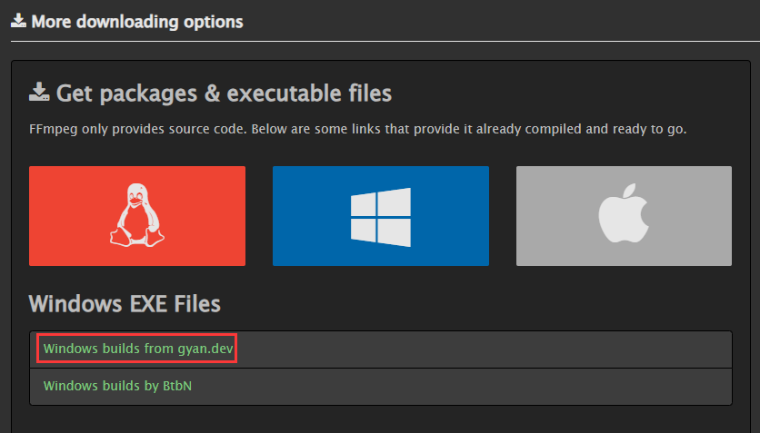
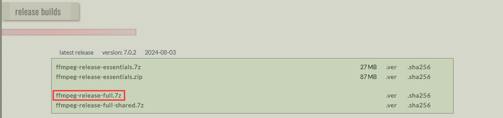
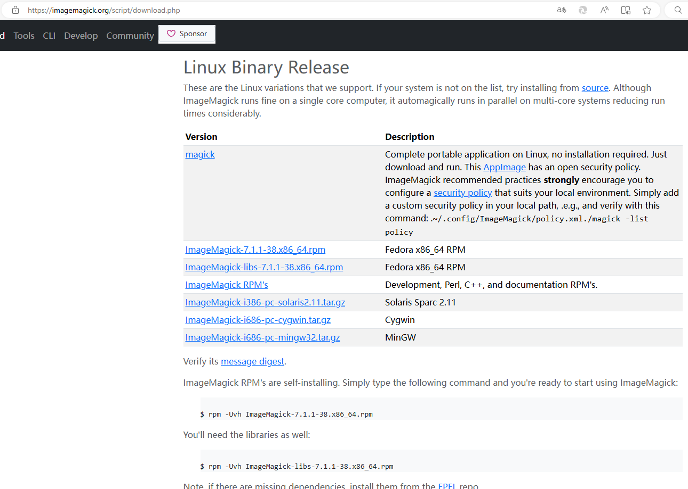
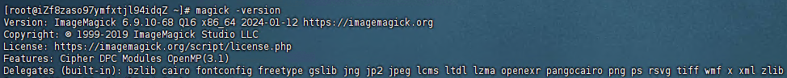

# ffmpeg和ImageMagick

## ffmpeg

### Windows安装

下载地址：[Download FFmpeg](https://ffmpeg.org/download.html)





解压文件，在path中配置环境变量`C:\ffmpeg\bin`

### Linux安装

```
conda install ffmpeg
```

> 这么安装可以直接在conda虚拟环境下可以使用，不污染Linux环境
>
> ```
> ffmpeg -version
> ```

## ImageMagick

下载地址：[ImageMagick – Download](https://imagemagick.org/script/download.php)

### Windows安装


### Linux安装



直接yum命令安装

```
sudo yum install ImageMagick
```

> 查看版本号
>
> ```
> magick -version
> ```
>
> 如果没有则创建软连接，因为Centos的yum安装的可能不是最新版本，所以是`convert`命令，通过软连接更新命令为`magick`
>
> ```
> sudo ln -s /usr/bin/convert /usr/bin/magick
> ```
>
> 

### 环境判断

```python
from moviepy.config import change_settings

if os.name == 'nt':
    change_settings({"IMAGEMAGICK_BINARY": r"F:\yxx\ImageMagick-7.1.1-Q16-HDRI\magick.exe"})
    print("当前操作系统是Windows")
elif os.name == 'posix':
    change_settings({"IMAGEMAGICK_BINARY": r"/usr/bin/convert"})
    print("当前操作系统是类Unix系统，比如Linux或Mac OS X")

```
