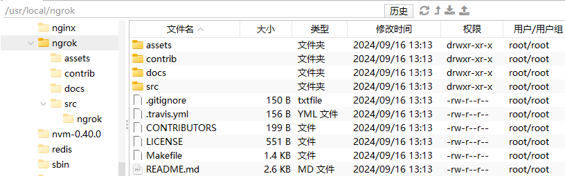
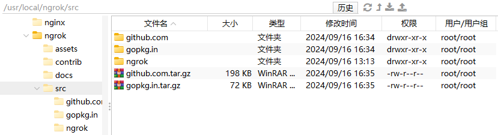

# ngrok

> 官网：[ngrok | API Gateway, IoT Device Gateway, Secure Tunnels for Containers, Apps & APIs](https://ngrok.com/)

## ngrokd编译

> 官方文档：[ngrok/docs/DEVELOPMENT.md at master · inconshreveable/ngrok (github.com)](https://github.com/inconshreveable/ngrok/blob/master/docs/DEVELOPMENT.md)

### 配置go环境

> 由于使用yum安装的go不能进行交叉编译，不能够编译生成其它客户端，所以使用源代码安装

解压源代码：

```
tar -C /usr/local -zxvf go1.9.2.linux-amd64.tar.gz
```

配置环境变量：

```
vim /etc/profile


export GOROOT="/usr/local/go"
export PATH=$PATH:$GOROOT/bin


source /etc/profile
```

安装结果：

```
go version
```

> 

### 安装go1.4版本

> Go1.5版本开始，Go语言实现了自举（bootstrap），这意味着需要使用Go1.4版本来编译新的Go版本

解压源代码：

```
tar -zxvf go1.4.linux-amd64.tar.gz
```

配置环境变量：

```
vim /etc/profile


export GOROOT_BOOTSTRAP="/usr/local/go1.4"


source /etc/profile
```

> 设置`GOROOT_BOOTSTRAP`环境变量指向Go 1.4的安装目录

运行安装脚本：

```
./src/make.bash
```

> 

### 拉取源代码

```
git clone https://github.com/inconshreveable/ngrok.git
```

> 

### 放置运行依赖

将编译依赖手动放置`/usr/local/ngrok/src`目录下

```
tar -zxvf github.com.tar.gz
tar -zxvf gopkg.in.tar.gz
```

> 

### 生成证书

> 不能为ip，需要为域名

生成证书：

```
cd /usr/local/ngrok
mkdir mycert
cd mycert

export NGROK_DOMAIN="www.meraki-x.com"
openssl genrsa -out base.key 2048
openssl req -new -x509 -nodes -key base.key -days 10000 -subj "/CN=$NGROK_DOMAIN" -out base.pem
openssl genrsa -out server.key 2048
openssl req -new -key server.key -subj "/CN=$NGROK_DOMAIN" -out server.csr
openssl x509 -req -in server.csr -CA base.pem -CAkey base.key -CAcreateserial -days 10000 -out server.crt
```

> 

替换源代码中的文件：

```
cp server.key ../assets/server/tls/snakeoil.key
cp server.crt ../assets/server/tls/snakeoil.crt
cp base.pem ../assets/client/tls/ngrokroot.crt
```

### 多平台编译

**Linux客户端编译**

进入go目录，进行环境配置：

```
cd /usr/local/go/src/
GOOS=linux GOARCH=amd64 CGO_ENABLED=0 ./make.bash
```

> 安装结果：
>
> 
>
> 需要1个G以上的内存，否则会报错：
>
> ```
> go build bootstrap/cmd/compile/internal/ssa: /usr/local/go1.4/pkg/tool/linux_amd64/6g: signal: killed
> go tool dist: FAILED: /usr/local/go1.4/bin/go install -gcflags=-l -tags=math_big_pure_go -v bootstrap/cmd/...: exit status 1
> ```
>
> 查看进程进程被杀死的详细信息：
>
> ```
> vim /var/log/messages
> ```
>
> > ```
> > Sep 16 17:08:02 iZf8zaso97ymfxtjl94idqZ kernel: Out of memory: Kill process 10468 (6g) score 352 or sacrifice child
> > Sep 16 17:08:02 iZf8zaso97ymfxtjl94idqZ kernel: Killed process 10468 (6g), UID 0, total-vm:660284kB, anon-rss:651540kB, file-rss:408kB, shmem-rss:0kB
> > ```

进入ngrok目录，进行编译：

```
cd /usr/local/ngrok
GOOS=linux GOARCH=amd64 make release-server release-client
```

> 提示信息：
>
> 
>
> 编译结果：
>
> 
>
> 进入bin目录：
>
> 

**windows客户端编译**

进入go目录，进行环境配置：

```
cd /usr/local/go/src/
GOOS=windows GOARCH=amd64 CGO_ENABLED=0 ./make.bash
```

> 

进入ngrok目录，进行编译：

```
cd /usr/local/ngrok
GOOS=windows GOARCH=amd64 make release-server release-client
```

> 

**mac客户端编译**

进入go目录，进行环境配置：

```
cd /usr/local/go/src/
GOOS=darwin GOARCH=amd64 CGO_ENABLED=0 ./make.bash
```

> 

进入ngrok目录，进行编译：

```
cd /usr/local/ngrok
GOOS=darwin GOARCH=amd64 make release-server release-client
```

> 

**arm客户端编译**

进入go目录，进行环境配置：

```
cd /usr/local/go/src/
GOOS=linux GOARCH=arm CGO_ENABLED=0 ./make.bash
```

> 

进入ngrok目录，进行编译：

```
cd /usr/local/ngrok
GOOS=linux GOARCH=arm make release-server release-client
```

> 

### 编译结果


## ngrok使用

> 配置域名泛解析，ngrok可以通过hostname去判断代理的服务
>
> 

### ngrokd命令

- `-domain string`：ngrok隧道所托管的域名（默认为`"ngrok.com"`）
- `-httpAddr string`：公共地址，用于HTTP连接，留空字符串使用默认值（默认为`":80"`）
- `-httpsAddr string`：公共地址，用于监听HTTPS连接，留空字符串使用默认值（默认为`":443"`）
- `-log string`：将日志消息写入此文件。"stdout"和"none"有特殊含义（默认为`"stdout"`）
- `-log-level string`：要记录的消息级别。可选项包括：DEBUG、INFO、WARNING、ERROR（默认为`"DEBUG"`）
- `-tlsCrt string`：TLS证书文件的路径
- `-tlsKey string`：TLS密钥文件的路径
- `-tunnelAddr string`：公共地址，用于监听ngrok客户端（默认为`":4443"`）

启动命令：

```
nohup ./ngrokd -domain="meraki-x.com" -log="ngrokd.log" > /dev/null 2>&1 &
```

> 
>
> 查找进程：
>
> ```
> ps -ef | grep ngrokd
> 
> netstat -tulnp | grep 4443
> ```
>
> > 

### ngrok命令

基本用法：

- `-authtoken string`：用于识别ngrok.com账户的身份验证令牌
- `-config string`：ngrok配置文件的路径。 (默认：`$HOME/.ngrok`)
- `-hostname string`：从ngrok服务器请求自定义主机名。 (仅限HTTP) (需要您的DNS的CNAME)
- `-httpauth string`：保护公共隧道端点的HTTP基本认证凭据，格式为：`用户名:密码`
- `-log string`：将日志消息写入此文件。"stdout"和"none"有特殊含义 (默认`"none"`)
- `-log-level string`：要记录的消息级别。可选项为：DEBUG、INFO、WARNING、ERROR (默认`"DEBUG"`)
- `-proto string`：隧道中流量的协议 {"http", "https", "tcp"} (默认：`“http+https”`)
- `-subdomain string`：从ngrok服务器请求自定义子域名。 (仅限HTTP)

使用示例：

```
    ngrok 80
    ngrok -subdomain=example 8080
    ngrok -proto=tcp 22
    ngrok -hostname="example.com" -httpauth="user:password" 10.0.0.1
```

高级用法：`ngrok [选项] <命令> [命令参数] […]`

- `ngrok start [隧道] […]`：从配置文件按名称启动隧道
- `ngrok start-all`：启动配置文件中定义的所有隧道
- `ngrok list`：列出配置文件中的隧道名称
- `ngrok help`：打印帮助信息
- `ngrok version`：打印ngrok版本

使用示例：

```
    ngrok start www api blog pubsub
    ngrok -log=stdout -config=ngrok.yml start ssh
    ngrok start-all
    ngrok version
```

配置`ngrok.yml`文件：

```yaml
# 指定域名和隧道通信端口号
server_addr: www.meraki-x.com:4443
# 为false代表使用编译时证书通信，为true代表使用CA证书通信
trust_host_root_certs: false
# auth_token: test


tunnels:
  myHttpsTest:
    # 指定域名，不指定默认为name.{ngrokd.domain}，后缀还可以指定到端口号
    hostname: www.meraki-x.com
    proto:
      # 使用https，本地程序端口8000(本地程序无需启用https)
      https: "8000"
    # 远程端口
    remote_port: 443
  myOtherTest:
    proto:
      http: "8000"
    remote_port: 80
  myTestApp:
    hostname: www.meraki-x.com
    proto:
      http: "8000"
    remote_port: 80

```

启动命令：

```
ngrok.exe -config=ngrok.yml start-all
```

> 
>
> 访问：`127.0.0.1:4040`
>
> 
>
> 测试请求：`http://myothertest.meraki-x.com/`
>
> 
>
> 
>
> web界面会记录所有请求：
>
> 
>
> 访问未设置的域名：
>
> 

### 安全HTTPS

> 因为是使用的自签名证书，所以对于https的url，浏览器访问会直接报不安全


需要都使用CA签名的证书来进行加密通信


准备证书文件：


ngrokd启动命令：

```
nohup ./ngrokd -domain="meraki-x.com" -log="ngrokd.log" -tlsCrt="meraki-x.com_public.crt" -tlsKey="meraki-x.com.key" > /dev/null 2>&1 &
```

修改`ngrok.yml`文件

```yaml
# 指定域名和隧道通信端口号
server_addr: www.meraki-x.com:4443
# 为false代表使用编译时证书通信，为true代表使用CA证书通信
trust_host_root_certs: true
# auth_token: test


tunnels:
  myHttpsTest:
    # 指定域名，不指定默认为name.{ngrokd.domain}
    hostname: www.meraki-x.com
    proto:
      # 使用https，本地程序端口8000(本地程序无需启用https)
      https: "8000"
    # 远程端口
    remote_port: 443
  myOtherTest:
    # 这里不指定域名默认为myOtherTest.meraki-x.com
    proto:
      http: "8000"
    remote_port: 80
  myTestApp:
    hostname: www.meraki-x.com
    proto:
      http: "8000"
    remote_port: 80

```

启动命令：

```
ngrok.exe -config=ngrok.yml start-all
```

访问：`https://www.meraki-x.com/`

> 

## tcp穿透windows远程桌面

配置文件`ngrok.yml`：

```yaml
# 指定域名和隧道通信端口号
server_addr: dev.360gpt.net:72
# 为false代表使用编译时证书通信，为true代表使用CA证书通信
trust_host_root_certs: true
# auth_token: test


tunnels:
  myRemoteDesktop:
    # 指定域名，不指定默认为name.{ngrokd.domain}
    hostname: dev.360gpt.net:70
    proto:
      tcp: 3389
    # 远程端口
    remote_port: 70
```

> 对于基于TCP的连接都可以进行穿透，像是Mysql

连接配置：


> 

## 配置为系统服务

```
vim /etc/systemd/system/ngrokd.service
```

服务配置内容：

```ini
[Unit]
Description=ngrok daemon
After=network.target

[Service]
Type=simple
User=root
WorkingDirectory=/usr/local/ngrok
ExecStart=/usr/local/ngrok/ngrokd -domain="dev.360gpt.net" -tunnelAddr=":72" -httpAddr=":73" -httpsAddr=":74" -tlsCrt="dev.360gpt.net_public.crt" -tlsKey="dev.360gpt.net.key" -log="ngrokd.log"
ExecStop=/bin/kill -TERM $MAINPID
Restart=always
RestartSec=1
StandardOutput=file:/usr/local/ngrok/system-ngrokd.log
StandardError=inherit

[Install]
WantedBy=multi-user.target
```

参考博客：

- https://www.vediotalk.com/?p=336
- [手把手教你在 CentOS7 上部署Ngrok （踩坑&填坑）-CSDN博客](https://blog.csdn.net/renpeng009672/article/details/136390570)

参考视频：

- 【内网穿透手把手教你自建ngrok服务器，从此抛弃花生壳公云等DDNS服务商】https://www.bilibili.com/video/BV1MW411u7sJ?vd_source=d3114f37bed3f504c7d6f0902d1b3d87