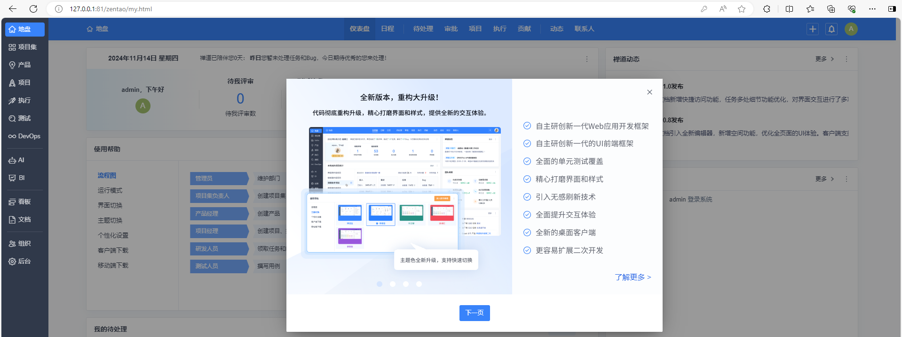

# 禅道

> 官网地址：[禅道项目管理软件 - 开源、免费的项目研发测试管理工具 (zentao.net)](https://www.zentao.net/)
>
> 下载地址：[禅道21.0发布！文档新增快捷访问功能，任务多处细节功能优化，对界面交互进行了多项改进 - 禅道下载 - 禅道项目管理软件 (zentao.net)](https://www.zentao.net/download/pms21.0-84449.html)
>
> 

## Windows安装

解压到指定目录：


启动服务：


使用开源版：


启动：



## Linux安装

```
cd /opt
wegt https://www.zentao.net/dl/zentao/21.0/ZenTaoPMS-21.0-zbox_amd64.tar.gz
tar -zxvf ZenTaoPMS-21.0-zbox_amd64.tar.gz
```

常用命令：

- 启动所有服务：`/opt/zbox/zbox start`
- 停止所有服务：`/opt/zbox/zbox stop`
- 重启所有服务：`/opt/zbox/zbox restart`
- 通过配置检查服务状态：`/opt/zbox/zbox check`【18.10版本支持】
- 注：如果需要开机自动启动，可以把`/opt/zbox/zbox restart`加到操作系统的自启目录

启动服务：


访问效果：


> 一键安装包首次启动时，会在根目录创建一个`.env`文件
>
> ```
> # Apache 主机地址，如果用外部Web服务，需要手动修改，18.10版本新增
> export APACHE_HOST=127.0.0.1
> 
> # Aapche 端口号，通过--aport参数修改
> export APACHE_PORT=80
> 
> # MySQL 主机地址，如果用外部MySQL，需要手动修改，18.10版本新增
> export MYSQL_HOST=127.0.0.1
> 
> # MySQL 端口号，通过--mport参数修改
> export MYSQL_PORT=3306
> 
> # MySQL 密码，如果手动更改后，需要修改这个配置
> export MYSQL_PASS=123456
> 
> # 服务的默认用户，不要修改
> export DEFAULT_USER="nobody"
> 
> # 服务的默认用户组，不要修改
> export DEFAULT_GROUP="nogroup"
> 
> # 是否启用内置MySQL服务，18.10版本新增
> export MYSQL_SERVICE=enabled
> 
> # 是否启用内置Apache服务，18.10版本新增
> export APACHE_SERVICE=enabled
> 
> # 是否启用内置XXD服务，18.10 版本新增
> export XXD_SERVICE=enabled
> 
> # 是否启用内置Roadrunner服务，18.10版本新增
> export ROADRUNNER_SERVICE=enabled
> 
> # 设置PATH变量
> export PATH=$PATH:/opt/zbox/bin
> ```
>
> 如果在`.env`中开启（enabled）或者禁用（disabled）了某些服务，需要通过`/opt/zbox/zbox check`使配置立即生效