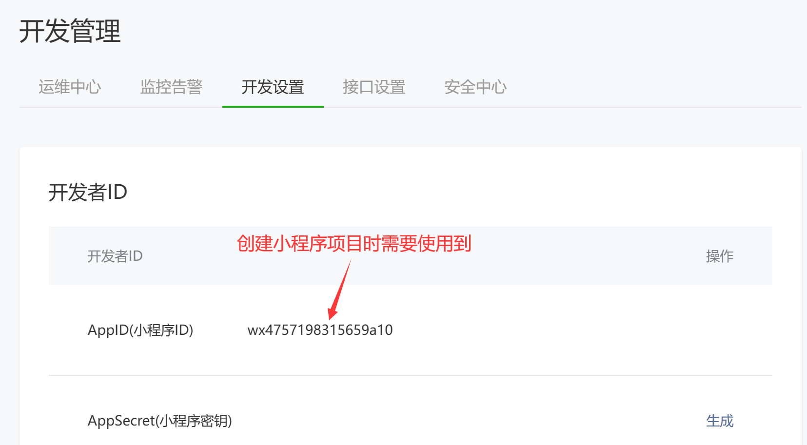
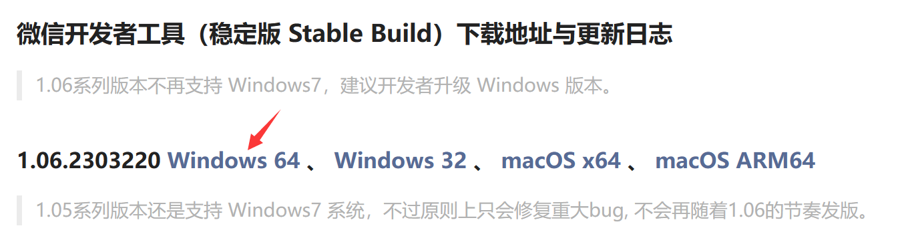
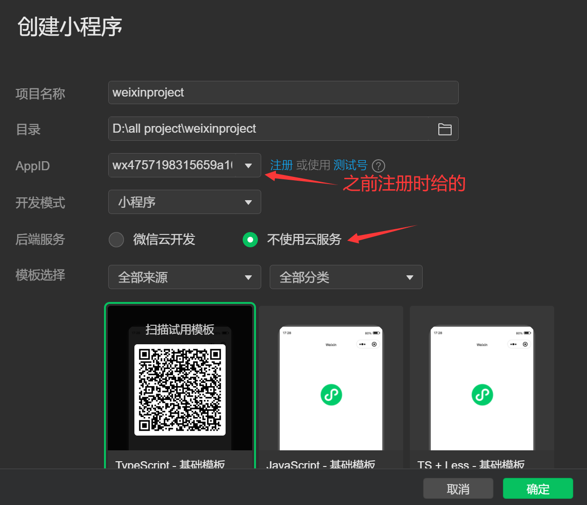
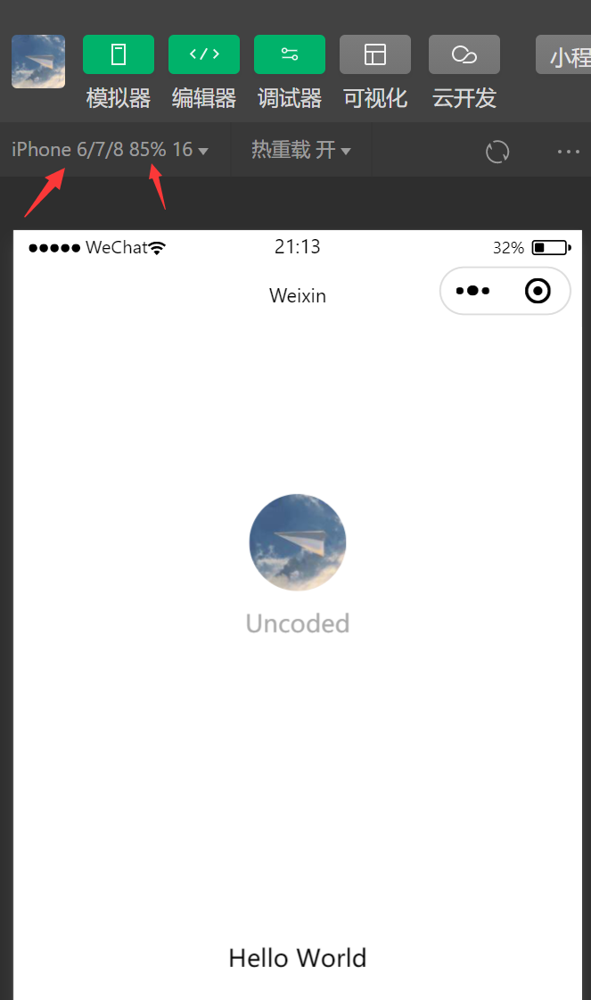

# 搭建小程序环境

## 注册小程序账号

进入官网：[公众号 (qq.com)](https://mp.weixin.qq.com/cgi-bin/wx?lang=zh_CN&token=)，填写邮箱注册小程序，选择个人身份：


## 获取小程序的AppID

登录网站：[小程序 (qq.com)](https://mp.weixin.qq.com/wxamp/devprofile/get_profile?token=1955649743&lang=zh_CN)，在开发选项中可以获取信息：



```
wx4757198315659a10
```

## 安装开发者工具

官方网站：[微信开发者工具（稳定版 Stable Build）下载地址与更新日志 | 微信开放文档 (qq.com)](https://developers.weixin.qq.com/miniprogram/dev/devtools/stable.html)，下载工具



## 创建项目



修改机型和显示比例

