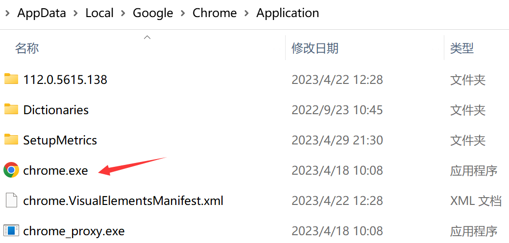

# Handless浏览器

> Handless浏览器即无界面浏览器，因为不进行css和gui渲染，运行效率和cpu占用都要比真实的浏览器要快很多，除此之外，无界面浏览器也是支持页面查找、js的执行等

## phantomjs

phantomjs下载网站：[Index of phantomjs-local (huaweicloud.com)](https://mirrors.huaweicloud.com/phantomjs/)

由于4.0以上的selenium是弃用了phantomjs，所以这里示例的代码为旧版本的selenium使用方式

```python
from selenium import webdriver

path = "phantomjs/phantomjs.exe"

browser = webdriver.PhantomJs(path)

url = 'https://www.baidu.com/'

browser.get(url)

browser.save_screenshot('百度.png')

```

## Chrome handless

> Chrome-headless模式，Google针对Chrome浏览器59版新增加的一种模式，可以在不打开UI界面的情况下使用Chrome浏览器，运行效与Chrome保持一致

通过快捷方式定位到chrome.exe位置



chrome_headless.py

```python
from selenium import webdriver
from selenium.webdriver.chrome.options import Options


def get_chrome_headless(chrome_path):
    chrome_options = Options()
    chrome_options.add_argument('--headless')
    chrome_options.add_argument('--disable-gpu')

    chrome_options.binary_location = chrome_path

    return webdriver.Chrome(chrome_options=chrome_options)

```

chrome_headless使用.py

```python
import time
from selenium.webdriver.common.by import By
from chrome_headless import get_chrome_headless

path = r'C:\Users\喻欣轩\AppData\Local\Google\Chrome\Application\chrome.exe'

browser = get_chrome_headless(path)

url = 'https://www.baidu.com/'

browser.get(url)

time.sleep(1)

# 通过XPath定位到输入框
button = browser.find_element(By.XPATH, '//*[@id="kw"]')

# 输入值
button.send_keys('周杰伦')

# 点击"百度一下"
browser.find_element(By.ID, 'su').click()

time.sleep(2)

browser.save_screenshot('周杰伦.png')

```

