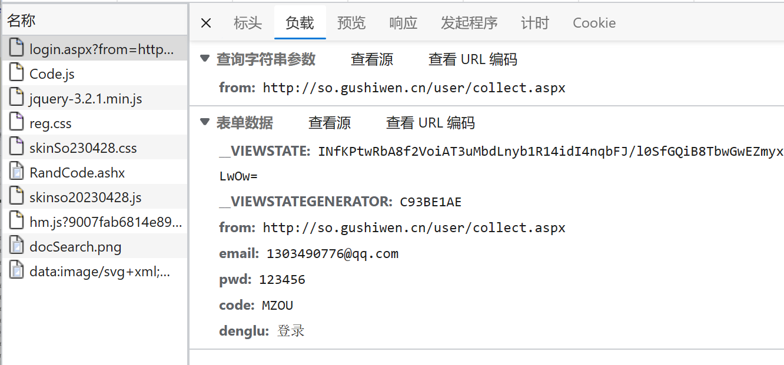

# requests

## 基本使用

参考文档

- 官方文档：[Requests: 让 HTTP 服务人类 — Requests 2.18.1 文档](https://requests.readthedocs.io/projects/cn/zh_CN/latest/)
- 快速上手：[快速上手 — Requests 2.18.1 文档](https://requests.readthedocs.io/projects/cn/zh_CN/latest/user/quickstart.html)

安装库

```
pip install requests -i https://pypi.tuna.tsinghua.edu.cn/simple
```

response类型(`requests.models.Response`)以及属性

- `response.text`：通过默认编码方式，以字符串的方式获取网站源码
- `response.encoding`：获取编码方式(**ISO-8859-1**)，修改值可定制编码方式(**UTF-8**)
- `response.url`：获取请求的url
- `response.content`：以二进制的方式返回数据
- `response.status_code`：响应的状态码
- `response.headers`：响应的头信息

```python
import requests

url = 'http://www.baidu.com'

response = requests.get(url=url)

# 设置编码方式
response.encoding = 'utf-8'

print(response.text)

print(response.headers)

```

运行结果为：

```python
<!DOCTYPE html>
<!--STATUS OK--><html> <head><meta http-equiv=content-type content=text/html;charset=utf-8><meta http-equiv=X-UA-Compatible content=IE=Edge><meta content=always name=referrer><link rel=stylesheet type=text/css href=http://s1.bdstatic.com/r/www/cache/bdorz/baidu.min.css><title>百度一下，你就知道</title></head> <body link=#0000cc> <div id=wrapper> <div id=head> <div class=head_wrapper> <div class=s_form> <div class=s_form_wrapper> <div id=lg>  </div> <form id=form name=f action=//www.baidu.com/s class=fm> <input type=hidden name=bdorz_come value=1> <input type=hidden name=ie value=utf-8> <input type=hidden name=f value=8> <input type=hidden name=rsv_bp value=1> <input type=hidden name=rsv_idx value=1> <input type=hidden name=tn value=baidu><span class="bg s_ipt_wr"><input id=kw name=wd class=s_ipt value maxlength=255 autocomplete=off autofocus></span><span class="bg s_btn_wr"><input type=submit id=su value=百度一下 class="bg s_btn"></span> </form> </div> </div> <div id=u1> <a href=http://news.baidu.com name=tj_trnews class=mnav>新闻</a> <a href=http://www.hao123.com name=tj_trhao123 class=mnav>hao123</a> <a href=http://map.baidu.com name=tj_trmap class=mnav>地图</a> <a href=http://v.baidu.com name=tj_trvideo class=mnav>视频</a> <a href=http://tieba.baidu.com name=tj_trtieba class=mnav>贴吧</a> <noscript> <a href=http://www.baidu.com/bdorz/login.gif?login&amp;tpl=mn&amp;u=http%3A%2F%2Fwww.baidu.com%2f%3fbdorz_come%3d1 name=tj_login class=lb>登录</a> </noscript> <script>document.write('<a href="http://www.baidu.com/bdorz/login.gif?login&tpl=mn&u='+ encodeURIComponent(window.location.href+ (window.location.search === "" ? "?" : "&")+ "bdorz_come=1")+ '" name="tj_login" class="lb">登录</a>');</script> <a href=//www.baidu.com/more/ name=tj_briicon class=bri style="display: block;">更多产品</a> </div> </div> </div> <div id=ftCon> <div id=ftConw> <p id=lh> <a href=http://home.baidu.com>关于百度</a> <a href=http://ir.baidu.com>About Baidu</a> </p> <p id=cp>&copy;2017&nbsp;Baidu&nbsp;<a href=http://www.baidu.com/duty/>使用百度前必读</a>&nbsp; <a href=http://jianyi.baidu.com/ class=cp-feedback>意见反馈</a>&nbsp;京ICP证030173号&nbsp;  </p> </div> </div> </div> </body> </html>

{'Cache-Control': 'private, no-cache, no-store, proxy-revalidate, no-transform', 'Connection': 'keep-alive', 'Content-Encoding': 'gzip', 'Content-Type': 'text/html', 'Date': 'Tue, 09 May 2023 08:04:33 GMT', 'Last-Modified': 'Mon, 23 Jan 2017 13:27:56 GMT', 'Pragma': 'no-cache', 'Server': 'bfe/1.0.8.18', 'Set-Cookie': 'BDORZ=27315; max-age=86400; domain=.baidu.com; path=/', 'Transfer-Encoding': 'chunked'}
```

## get请求

```python
import requests

url = 'http://www.baidu.com/s?'

headers = {
    "User-Agent": 'Mozilla/5.0 (Windows NT 10.0; Win64; x64) AppleWebKit/537.36 (KHTML, like Gecko) Chrome/111.0.0.0 '
                  'Safari/537.36 Edg/111.0.1661.62 '
}

data = {
    'wd': '北京'
}

# url请求资源路径，params为参数，kwargs为字典
response = requests.get(url=url,params=data,headers=headers)

response.encoding='utf-8'

print(response.text)

```

与传统的urllib相比

- 参数使用params传递
- 参数无需encoding编码
- 不需要请求对象的定制
- 请求资源路径中的"?"可不加

## 图片下载

```python
import time

import requests
from lxml import etree

url = 'https://ichelabamotor.com/product/baw-brumby-luxury/'

headers = {
    "User-Agent": 'Mozilla/5.0 (Windows NT 10.0; Win64; x64) AppleWebKit/537.36 (KHTML, like Gecko) Chrome/111.0.0.0 '
                  'Safari/537.36 Edg/111.0.1661.62 '
}

response = requests.get(url=url, headers=headers)

content = etree.HTML(response.text)

img_list = content.xpath("//div[@class='n2-ss-slide-background-image']//img/@src")

for i in img_list:
    img_content = requests.get("https:" + i)
    # .content是用来获取二进制数据
    with open(i.split("/")[-1], 'wb') as file:
        file.write(img_content.content)
    time.sleep(0.3)

```

## post请求

```python
import requests

url = 'https://fanyi.baidu.com/sug'

headers = {
    "User-Agent": 'Mozilla/5.0 (Windows NT 10.0; Win64; x64) AppleWebKit/537.36 (KHTML, like Gecko) Chrome/111.0.0.0 '
                  'Safari/537.36 Edg/111.0.1661.62 '
}

data = {
    'kw': 'eye'
}

# url请求资源路径，data为参数，kwargs为字典
response = requests.post(url=url, data=data, headers=headers)

# 将结果转换为json对象
content = response.json()

print(content)

```

> {'errno': 0, 'data': [{'k': 'eye', 'v': 'n. 眼睛; 视力; 眼状物; 风纪扣扣眼 vt. 定睛地看; 注视; 审视; 细看'}, {'k': 'Eye', 'v': '[人名] 艾; [地名] [英国] 艾伊'}, {'k': 'EYE', 'v': 'abbr. European Year of the Environment 欧洲环境年; Iwas'}, {'k': 'eyed', 'v': 'adj. 有眼的'}, {'k': 'eyer', 'v': 'n. 注视的人'}]}

与传统的urllib相比

- post请求是不需要编解码
- post请求的参数是data
- 不需要请求对象的定制

## Https请求

> requests库在处理https的请求时，对处理SSL连接的处理可能更加健壮

```python
import requests

url = 'https://www.jkqcyl.com/prod-api/notice/list'

headers = {
    'Content-Type': 'application/json'
}

data = {
    'pageNo': '1',
    'pageSize': '2'
}

# 自动处理SSL证书验证(也可以指定verify=False不验证证书)
response = requests.post(url=url, headers=headers, json=data)

print(response.status_code)
print(response.text)

```

> 对于有些还是发送失败的请求，可以尝试使用Java进行发送

## 代理

```python
import requests

url = 'https://fanyi.baidu.com/sug'

headers = {
    "User-Agent": 'Mozilla/5.0 (Windows NT 10.0; Win64; x64) AppleWebKit/537.36 (KHTML, like Gecko) Chrome/111.0.0.0 '
                  'Safari/537.36 Edg/111.0.1661.62 '
}

data = {
    'kw': 'eye'
}

proxy = {
    'http': '140.255.139.249:3256'
}

# url请求资源路径，data为参数，kwargs为字典，proxies为代理
response = requests.post(url=url, data=data, headers=headers, proxies=proxy)

# 将结果转换为json对象
content = response.json()

print(content)

```

## cookies登录

在登录时通过填入错误的密码截取发出去的表单信息(post提交的)



下一步就是需要截取到每次访问网页时产生的`__VIEWSTATE`和`__VIEWSTATEGENERATOR`，下载验证码，手动识别后填入就可以实现自动登录的操作了

```python
import requests
from lxml import etree
# import urllib.request

url = 'https://so.gushiwen.cn/user/login.aspx?from=http://so.gushiwen.cn/user/collect.aspx'

headers = {
    "User-Agent": 'Mozilla/5.0 (Windows NT 10.0; Win64; x64) AppleWebKit/537.36 (KHTML, like Gecko) Chrome/111.0.0.0 '
                  'Safari/537.36 Edg/111.0.1661.62 '
}

response = requests.get(url=url, headers=headers)

content = etree.HTML(response.text)

__VIEWSTATE = '//div/input[@id="__VIEWSTATE"]/@value'

__VIEWSTATEGENERATOR = '//div/input[@id="__VIEWSTATEGENERATOR"]/@value'

__VIEWSTATE = content.xpath(__VIEWSTATE)

__VIEWSTATEGENERATOR = content.xpath(__VIEWSTATEGENERATOR)

img = 'https://so.gushiwen.cn' + content.xpath('//img[@id="imgCode"]/@src')[0]

# 因为request不一样，所以这里下载的图片其实已经算另外一个请求了
# urllib.request.urlretrieve(img, filename='验证码.jpg')

# 通过session()的返回值，将请求变成一个对象
session = requests.session()
# 获取验证码的内容
response_code = session.get(img)
# 此时返回的是二进制数据
content_code = response_code.content
# wb模式将二进制数据写入到文件
with open('验证码.jpg', 'wb') as fp:
    fp.write(content_code)

code = input("请输入验证码")

data = {
    '__VIEWSTATE': __VIEWSTATE,
    '__VIEWSTATEGENERATOR': __VIEWSTATEGENERATOR,
    'from': 'http://so.gushiwen.cn/user/collect.aspx',
    'email': '1303490776@qq.com',
    'pwd': 'yuxingxuan',
    'code': code,
    'denglu': '登录'
}

# 通过同一个session来登录
response = session.post(url=url, headers=headers, data=data)

content = response.text

with open('gushiwen.html', 'w', encoding='utf-8') as fp:
    fp.write(content)

```

> 当然对于验证码可以自己通过Tesseract处理好图片后进行识别，也可以通过第三方超级鹰平台去识别
