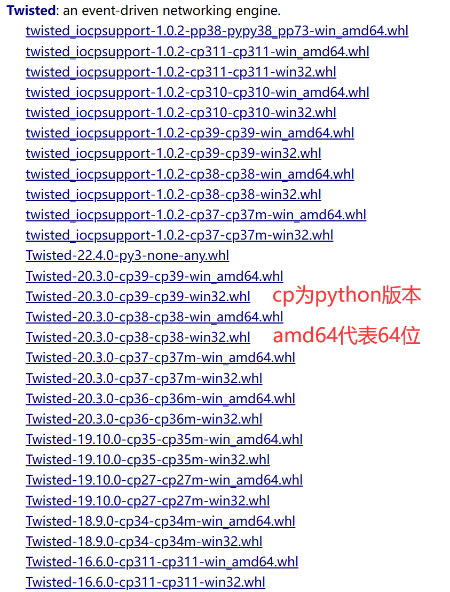
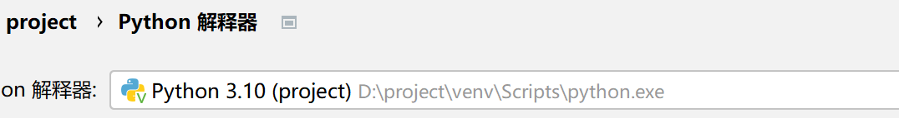
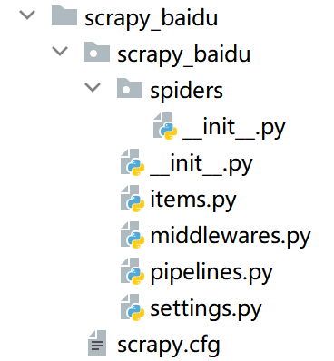
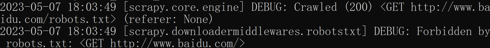
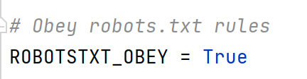
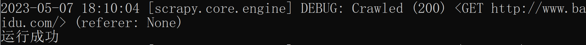
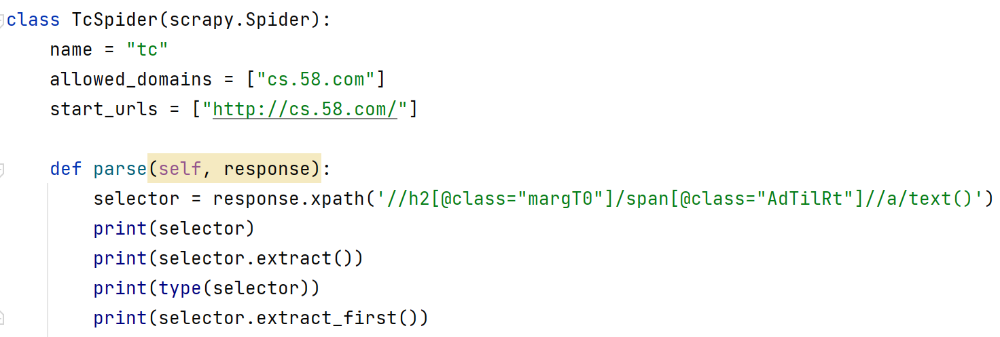
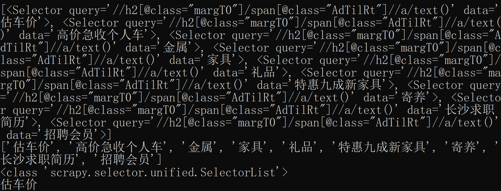
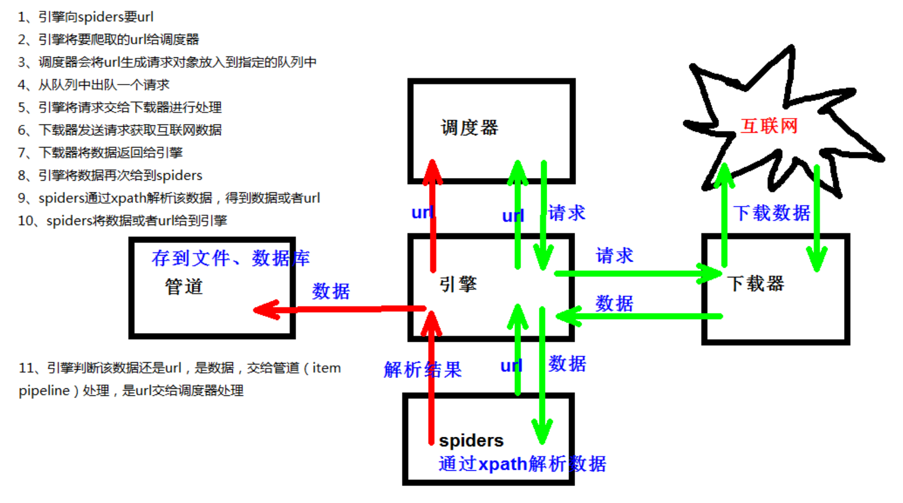

# scrapy

> Scrapy是一个为了爬取网站数据，提取结构性数据而编写的应用框架。可以应用在包括数据挖掘，信息处理或存储历史数据等一系列的程序中。

## 安装scrapy

```
pip install scrapy -i https://pypi.tuna.tsinghua.edu.cn/simple
```

安装时间会有点长，如果安装时存在错误——缺少scrapy依赖的twisted库导致安装失败，则需要手动下载和安装twisted库

网站：[Archived: Python Extension Packages for Windows - Christoph Gohlke (uci.edu)](https://www.lfd.uci.edu/~gohlke/pythonlibs/#twisted)(在快末尾的位置)



通过文件目录手动安装

```
pip install xx\yy\zz.whl
```

完成后继续执行安装scrapy指令

如果还是失败，提示需要升级pip，则按照提示指令升级即可，如果升级后还是无效，则需要使用软件Anaconda，打开Anaconda，点击environments，点击not installed，输入scrapy，最后将项目解释器更改为Anaconda的环境即可



## 基本使用

### 创建scrapy项目

```
终端目录>scrapy startproject 项目名称
```

> 项目名称不能包括中文，不能以数字开头，最好纯英文

执行如下cmd命令

```
D:\project>scrapy startproject scrapy_baidu
```

生成的文件目录：



文件解释如下：

>     spiders
>         __init__.py
>         自定义爬虫文件.py  -->由自己创建，是实现爬虫核心功能的文件
>     __init__.py
>     items.py			-->定义数据结构的地方，是一个继承自scrapy.Item的类
>     middlewares.py		-->中间件	代理
>     pipelines.py		-->管道文件，里面只有一个类，用于处理下载数据的后续处理，默认是300优先级，值越小优先级越高(1-1000)
>     settings.py			-->配置文件	比如：是否遵守robots协议，User-Agent定义等

### 创建爬虫文件

切换到对应目录

```
cd scrapy_baidu\scrapy_baidu\spiders
```

在spiders目录下创建baidu.py

```
scrapy genspider baidu www.baidu.com
```

> `baidu`：文件名称
>
> `www.baidu.com`：对应的域名(不需要加`http://`)

生成的文件代码如下：

```python
import scrapy


class BaiduSpider(scrapy.Spider):
    name = "baidu"
    allowed_domains = ["www.baidu.com"]
    start_urls = ["http://www.baidu.com/"]

    def parse(self, response):
        pass

```

添加数据并修改后：

```python
import scrapy


class BaiduSpider(scrapy.Spider):
    # 爬虫的名字，在运行爬虫的时候使用的值
    name = "baidu"
    # 允许访问的域名
    allowed_domains = ["www.baidu.com"]
    # 起始的url地址——第一次要访问的域名
    # start_urls会自动在allowed_domains前面自动添加"http://"，结尾自动添加"/"
    start_urls = ["http://www.baidu.com/"]

    # 执行start_urls之后执行的方法
    # response就是运行后返回的值，即urllib.request.urlopen()或request.get()
    def parse(self, response):
        print("运行成功")

```

### 运行爬虫文件

```
scrapy crawl baidu
```

> `baidu`：爬虫的名字

此时由于爬虫的"君子协议"，运行不会成功



### 关于使用scrapy时涉及到robots.txt的问题

> robots协议的初衷是为了指引搜索引擎的网络机器人更有效的抓取对网络用户有用的信息，从而更好地促进信息共享，而不应将robots协议作为限制信息流通的工具，**由于Robots协议包含排斥性条款，搜索巨鳄可能会利用Robots协议的条款，迫使某些热门网站与其签署排他性协议，从而将后起竞争者挡在门外，维护垄断。**所以这只是一个君子条约，对于个人来说可以不需要遵守。

修改setting.py，将其遵循注释或者改为false即可



再次执行cmd指令，运行结果如下



## 爬虫文件中response的属性和方法

- `response.encoding`：获取编码方式，默认为**'utf-8'**
- `response.text`：通过默认的编码方式，以字符串的方式获取响应的数据
- `response.body`：以二进制的方式获取二进制数据
- `response.xpath()`：使用xpath语法解析其中的内容，返回selector对象(`scrapy.selector.unified.SelectorList`)
- `selector.extract()`：提取selector对象的data属性值
  - `selector.extract_first()`：提取selector列表的第一个数据




> 

## scrapy架构组成

> ```
>     (1)引擎			-->自动运行，无需关注，会自动组织所有的请求对象，分发给下载器
>     (2)下载器			-->从引擎处获取到请求对象后，请求数据
>     (3)spiders			-->Spider类定义了如何爬取某个(或某些)网站。包括了爬取的动作(例如：是否跟进链接)以及如何从网页的内容中提取结构化数据(爬取item)。也就是说，Spider就是定义爬取的动作以及分析某个网页(或者是有些网页)的地方
>     (4)调度器			-->有自己的调度规则，无需关注
>     (5)管道(Item pipeline)	-->最终处理数据的管道，会预留接口供处理数据。当Item在Spider中被收集之后，它将会被传递到Item Pipeline，一些组件会按照一定的顺序执行对Item的处理。每个item pipeline组件(有时称之为"Item Pipeline")是实现了简单方法的Python类。它们接收到Item并通过它执行一些行为，同时也决定此Item是否继续通过pipeline，或是被丢弃而不再进行处理。
>     以下是item pipeline的一些典型应用：
>     1.清理HTML数据
>     2.验证爬取的数据(检查item包含某些字段)
>     3.查重(并丢弃)
>     4.将爬取结果保存到数据库中
> ```

## scrapy工作原理


