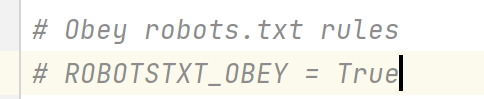
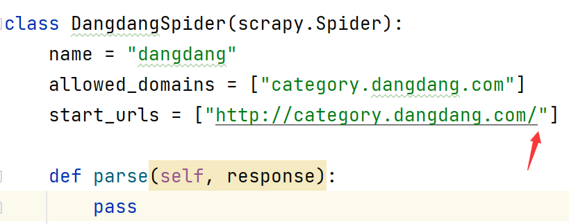
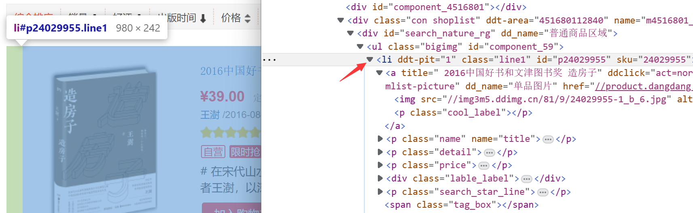
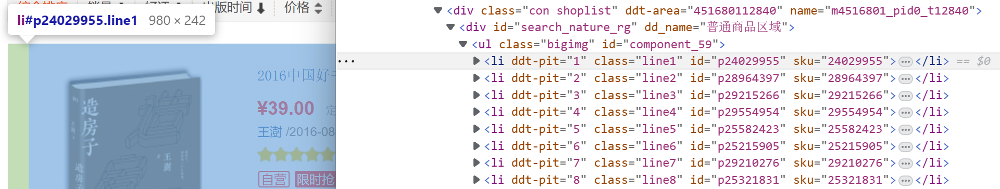
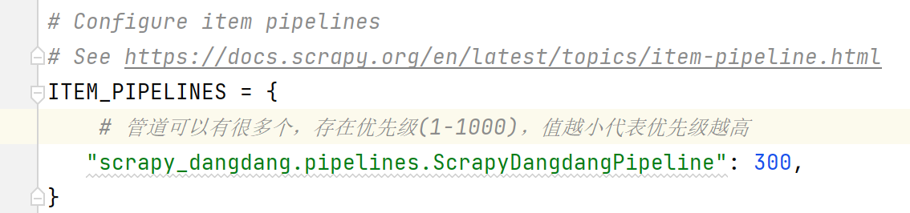
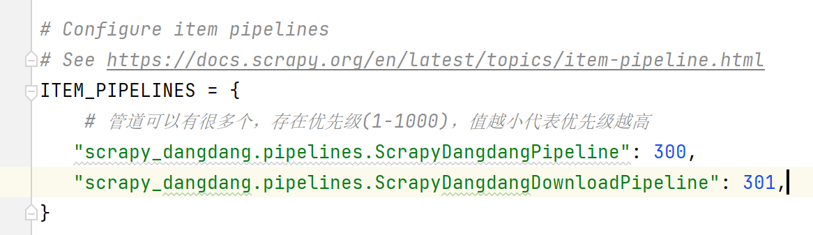
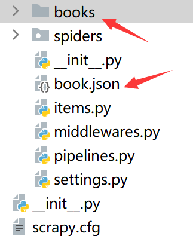

# yield

> yieId是一个类似return的关键字，迭代一次遇到yieId时就返回yieId后面(右边)的值。带有yieId的函数不再是一个普通函数，而是一个生成器generator，可用于迭代

生成器和迭代器的区别：

定义和实现方式

- **生成器**：生成器是一种特殊的迭代器，它使用生成器函数（在Python中是一个返回迭代器的简单函数）来生成值。生成器函数定义了值的生成规则，当从生成器中请求一个值时，生成器函数会按照定义好的规则生成一个新的值，并返回这个值
- **迭代器**：迭代器是一个更一般的概念。任何具有`__next__()`方法的对象都是迭代器。在Python中，你可以通过实现`__next__()`方法来创建自己的迭代器。迭代器可以按照任何你选择的规则生成值，它不必遵循像生成器那样的规则

内存使用

- **生成器**：生成器是一种惰性求值的函数，它只会在需要的时候生成新的值，这意味着它不会预先加载或存储所有的值。这使得生成器在处理大数据集时非常有用，因为它可以节省内存
- **迭代器**：迭代器没有这种特性，迭代器需要一次性加载所有数据到内存中。这意味着如果数据集很大，可能会占用大量内存

异常处理：

- **生成器**：如果生成器的函数在尝试生成一个值时抛出了异常，那么这个异常会被传递给调用者
- **迭代器**：迭代器的`__next__()`方法也可以抛出异常，但这通常不会影响其他对同一个迭代器的调用

在Python中，可以使用`yield`关键字来创建一个生成器。`yield`关键字会"暂停"函数的执行，并返回其结果值。当你再次请求该生成器时，它会从上次暂停的地方继续执行

```python
# 生成器
def my_generator(n):
    i = 0
    while i < n:
        yield i
        i += 1


for number in my_generator(5):
    print(number)


# 迭代器
class MyIterator:

    def __init__(self, max_val):
        self.max_val = max_val

    def __iter__(self):
        self.val = 0
        return self

    def __next__(self):
        if self.val >= self.max_val:
            raise StopIteration
        else:
            self.val += 1
            return self.val - 1


my_iter = MyIterator(5)
for number in my_iter:
    print(number)

```

> 输出结果一致

## 准备工作

> 爬取当当网数据

创建爬虫项目

```
scrapy startproject scrapy_dangdang
```

切换目录

```
cd scrapy_dangdang\scrapy_dangdang\spiders
```

创建爬虫文件

```
scrapy genspider dangdang http://category.dangdang.com/cp01.07.37.00.00.00.html
```

注释settings.py中的爬虫协议



补全地址，添加`cp01.07.37.00.00.00.html`对应当当网中的"建筑艺术"书籍



## items.py

> items 定义数据结构
>
> 

查看页面源代码

> 每一本书的结构：
>
> 
>
> 一本书对应一个li标签：
>
> 

items.py

```python
# Define here the models for your scraped items
#
# See documentation in:
# https://docs.scrapy.org/en/latest/topics/items.html

import scrapy


class ScrapyDangdangItem(scrapy.Item):
    # define the fields for your item here like:
    # name = scrapy.Field()

    # 图片
    src = scrapy.Field()
    # 名字
    name = scrapy.Field()
    # 价格
    price = scrapy.Field()

```

## piplines.py

使用管道的需要在settings.py中打开



添加管道



pipelines.py

```python
# Define your item pipelines here
#
# Don't forget to add your pipeline to the ITEM_PIPELINES setting
# See: https://docs.scrapy.org/en/latest/topics/item-pipeline.html


# useful for handling different item types with a single interface
from itemadapter import ItemAdapter
import urllib.request


# 需要先在settings.py中开启后才能使用
class ScrapyDangdangPipeline:

    def __init__(self):
        self.fp = None

    # 在爬虫文件开启之前执行的方法(方法名字固定)
    def open_spider(self, spider):
        self.fp = open('book.json', 'w', encoding='utf-8')

    # item就是yield后面的book对象
    def process_item(self, item, spider):
        # 频繁读写过于浪费性能
        #
        # # w模式会覆盖之前的内容写入
        # # a模式进行追加写入
        # with open('book.json', 'a', encoding='utf-8') as fp:
        #     # write只能写入字符串
        #     fp.write(str(item))

        # 可以只打开一次，直到写完
        self.fp.write(str(item))

        return item

    # 在爬虫文件执行完之后执行的方法(方法名字固定)
    def close_spider(self, spider):
        self.fp.close()


# 开启多条管道，在定义管道类后需要在settings.py中添加管道
class ScrapyDangdangDownloadPipeline:
    def process_item(self, item, spider):
        url = 'https:' + item.get('src')
        # 文件不允许出现以下任何特殊字符/ \ : * ? " < > |
        filename = 'books/' + item.get('name').replace("/", "").replace("\\", "").replace(":", "").replace("*", "").replace("?", "").replace("\"", "").replace("<", "").replace(">", "").replace("|", "") + '.jpg'
        urllib.request.urlretrieve(url=url, filename=filename)
        return item

```

## dangdang.py

```python
import scrapy
from scrapy_dangdang.items import ScrapyDangdangItem  # 这里导包报错可以忽略，PyCharm运行是基于项目路径，而通过cmd命令运行的爬虫文件是基于爬虫项目目录
import os  # os.mkdir("单级目录") os.makedirs("多级目录")


class DangdangSpider(scrapy.Spider):
    name = "dangdang"
    # 代表访问网址中需要包含的字符，如果访问的网址没有包含此字符，则无法爬取
    allowed_domains = ["category.dangdang.com"]
    start_urls = ["http://category.dangdang.com/cp01.07.37.00.00.00.html"]

    base_url = 'http://category.dangdang.com/pg'
    page = 1

    folder_name = 'books'
    if os.path.exists(folder_name):
        print("目录\"" + folder_name + "\"已存在，不可重复创建")
    else:
        os.makedirs(folder_name)

    def parse(self, response):
        # pipelines 下载数据
        # items 定义数据结构

        # 所有的selector对象都可以再次调用xpath方法
        li_list = response.xpath('//ul[@id="component_59"]/li')

        for li in li_list:
            # "."代表当前的基础上继续查找
            # 由于当当使用了图片的懒加载，只有第一个图片可以通过@src找到
            # 其余的图片需要通过@data-original找到地址，此时@src为images/model/guan/url_none.png
            src = li.xpath('.//img/@data-original').extract_first()
            # 如果不是第一个图片
            if src:
                pass
            else:
                src = li.xpath('.//img/@src').extract_first()

            name = li.xpath('.//img/@alt').extract_first()
            price = li.xpath('.//p[@class="price"]/span[1]/text()').extract_first()

            # 存入管道封装
            book = ScrapyDangdangItem(src=src, name=name, price=price)
            # 获取一个"book"就交给pipelines一次
            yield book

        if self.page < 3:
            self.page = self.page + 1
            url = self.base_url + str(self.page) + '-cp01.07.37.00.00.00.html'
            # 调用parse方法，Request是scrapy的get请求，url为请求地址，callback为调用的函数(后面不能加"()")
            yield scrapy.Request(url=url, callback=self.parse)

```

> 无论并发量如何，手写的页面跳转方式数据顺序是一致的

执行爬虫

```
scrapy crawl dangdang
```



> 文件和文件夹名不能包含以下任何字符
>
> ```
> / \ : * ? " < > |
> ```
