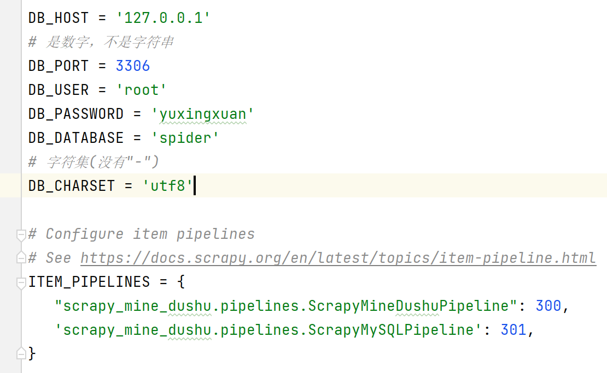

# 数据入库

## 安装pymysql

```
pip install pymysql -i https://pypi.tuna.tsinghua.edu.cn/simple
```

参考连接

```
DB_HOST = '127.0.0.1'
# 是数字，不是字符串
DB_PORT = 3306
DB_USER = 'root'
DB_PASSWORD = 'yuxingxuan'
DB_DATABASE = 'spider'
# 字符集(没有"-")
DB_CHARSET = 'utf8'
```

常用方法

```python
# 获取连接
conn = pymysql.connect(host=DB_HOST, port=DB_PORT, user=DB_USER, password=DB_PASSWORD, database=DB_DATABASE, charset=DB_CHARSET)
# 获取操作对象
cursor = conn.cursor()
# 执行sql语句
cursor.execute(sql)
# 提交事务
conn.commit()
```

## 写入数据库

## 建库建表

创建数据库spider，创建数据库表books

```sql
DROP DATABASE IF EXISTS `spider`;
CREATE DATABASE `spider`;

USE `spider`;
SET NAMES utf8mb4;
SET FOREIGN_KEY_CHECKS = 0;
-- ----------------------------
-- Table structure for books
-- ----------------------------
DROP TABLE IF EXISTS `books`;
CREATE TABLE `books`  (
  `id` int NOT NULL AUTO_INCREMENT,
  `name` varchar(255) CHARACTER SET utf8mb4 COLLATE utf8mb4_0900_ai_ci NULL DEFAULT NULL,
  `src` varchar(255) CHARACTER SET utf8mb4 COLLATE utf8mb4_0900_ai_ci NULL DEFAULT NULL,
  PRIMARY KEY (`id`) USING BTREE
) ENGINE = InnoDB CHARACTER SET = utf8mb4 COLLATE = utf8mb4_0900_ai_ci ROW_FORMAT = Dynamic;

-- ----------------------------
-- Records of books
-- ----------------------------

SET FOREIGN_KEY_CHECKS = 1;
```

### settings.py

在scrapy_mine_dushu项目中的settings.py添加参数，并开启管道



### pipelines.py

在scrapy_mine_dushu项目中的pipelines.py进行修改，其它地方都不需要再进行修改

```python
# Define your item pipelines here
#
# Don't forget to add your pipeline to the ITEM_PIPELINES setting
# See: https://docs.scrapy.org/en/latest/topics/item-pipeline.html


# useful for handling different item types with a single interface
from itemadapter import ItemAdapter
# 加载settings.py文件
from scrapy.utils.project import get_project_settings
import pymysql


class ScrapyMineDushuPipeline:

    def __init__(self):
        self.fp = None

    # 在爬虫文件开启之前执行的方法(方法名字固定)
    def open_spider(self, spider):
        self.fp = open('book.json', 'w+', encoding='utf-8')
        self.fp.write("{\"data\": [")

    def process_item(self, item, spider):
        # 最后一个不能带","
        self.fp.write("{\"" + str(item["name"]) + "\": \"" + str(item["src"]) + "\"},")
        return item

    # 在爬虫文件执行完之后执行的方法(方法名字固定)
    def close_spider(self, spider):
        # 处理最后一个","
        self.fp.seek(self.fp.tell()-1)
        self.fp.write("]}")
        self.fp.close()


class ScrapyMySQLPipeline:

    def __init__(self):
        self.conn = None
        self.cursor = None
        self.charset = None
        self.database = None
        self.password = None
        self.user = None
        self.port = None
        self.host = None

    def open_spider(self, spider):
        settings = get_project_settings()
        self.host = settings['DB_HOST']
        self.port = settings['DB_PORT']
        self.user = settings['DB_USER']
        self.password = settings['DB_PASSWORD']
        self.database = settings['DB_DATABASE']
        self.charset = settings['DB_CHARSET']

    def connect(self):
        self.conn = pymysql.connect(host=self.host, port=self.port,
                                       user=self.user, password=self.password,
                                       database=self.database, charset=self.charset)
        return self.conn.cursor()

    def process_item(self, item, spider):
        self.cursor = self.connect()
        sql = 'insert into books(name,src) values ("{}","{}")'.format(str(item["name"]), str(item["src"]))
        # 执行sql语句
        self.cursor.execute(sql)
        # 提交事务
        self.conn.commit()
        return item

    def close_spider(self, spider):
        self.cursor.close()
        self.conn.close()

```

> 数据成功入库，对于查询语句：
>
> ```python
>     cursor.execute(sql)
>     # 获取返回的第一个数据，指针往后移一位
>     data = cursor.fetchone()
>     print(data)
>     # 获取返回的全部数据
>     data = cursor.fetchall()
>     for i in data:
>         print(i)
> 
> ```