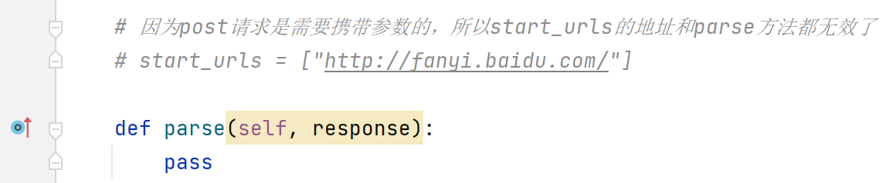

# scrapy的Post请求和代理模式

## post请求

### 准备工作

创建项目

```
scrapy startproject scrapy_post
```

切换目录

```
cd scrapy_post\scrapy_post\spiders
```

创建爬虫

```
scrapy genspider testpost https://fanyi.baidu.com/sug
```

注释testpost.py的start_urls参数，parse方法不需要填写内容，注释settings.py的爬虫协议

> 

### FormRequest

```python
scrapy.FormRequest(url=url, headers=headers, formdata=data, callback=self.parse_item)
# url: 要发送的post地址
# headers：可以定制头信息
# formdata: post所携带的数据，这是一个字典
# callback: 回调函数
```

### testpost.py

```python
import scrapy
import json


class TestpostSpider(scrapy.Spider):
    name = "testpost"
    allowed_domains = ["fanyi.baidu.com"]

    # 因为post请求是需要携带参数的，所以start_urls的地址和parse方法都无效了
    # start_urls = ["http://fanyi.baidu.com/"]

    def parse(self, response):
        pass

    # 重写start_requests方法
    def start_requests(self):
        url = 'https://fanyi.baidu.com/sug'

        data = {
            'kw': 'final'
        }

        yield scrapy.FormRequest(url=url, formdata=data, callback=self.parse_second)

    def parse_second(self, response):

        content = response.text
        # 数据需要再进行一次编码
        obj = json.loads(content)
        print(obj)

```

> 成功获取返回的数据

## 代理

```python
    # 到settings.py中，打开一个选项
    DOWNLOADER_MIDDLEWARES = {
        'postproject.middlewares.Proxy': 543,
    }


    # 到middlewares.py中写代码
    def process_request(self, request, spider):
        request.meta['proxy'] = 'https://113.68.202.10:9999'
        return None
```

