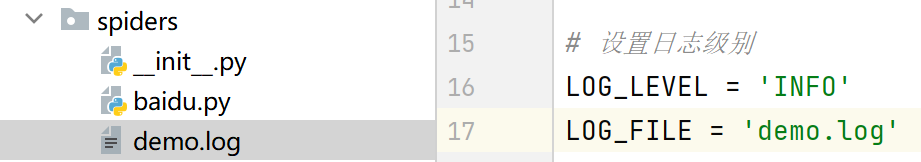

# scrapy日志信息

## 日志级别

```
CRITICAL：严重错误
ERROR： 一般错误
WARNING： 警告
INFO: 一般信息
DEBUG： 调试信息
```

> 默认的日志等级是DEBUG，只要出现了DEBUG或者DEBUG以上等级的日志，那么这些日志将会打印

## 日志设置

在settings.py文件添加参数设置日志级别

```
LOG_LEVEL : 设置日志显示的等级，即显示哪些，不显示哪些
```

除此之外，还可以将日志信息保存为文件

```
LOG_FILE : 将屏幕显示的信息全部记录到文件中(追加写入的方式)，屏幕不再显示，注意文件后缀一定是.log
```

> 