# Selenium

Selenium概念：

- Selenium是一个用于Web应用程序测试的工具
- Selenium测试直接运行在浏览器中，就像真正的用户在操作一样
- 支持通过各种`driver(FirfoxDriver,IternetExplorerDriver,OperaDriver,ChromeDriver)`驱动
  真实浏览器完成测试
- selenium也是支持无界面浏览器操作的

**可以使用Selenium模拟浏览器功能，自动执行网页中的js代码，实现动态加载**

## 安装Selenium

### 谷歌浏览器

- 谷歌浏览器驱动下载地址(较新版本名称与chrome内核版本保持一致)：http://chromedriver.storage.googleapis.com/index.html
  - 谷歌驱动和谷歌浏览器版本之间的映射表(远古版本)：http://blog.csdn.net/huilan_same/article/details/51896672

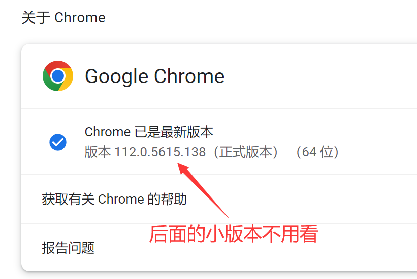

下载：

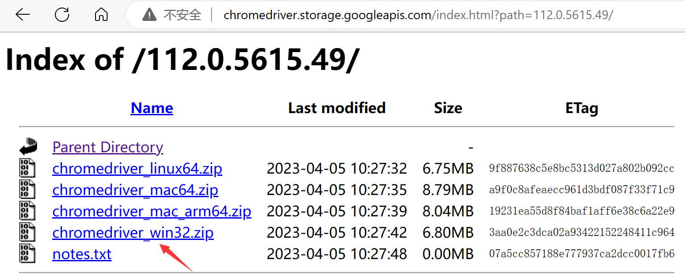

> 114以上版本：[Chrome for Testing availability (googlechromelabs.github.io)](https://googlechromelabs.github.io/chrome-for-testing/)
>
> 

### edge浏览器

- 查看谷歌浏览器版本：谷歌浏览器右上角-->帮助-->关于

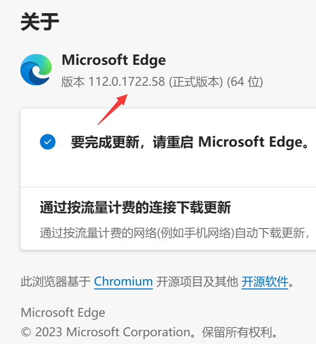

> Edge浏览器驱动下载地址：[Microsoft Edge WebDriver - Microsoft Edge Developer](https://developer.microsoft.com/en-us/microsoft-edge/tools/webdriver/#downloads)

### 驱动使用

解压后放入项目运行目录下：

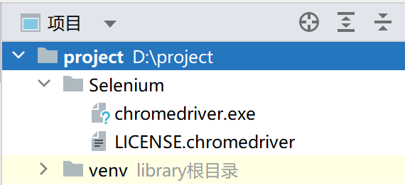

> 现在已经不需要再手动去进行下载了，默认会去读取浏览器内核来下载对应版本，会将其下载到用户目录下的`.cache\selenium\`目录下，无需再指定path

安装库

```
pip install selenium -i https://pypi.tuna.tsinghua.edu.cn/simple
```

> 升级库
>
> ```
> pip install -i https://pypi.tuna.tsinghua.edu.cn/simple --upgrade selenium
> ```
>
> 运行后回车确认进行升级即可

## 运行示例

```python
from selenium import webdriver
from selenium.webdriver.chrome.service import Service

# 创建浏览器对象
path = 'Selenium/chromedriver.exe'
s = Service(path)

# 指定为本地目录的驱动
browser = webdriver.Chrome(service=s)

# 访问网站
url = 'https://www.jd.com/'

browser.get(url)

# page_source获取网页源码
content = browser.page_source
print(content)


import urllib.request


def https(url=None):
    request = urllib.request.Request(url=url, headers=headers)
    response = urllib.request.urlopen(request)
    return response.read().decode("UTF-8")


headers = {
    "User-Agent": 'Mozilla/5.0 (Windows NT 10.0; Win64; x64) AppleWebKit/537.36 (KHTML, like Gecko) Chrome/111.0.0.0 '
                  'Safari/537.36 Edg/111.0.1661.62 '
}

# 模拟的浏览器会缺少一部分信息
content = https(url)

with open("京东.html", 'w', encoding='utf-8') as fp:
    fp.write(content)

# 保持页面不关闭
input()

```

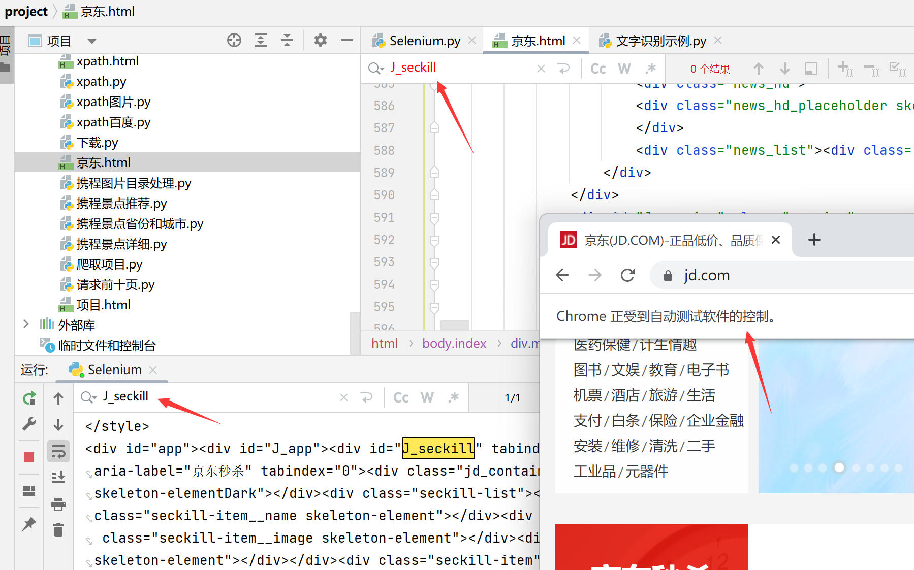

> 使用cookie
>
> ```python
> import time
> from selenium import webdriver
> from selenium.webdriver.chrome.service import Service
> import pickle
> import os
> 
> # 创建浏览器对象
> path = 'chromedriver.exe'
> s = Service(path)
> 
> # 指定为本地目录的驱动
> browser = webdriver.Chrome(service=s)
> 
> # 访问网站
> url = 'https://weibo.cn/6403049862/info'
> 
> # 添加cookies之前需要先打开网页
> browser.get(url)
> 
> if os.path.exists('cookie.pick'):
>     # 如果有，则加载cookie.pick
>     cookies = pickle.load(open('cookie.pick', 'rb'))
>     print(cookies)
>     for cookie in cookies:
>         cookie_dict = {
>             # 需要保证打开的url处于domain的范围内，否则会报错
>             'domain': '.weibo.cn',
>             'name': cookie.get('name'),
>             'value': cookie.get('value')
>         }
>         browser.add_cookie(cookie)
>     # 增加休眠
>     time.sleep(0.1)
>     # 重新打开链接，即可自动登录成功
>     browser.get('https://weibo.cn/6403049862/info')
> else:
>     # 等待完成登录操作后继续
>     input()
>     with open("cookie.pick", "wb") as fp:
>         # [{'domain': '.weibo.cn', 'httpOnly': False, 'name': 'SSOLoginState', 'path': '/', 'sameSite': 'Lax',
>         # 'secure': True, 'value': '1705917223'}, {'domain': '.weibo.cn', 'expiry': 1740477222, 'httpOnly': True,
>         # 'name': 'SCF', 'path': '/', 'sameSite': 'None', 'secure': True, 'value':
>         # 'AqV8rUc-w3Z3mPilJKC-0dycL8nvzS-h_91Y61hZMz_6rYZ1gV1T-voZlTqwvVfxxLNXLX33doLHcH1phmBCkZQ.'}, {'domain':
>         # '.weibo.cn', 'expiry': 1737453222, 'httpOnly': True, 'name': 'SUB', 'path': '/', 'sameSite': 'None',
>         # 'secure': True, 'value': '_2A25Iqkt3DeRhGeBK61ER9CfEzT6IHXVrxsK_rDV6PUJbkdANLUjmkW1NR
>         # -WMe0SlFe9kCVrSeOJkcabDEuF_yFbM'}, {'domain': '.weibo.cn', 'expiry': 1708509207, 'httpOnly': True,
>         # 'name': '_T_WM', 'path': '/', 'sameSite': 'Lax', 'secure': False, 'value':
>         # '34a4ae2fbdf53f671c3ae0bac915e052'}]
>         print(browser.get_cookies())
>         pickle.dump(browser.get_cookies(), fp)
> 
> input()
> 
> ```
>
> 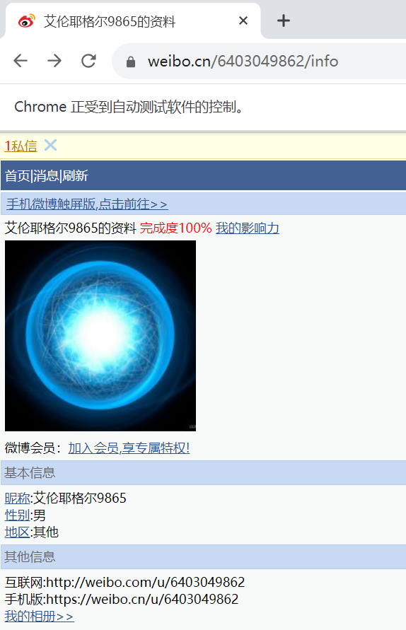

## 元素定位和信息的获取

> 元素定位和信息获取：
>
> - `find_element(By.XXX, 'yyy')`：获取一个元素(返回第一个符合条件的)
>
> - `find_elements(By.XXX, 'yyy')`：获取多个元素(返回列表)
>
>   - `.get_attribute('yyy')`：获取标签内元素信息
>
>   - `.text`：获取标签内的文本信息
>
>   - `.tag_name`：获取标签名

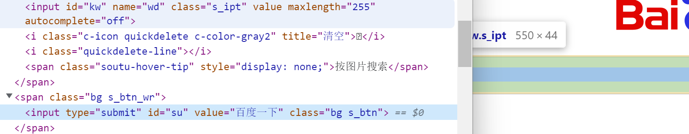

```python
from selenium import webdriver
from selenium.webdriver.common.by import By  # 导入用于定位的库

# 初始化浏览器对象
browser = webdriver.Chrome()

# 访问网站
url = 'https://www.baidu.com/'

browser.get(url)

# # 通过id定位到输入框
# button = browser.find_element(By.ID, 'kw')

# # 通过name定位到输入框
# button= browser.find_element(By.NAME, 'wd')

# # 通过css选择器定位到输入框
# button = browser.find_element(By.CSS_SELECTOR, '#su')

# 通过带链接的文本定位
button = browser.find_element(By.LINK_TEXT, '新闻')

# 输出标签名字、链接和文本信息
print(button.tag_name + button.get_attribute('href') + button.text)

# 通过标签名字定位
input_list = browser.find_elements(By.TAG_NAME, 'input')

for i in input_list:
    print(i.get_attribute('name'))

# 通过XPath定位到输入框
button = browser.find_element(By.XPATH, '//*[@id="kw"]')

# 输入值
button.send_keys('周杰伦')

# 点击"百度一下"
browser.find_element(By.ID, 'su').click()

input()

```

## 交互

> - 点击：`click()`
>
> - 输入：`send_keys()`
>
> - 后退操作：`browser.back()`
> - 前进操作：`browser.forword()`
> - 模拟js滚动：
>   - 设置滚动值：`js = 'document.documentElement.scrollTop=100000'`
>   - 执行js代码：`browser.execute_script(js)`
> - 获取网页代码：`browser.page_source`
> - 退出：`browser.quit()`

```python
from selenium import webdriver
from selenium.webdriver.common.by import By  # 导入用于定位的库
import time

# 初始化浏览器对象
browser = webdriver.Chrome()

# 访问网站
url = 'https://www.baidu.com/'

browser.get(url)

time.sleep(1)

# 通过XPath定位到输入框
button = browser.find_element(By.XPATH, '//*[@id="kw"]')

# 输入值
button.send_keys('周杰伦')

# 点击"百度一下"
browser.find_element(By.ID, 'su').click()

time.sleep(2)

# 慢慢滑动
for i in range(5):
    js = 'document.documentElement.scrollTop=' + str(i * 800)
    browser.execute_script(js)
    time.sleep(0.3)

# 获取下一页按钮
next_button = browser.find_element(By.XPATH, '//a[@class="n"]')

# 点击下一页
next_button.click()
time.sleep(3.5)

# 返回操作
browser.back()
time.sleep(3.5)

# 前进操作
browser.forward()
time.sleep(3.5)

# 退出浏览器
browser.quit()

```

> 控制完成操作后自动退出

### 选择框

```python
import time
from selenium import webdriver
from selenium.webdriver.common.by import By
# 导入Select类
from selenium.webdriver.support.ui import Select

wb = webdriver.Chrome()

url = 'https://cdn2.byhy.net/files/selenium/test2.html'

wb.get(url)

radio = wb.find_element(By.XPATH, '//div[@id="s_radio"]')

# 返回的是字符串，不是列表
radio_one = radio.text.split("\n")[0]
print(radio_one, type(radio_one), len(radio_one))

# 可以继续Xpath
radio_one = radio.find_element(By.XPATH, '%s"%s"%s' % ('.//input[@value=', radio_one, ']'))
radio_one.click()

check_box = wb.find_element(By.XPATH, '//div[@id="s_checkbox"]')
check_box_some = check_box.text.split("\n")

for check_box_one in check_box_some:
    check_box_some = check_box.find_element(By.XPATH, '%s"%s"%s' % ('.//input[@value=', check_box_one, ']'))
    check_box_some.click()


# 对select选择框的处理
select_one = Select(wb.find_element(By.ID, 'ss_single'))
# 这里选择第一个，还可以通过value()或者visible_text()
select_one.select_by_index(0)

# 对select选择框的处理
select_some = Select(wb.find_element(By.ID, 'ss_multi'))
# 清除所有已选中的
select_some.deselect_all()
select_some.select_by_index(0)
select_some.select_by_index(1)

time.sleep(10)
```

> 未操作前：
>
> 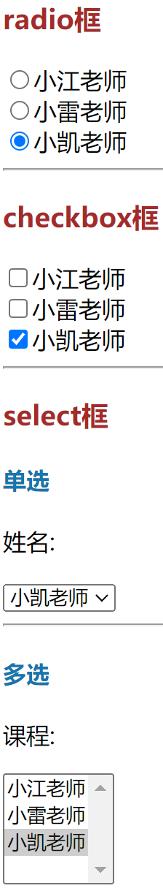
>
> 操作后：
>
> 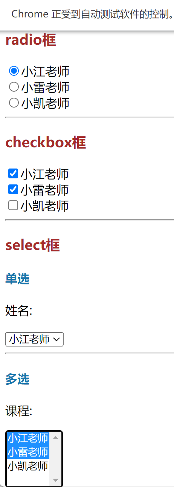

### 切换iframe

```python
from selenium import webdriver
from selenium.webdriver.common.by import By  # 导入用于定位的库
import time


# 初始化浏览器对象
browser = webdriver.Chrome()

# 访问网站
url = 'http://sso.hnuit.edu.cn/cas/login?service=http%3A%2F%2Fjwgl.hnisc.com%2Fjsxsd%2Fframework%2FxsMain.jsp'

your_username = ''
your_password = ''

browser.get(url)

username = browser.find_element(By.XPATH, '//input[@id="username"]')
password = browser.find_element(By.XPATH, '//input[@id="password"]')
submit = browser.find_element(By.XPATH, '//input[@id="loginBtn"]')

username.send_keys(your_username)
password.send_keys(your_password)

submit.click()
time.sleep(2)

print('登录成功')
time.sleep(2)

# with open('湖南信息主页.html', 'w', encoding='utf-8') as fp:
#     fp.write(browser.page_source)

xf = browser.find_element(By.XPATH, '//iframe[@id="Frame0"]')
browser.switch_to.frame(xf)

button_selection_center = browser.find_element(By.XPATH, '//div[@class="cy_icon"]/div[3]')
print("成功进入学生选课中心")
button_selection_center.click()

# 切换回主页面
browser.switch_to.default_content()
xf3 = browser.find_element(By.XPATH, '//iframe[@id="Frame1"]')
browser.switch_to.frame(xf3)
print("成功进入二级页面")
button_course = browser.find_element(By.XPATH, '//table[@id="tbKxkc"]')

if "未查询到数据" in button_course.text:
    print("选课时间已截至")
    input()
    browser.quit()


# 记录所抢课的页数
```

### 切换窗口

```python
import time
from selenium import webdriver
from selenium.webdriver.common.by import By


wb = webdriver.Chrome()

url = 'https://cdn2.byhy.net/files/selenium/sample3.html'

wb.get(url)

bing = wb.find_element(By.XPATH, '//a')

bing.click()

# 直接打印会是一串地址，所以得借助循环
for handle in wb.window_handles:
    wb.switch_to.window(handle)
    if '必应' in wb.title:
        break

print(wb.title)

in_put = wb.find_element(By.XPATH, '//input[@id="sb_form_q"]')

in_put.send_keys("你好")

time.sleep(5)
```

> 新建标签页
>
> ```python
> driver.execute_script("window.open('http://www.google.com');")
> ```

### 冻结页面

对于需要将鼠标放上去才会显示的元素，可以在控制台输入

```js
setTimeout(function(){debugger}, 5000)
```

在5秒后进入debugger模式冻结页面，方便分析页面

> 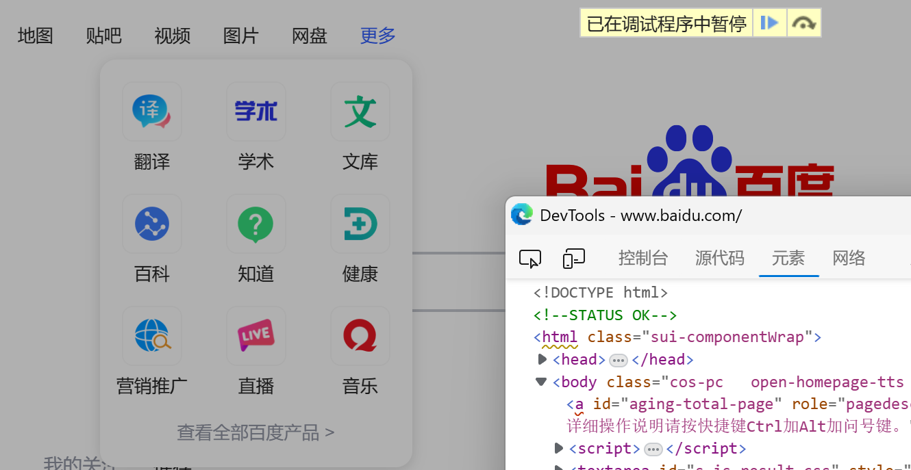

### 模拟鼠标和键盘

```python
import time
from selenium import webdriver
from selenium.webdriver.common.by import By
from selenium.webdriver.common.action_chains import ActionChains
from selenium.webdriver.common.keys import Keys


wb = webdriver.Chrome()

wb.get('https://www.baidu.com/')

ac = ActionChains(wb)

# 隐式等待2秒
wb.implicitly_wait(2)

# 定位到空白区并点击，使其可以使用快捷键
ac.move_by_offset(200, 200)
ac.click()

# 按下按键
ac.key_down(Keys.CONTROL).send_keys("A").perform()
# 松开按键
ac.key_up(Keys.ALT).key_up(Keys.CONTROL).perform()

time.sleep(1)

# 鼠标移动到"更多"元素上后再点击百度翻译
geng_duo = wb.find_element(By.CSS_SELECTOR, '[name="tj_briicon"]')
fan_yi = wb.find_element(By.XPATH, '//div[@class="s-top-more"]/div[1]/a[1]')
ac.move_to_element(geng_duo).click(fan_yi).perform()

time.sleep(5)

```

> ActionChains方法列表：
> - `click(on_element=None)`：单击鼠标左键
> - `click_and_hold(on_element=None)`：按住鼠标左键不松开
> - `context_click(on_element=None)`：点击鼠标右键
> - `double_click(on_element=None)`：双击鼠标左键
> - `drag_and_drop(source, target)`：拖拽到某个元素然后松开
> - `drag_and_drop_by_offset(source, xoffset, yoffset)`：拖拽到某个坐标然后松开
> - `key_down(value, element=None)`：按下某个键盘上的键
> - `key_up(value, element=None)`：松开某个键
> - `move_by_offset(xoffset, yoffset)`：鼠标从当前位置移动到某个坐标
> - `move_to_element(to_element)`：鼠标移动到某个元素
> - `move_to_element_with_offset(to_element, xoffset, yoffset)`：移动到距某个元素（左上角坐标）多少距离的位置
> - `perform()`：执行链中的所有动作
> - `release(on_element=None)`：在某个元素位置松开鼠标左键

### 对话框

- **Alter**：目的就是显示通知信息，只需用户看完信息后，点击 OK（确定）就可以了（注意：如果不去点击它，页面的其它元素是不能操作的）
- **Confirm**：主要是让用户确认是否要进行某个操作，例如：当管理员在网站上选择删除某个账号时，就可能会弹出Confirm弹出框， 要求确认是否确定要删，有两个选择供用户选择，分别是 OK 和 Cancel
- **Prompt**：需要用户输入一些信息，提交上去

```python
import time
from selenium import webdriver
from selenium.webdriver.common.by import By


wb = webdriver.Chrome()
wb.implicitly_wait(2)
wb.get('https://cdn2.byhy.net/files/selenium/test4.html')


# --- alert ---
wb.find_element(By.ID, 'b1').click()

alert = wb.switch_to.alert
# 打印 弹出框 提示信息
print(alert.text)

time.sleep(2)
# 点击 OK 按钮(dismiss()方法效果一致)
alert.accept()


# --- confirm ---
wb.find_element(By.ID, 'b2').click()

alert = wb.switch_to.alert
# 打印 弹出框 提示信息
print(alert.text)

time.sleep(2)
# 点击 OK 按钮
alert.accept()
# alert.dismiss()为 Cancel 按钮


# --- prompt ---
wb.find_element(By.ID, 'b3').click()

alert = wb.switch_to.alert
# 打印 弹出框 提示信息
print(alert.text)

# 设置内容
alert.send_keys('web自动化测试')

time.sleep(2)
# 点击确认
alert.accept()
# alert.dismiss()为取消

# 打印窗口大小
print(wb.get_window_size())
# 设置窗口大小
wb.set_window_size(200, 300)
time.sleep(2)
print(wb.get_window_size())
# 窗口最大化
wb.maximize_window()

time.sleep(5)

```

> 值得注意的是，在prompt中，就算设置了内容，获取到的对话框信息还是不会变的

## 关于等待

### 直接等待

`time.sleep()`：强制等待，线程会休眠一段时间

> - 非常不智能，使用不当会影响程序运行
>
> - 例如，定位元素。让页面加载完成后，元素才能被成功定位。因此我们会加入等待语句来等待页面加载。当使用直接等待时，若设置时间较短，很可能会因为页面还未完全加载而导致元素未成功定位；若设置时间较长，则会影响线程运行时

### 隐式等待

`wb.implicitly_wait()`：设置一个等待时间，轮询查找(默认0.5秒)元素是否出现，如果没有出现就抛出异常

> - 轮询查找，相对智能，避免元素提前加载好后，程序还一直等待的情况
>
> - 全局设置，作用域所有find element的方法，因此等待时间必须设置成元素查找的最长时间。若元素查找出现故障时则会影响程序运行

### 显示等待

`WebDriverWait().until()`和`WebDriverWait( ).until_not()`

- 在代码中定义等待条件，当条件发生时才继续执行代码

- WebDriverWait()配合until()和until_not()方法，根据判断条件进行等待

- 程序每隔一段时间(默认0.5秒)进行条件判断，如果条件成立，则执行下一步，否则继续等待，直到超过设置的最长时间

> - 显示等待是最优的等待方式，它是指定某一个元素来进行等待条件判断的，因此避免了在使用直接等待和隐式等待时可能产生的问题，提高程序运行的效率
>
> ```python
> import time
> 
> from selenium import webdriver
> from selenium.webdriver.common.by import By
> from selenium.webdriver.support.ui import WebDriverWait
> from selenium.webdriver.support import expected_conditions as EC
> 
> driver = webdriver.Chrome()
> driver.get('https://www.baidu.com')
> 
> wait = WebDriverWait(driver, 10)
> element = wait.until(EC.presence_of_element_located((By.ID, 'kw')))
> element.send_keys('Python')
> element.submit()
> time.sleep(3)
> driver.quit()
> 
> ```

## 关于滚动值

> scrollHeight：在没有滚动条的情况下，元素内容的总高度
>
> scrollWidth：在没有滚动条的情况下，元素内容的总宽度
>
> scrollTop：被隐藏在内容区域左侧的像素数。设置该值可以改变元素的上下滚动位置
>
> scrollLeft：被隐藏在内容区域上方的像素数。设置该值可以改变元素的左右滚动位置

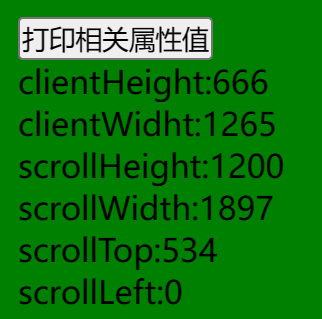

> 此时页面已经拉到底部了，并未往右边滑动**当滚动条越细，scrollTop和scrollLeft的最大值就越大**

```html
<!DOCTYPE html>
<html lang="en">

<head>
    <meta charset="UTF-8">
    <meta name="viewport" content="width=device-width, initial-scale=1.0">
    <title>Document</title>
    <style>
        * {
            margin: 0;
            padding: 0;
        }

        .container {
            height: 1200px;
        }

        .container div {
            height: 400px;
            width: 150%;
            font-size: 20px;
            font-weight: bold;
            text-align: right;
        }

        div.red {
            background-color: red;
        }

        div.green {
            background-color: green;
        }

        div.yellow {
            background-color: yellow;
        }

        div.black {
            background-color: black;
        }

        .print {
            position: fixed;
            top: 10px;
            left: 10px;
        }
    </style>
</head>

<body>
    <div class="container">
        <div class="red">最右边</div>
        <div class="green">最右边</div>
        <div class="yellow">最右边</div>
    </div>
    <div class="print">
        <button>
            打印相关属性值
        </button>
        <div></div>
    </div>
    <script>
        var _body = document.documentElement;
        var btn = document.querySelector('.print button');
        var text = document.querySelector('.print div');
        btn.onclick = function () {
            var html = "";
            var ch = _body.clientHeight;
            var cw = _body.clientWidth;
            var sh = _body.scrollHeight;
            var sw = _body.scrollWidth;
            var st = _body.scrollTop;
            var sl = _body.scrollLeft;
            html += "clientHeight:" + ch + "<br>";
            html += "clientWidht:" + cw + "<br>";
            html += "scrollHeight:" + sh + "<br>";
            html += "scrollWidth:" + sw + "<br>";
            html += "scrollTop:" + st + "<br>";
            html += "scrollLeft:" + sl + "<br>";
            text.innerHTML = html;
        } 
    </script>
</body>

</html>
```

