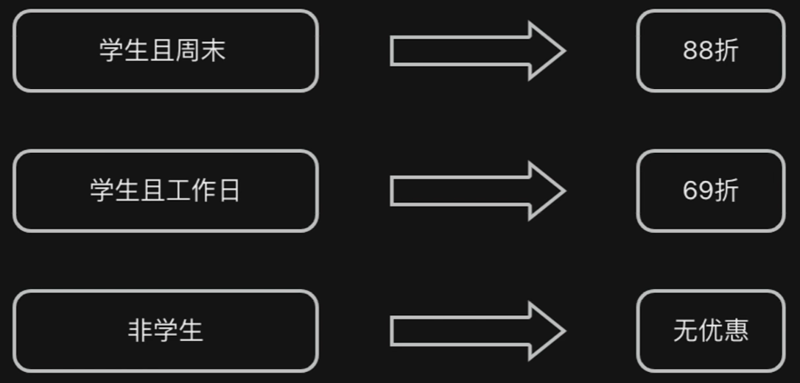
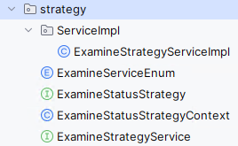

# 策略模式

> - 开闭原则：可以通过创建新的策略类来扩展系统的功能，而不需要修改现有的代码。即对扩展开放，对修改关闭
> - 单一职责原则：策略模式将不同的算法逻辑分离到不同的策略类中，每个策略类负责实现一种具体的算法

## 示例代码

> 
>
> 如果要新增一种策略，只需要在PayTypeEnum中新增一个枚举，新增一个实现PayTypeStrategy的类即可

定义枚举`PayTypeEnum.java`

```java
import com.fasterxml.jackson.annotation.JsonValue;
import lombok.AllArgsConstructor;
import lombok.Getter;

@Getter
@AllArgsConstructor
public enum PayTypeEnum {
    /**
     * 学生且周末
     */
    STUDENT_WEEKEND(1, "studentWeekendStrategy"),

    /**
     * 学生但工作日
     */
    STUDENT_WORKING_DAY(2, "studentWorkdayStrategy"),

    /**
     * 非学生
     */
    NOT_STUDENT(3, "notStudentStrategy");

    /**
     * 支付类型Code
     */
    private final Integer payTypeCode;

    /**
     * 对应的策略(bean)名称
     */
    private final String strategyName;

    public static PayTypeEnum fromCode(int code) {
        for (PayTypeEnum payType : PayTypeEnum.values()) {
            if (payType.getPayTypeCode() == code) {
                return payType;
            }
        }
        throw new IllegalArgumentException("Invalid pay type code: " + code);
    }

    // 指定当前对象转换为JSON时所返回的值，可用于属性或者方法上
    @JsonValue
    public String getStrategyName() {
        return strategyName;
    }
}
```

定义需要实现的策略`PayTypeStrategy.java`

```java
public interface PayTypeStrategy {
    /**
     * 执行支付逻辑
     */
    void pay();
}
```

定义具体实现策略的类：

StudentWeekendStrategy.java

```java
import org.springframework.stereotype.Component;

@Component
public class StudentWeekendStrategy implements PayTypeStrategy{
    @Override
    public void pay() {
        System.out.println("88折优惠");
    }
}
```

StudentWorkdayStrategy.java

```java
@Component
public class StudentWorkdayStrategy implements PayTypeStrategy{
    @Override
    public void pay() {
        System.out.println("69折优惠");
    }
}
```

NotStudentStrategy.java

```java
import org.springframework.stereotype.Component;

@Component
public class NotStudentStrategy implements PayTypeStrategy{
    @Override
    public void pay() {
        System.out.println("没有优惠");
    }
}
```

定义最终策略执行对象获取类`PayTypeStrategyContext.java`

```java
import com.atguigu.boot.Enum.PayTypeEnum;
import org.springframework.beans.factory.annotation.Autowired;
import org.springframework.stereotype.Component;

import java.util.HashMap;
import java.util.Map;

@Component
public class PayTypeStrategyContext {

    // 初始化 Map 是为了确保即使 Spring 容器中没有找到任何匹配的 Bean，你的 Map 字段也不会是 null。这有助于避免 NullPointerException
    @Autowired
    private Map<String, PayTypeStrategy> payTypeStrategyMap = new HashMap<>();

    public PayTypeStrategy getType(PayTypeEnum payTypeEnum) {
        return payTypeStrategyMap.get(payTypeEnum.getStrategyName());
    }
}
```

定义服务层`TestService.java`

```java
package com.atguigu.boot.Service;

import com.atguigu.boot.Enum.PayTypeEnum;

public interface TestService {
    void useStrategy(PayTypeEnum payTypeEnum);
}
```

定义服务层实现类`TestServiceImpl.java`

```java
package com.atguigu.boot.Service.Impl;

import com.atguigu.boot.Enum.PayTypeEnum;
import com.atguigu.boot.Service.TestService;
import com.atguigu.boot.strategy.PayTypeStrategy;
import com.atguigu.boot.strategy.PayTypeStrategyContext;
import org.springframework.beans.factory.annotation.Autowired;
import org.springframework.stereotype.Service;

@Service
public class TestServiceImpl implements TestService {

    @Autowired
    private PayTypeStrategyContext payTypeStrategyContext;


    @Override
    public void useStrategy(PayTypeEnum payTypeEnum) {
        PayTypeStrategy type = payTypeStrategyContext.getType(payTypeEnum);
        type.pay();
    }
}
```

定义枚举类转化器用于接收数据前端传递数据`StringToPayTypeEnumConverter.java`

```java
import com.atguigu.boot.Enum.PayTypeEnum;
import org.springframework.core.convert.converter.Converter;
import org.springframework.stereotype.Component;

@Component
public class StringToPayTypeEnumConverter implements Converter<String, PayTypeEnum> {

    /**
     * 这里Converter<String, PayTypeEnum>
     *     第一个参数必须为String，第二个参数为自定义转化的对象类型
     * @param source 原始值
     * @return 注入的对象
     */
    @Override
    public PayTypeEnum convert(String source) {
        return PayTypeEnum.fromCode(Integer.parseInt(source));
    }
}
```

定义请求接收类`TestController.java`

```java
@RestController
@RequestMapping("/test")
public class TestController {

    @Autowired
    private TestService testService;

    @RequestMapping("/useStrategy")
    public PayTypeEnum useStrategy(PayTypeEnum payTypeEnum) {
        testService.useStrategy(payTypeEnum);
        return payTypeEnum;
    }
}
```

> 请求示例
>
> ```
> http://localhost:8080/test/useStrategy?payTypeEnum=2
> ```
>
> 打印内容
>
> ```
> 69折优惠
> ```
>
> 返回内容
>
> ```
> "studentWorkdayStrategy"
> ```

## 结合泛型

> 通过泛型规定上界`<? extends ExamineBaseVo>`，可以让泛型`T t`在编译时获取的`ExamineBaseVo`对象的方法，再结合MP进行操作
>
> ```java
> @Component
> public class TbActivityUser extends ExamineBaseVo
> {
>     private static final long serialVersionUID = 1L;
> 
>     /** 活动报名id */
>     @TableId(value = "activity_user_id", type = IdType.AUTO)
>     private Long activityUserId;
> ```
>
> ```java
> public interface ExamineStatusStrategy<T extends ExamineBaseVo> extends IdInterface<T>
> ```
>
> ```java
> public interface ITbActivityUserService extends ExamineStatusStrategy<TbActivityUser>
> ```
>
> ```java
>     @Autowired
>     private Map<String, ExamineStatusStrategy<? extends ExamineBaseVo>> updateStatusStrategyMap = new HashMap<>();
> ```

ExamineServiceEnum.java

```java
/**
 * 实现bean名称枚举
 */
public enum ExamineServiceEnum {
    MESSAGE(1, "tbMessageServiceImpl", getAdminFlow()),
    RESOURCE(2, "tbResourceServiceImpl", getAdminFlow()),
    POLICY(3, "tbPolicyServiceImpl", getAdminFlow()),
    INVESTMENT(4, "tbInvestmentServiceImpl", getAdminFlow()),
    ACTIVITY(5, "tbActivityServiceImpl", getAdminFlow()),
    PLACE(6, "tbPlaceServiceImpl", getAdminFlow()),
    ACTIVITYUSER(11, "tbActivityUserServiceImpl", getAdminFlow()),
    RESERVATION(12, "tbReservationServiceImpl", getAdminFlow()),
    AUTHENTICATION(13, "tbUserAuthenticationServiceImpl", getAdminFlow()),
    USERAUTHENTICATION(14, "tbInitiateActivityServiceImpl", getAdminFlow()),
    ;

    /**
     * 默认审核流程
     *
     * @return 审核流程
     */
    public static String getDefaultFlow() {
        return "1,101";
    }

    /**
     * 超级管理员审核流程
     *
     * @return 审核流程
     */
    public static String getAdminFlow() {
        return "1";
    }

    public static ExamineServiceEnum fromCode(int code) {
        for (ExamineServiceEnum examineType : ExamineServiceEnum.values()) {
            if (examineType.getCode() == code) {
                return examineType;
            }
        }
        throw new IllegalArgumentException("Invalid type code: " + code);
    }

    public static ExamineServiceEnum fromStrategyName(String strategyName) {
        for (ExamineServiceEnum examineType : ExamineServiceEnum.values()) {
            if (examineType.getStrategyName().contains(strategyName)) {
                return examineType;
            }
        }
        throw new IllegalArgumentException("Invalid type updateType: " + strategyName);
    }

    /**
     * 状态类型Code
     */
    private final Integer code;

    /**
     * 对应的策略(bean)名称
     */
    private final String strategyName;

    /**
     * 审核流程
     */
    private final String flow;

    ExamineServiceEnum(Integer code, String strategyName, String flow) {
        this.code = code;
        this.strategyName = strategyName;
        this.flow = flow;
    }

    public Integer getCode() {
        return code;
    }

    public String getStrategyName() {
        return strategyName;
    }

    public String getFlow() {
        return flow;
    }
}
```

ExamineStatusStrategy.java

```java
import com.baomidou.mybatisplus.core.conditions.query.LambdaQueryWrapper;
import com.baomidou.mybatisplus.core.conditions.update.UpdateWrapper;
import com.cebc.common.exception.UniappException;
import com.cebc.common.utils.SecurityUtils;
import com.cebc.common.utils.spring.SpringUtils;
import com.cebc.uniapp.config.CacheMap;
import com.cebc.uniapp.domain.entity.TbExamine;
import com.cebc.uniapp.domain.entity.TbExamineRole;
import com.cebc.uniapp.domain.vo.Base.ExamineBaseVo;
import com.cebc.uniapp.enums.ExamineStatusEnum;
import com.cebc.uniapp.mapper.TbExamineMapper;
import com.cebc.uniapp.mp.IdInterface;
import com.cebc.uniapp.service.ITbExamineRoleService;
import org.apache.commons.lang3.ArrayUtils;
import org.springframework.transaction.support.TransactionTemplate;
import org.springframework.util.CollectionUtils;
import org.springframework.util.ObjectUtils;

import java.util.List;
import java.util.Objects;
import java.util.concurrent.atomic.AtomicInteger;
import java.util.stream.Collectors;

public interface ExamineStatusStrategy<T extends ExamineBaseVo> extends IdInterface<T> {

    /**
     * 审核通过后回调方法
     *
     * @param ids 需要更新的列
     */
    default void afterPass(ExamineServiceEnum examineServiceEnum, List<Long> ids, ExamineStatusEnum examineStatusEnum, T t) {

    }

    /**
     * 审核不通过后回调方法
     *
     * @param ids 需要更新的列
     */
    default void afterNotPass(ExamineServiceEnum examineServiceEnum, List<Long> ids, ExamineStatusEnum examineStatusEnum, T t) {

    }

    /**
     * 执行状态更新
     *
     * @param ids               需要更新的列
     * @param examineStatusEnum 枚举对象为需要更新的结果
     * @param t                 继承ExamineBaseVo的对象
     * @return 受影响的行数
     */
    default int updateStatus(ExamineServiceEnum examineServiceEnum, List<Long> ids, ExamineStatusEnum examineStatusEnum, T t) {
        final String idColumnName = getIdColumnName(t);
        // 设置状态
        t.setStatus(examineStatusEnum.getStatus());

        // 统一更新状态
        AtomicInteger disposalNumber = new AtomicInteger(0);

        // 手动管理事务
        TransactionTemplate transactionTemplate = SpringUtils.getBean(TransactionTemplate.class);
        transactionTemplate.executeWithoutResult(status -> {
            try {
                ids.forEach((item) -> {
                    UpdateWrapper<T> updateWrapper = new UpdateWrapper<>();
                    updateWrapper.eq(idColumnName, item);
                    // 自增
                    disposalNumber.addAndGet(this.getBaseMapper().update(t, updateWrapper));
                });
            } catch (Exception e) {
                status.setRollbackOnly();
                throw new UniappException(e.getMessage());
            }
        });
        // 执行回调方法，这里不和上面的事务保持一致
        if (examineStatusEnum.equals(ExamineStatusEnum.PASSEXAMINATION)) {
            this.afterPass(examineServiceEnum, ids, examineStatusEnum, t);
        } else if (examineStatusEnum.equals(ExamineStatusEnum.FAILEXAMINATION)) {
            this.afterNotPass(examineServiceEnum, ids, examineStatusEnum, t);
        }
        return disposalNumber.get();
    }


    /**
     * 获取到对应类型的审核结果，并设置Vo的值
     *
     * @param tList        审核对象查询结果
     * @param needLastList 不定长参数，兼容输入单参数调用
     */
    default void replaceExamineVO(List<T> tList, boolean... needLastList) {
        // 如果为空，则直接返回
        if (ObjectUtils.isEmpty(tList) || CollectionUtils.isEmpty(tList)) {
            return;
        }
        T t = tList.get(0);

        final String idName = getIdName(t);
        ExamineServiceEnum examineServiceEnum = ExamineServiceEnum.fromStrategyName(idName.replace("Id", "ServiceImpl").substring(1));

        // 通过查询任意对象的查询结果再去查询审核信息表中的结果
        TbExamineMapper examineMapper = SpringUtils.getBean(TbExamineMapper.class);
        LambdaQueryWrapper<TbExamine> tbExamineLambdaQueryWrapper = new LambdaQueryWrapper<>();
        // 构建查询审核表查询条件，只能查看审核和流程中包括自己的数据
        tbExamineLambdaQueryWrapper.eq(TbExamine::getObjType, examineServiceEnum.getCode());
//        tbExamineLambdaQueryWrapper.last(String.format(
//                " AND FIND_IN_SET(%s, flow)", SecurityUtils.getUserId()
//        ));
        List<Long> currentIds = tList.stream().map((item) -> getIdValue(item, idName)).collect(Collectors.toList());
        // 只查询出需要的id
        tbExamineLambdaQueryWrapper.in(TbExamine::getObjId, currentIds);
        // 查询出审核表中的信息
        List<TbExamine> resultExamines = examineMapper.selectList(tbExamineLambdaQueryWrapper);

        // 用于获取最后一次审核结果对象
        ITbExamineRoleService iTbExamineRoleService = SpringUtils.getBean(ITbExamineRoleService.class);
        tList.forEach((tItem) -> {
            // 获取当前对象的id值
            Long aLong = getIdValue(tItem, idName);
            resultExamines.forEach((examineItem) -> {
                // 因为in查询结果会乱
                if (Objects.equals(aLong, examineItem.getObjId())) {
                    // 对比id值，存在则设置信息
                    tItem.setUserName(CacheMap.getUserNameMap().get(examineItem.getCurrentId()));
                    tItem.setEndFlag(examineItem.getEndFlag());
                    // 如果需要最后一次查询结果
                    if (!ArrayUtils.isEmpty(needLastList) && needLastList[0]) {
                        TbExamineRole tbExamineRole = iTbExamineRoleService.getLastResult(examineItem);
                        if (!ObjectUtils.isEmpty(tbExamineRole)) {
                            tItem.setOpinion(tbExamineRole.getOpinion());
                            tItem.setResult(tbExamineRole.getResult());
                        }
                    }
                }
            });
        });
    }


    /**
     * 审核类型执行插入操作时，更新状态并插入审核数据到审核表中
     *
     * @param t 继承ExamineBaseVo的对象
     * @return 受影响行数
     */
    default int insertExamine(T t) {
        TransactionTemplate transactionTemplate = SpringUtils.getBean(TransactionTemplate.class);
        Integer result = transactionTemplate.execute(status -> {
            try {
                TbExamineMapper examineMapper = SpringUtils.getBean(TbExamineMapper.class);
                // 执行状态更新插入操作
                t.setStatus(ExamineStatusEnum.TOREVIEWED.getStatus());
                this.getBaseMapper().insert(t);
                // 获取ObjType
                final String idName = getIdName(t);
                ExamineServiceEnum examineServiceEnum = ExamineServiceEnum.fromStrategyName(idName.replace("Id", "ServiceImpl").substring(1));

                // 获取id的值
                Long idValue = getIdValue(t, getIdName(t));

                // 构建结果对象
                TbExamine tbExamine = new TbExamine();
                tbExamine.setUserId(SecurityUtils.getUserId());
                tbExamine.setObjType(Long.valueOf(examineServiceEnum.getCode()));
                tbExamine.setObjId(idValue);
                tbExamine.setFlow(examineServiceEnum.getFlow());
                tbExamine.setCurrentId(1L);
                return examineMapper.insert(tbExamine);
            } catch (Exception e) {
                status.setRollbackOnly();
                throw new UniappException(e.getMessage());
            }
        });
        if (ObjectUtils.isEmpty(result)) {
            return 0;
        }
        return result;
    }
}
```

ExamineStatusStrategyContext.java

```java
import com.cebc.uniapp.domain.vo.Base.ExamineBaseVo;
import org.springframework.beans.factory.annotation.Autowired;
import org.springframework.stereotype.Component;

import java.util.HashMap;
import java.util.Map;

/**
 * 状态更新策略执行对象获取类
 */
@Component
public class ExamineStatusStrategyContext {

    @Autowired
    private Map<String, ExamineStatusStrategy<? extends ExamineBaseVo>> updateStatusStrategyMap = new HashMap<>();

    public ExamineStatusStrategy<? extends ExamineBaseVo> getType(ExamineServiceEnum examineServiceEnum) {
        return updateStatusStrategyMap.get(examineServiceEnum.getStrategyName());
    }
}
```

ExamineStrategyService.java

```java
import com.cebc.uniapp.enums.ExamineStatusEnum;

import java.util.List;

public interface ExamineStrategyService {
    /**
     * 批量更新对应service的entity的状态到数据库
     *
     * @param examineServiceEnum UpdateService枚举
     * @param ids                      ids列表
     * @param examineStatusEnum        修改的状态
     * @return 更新行数
     */
    int useUpdateStatusStrategy(ExamineServiceEnum examineServiceEnum, List<Long> ids, ExamineStatusEnum examineStatusEnum);
}
```

ExamineStrategyServiceImpl.java

```java
import com.cebc.common.utils.spring.SpringUtils;
import com.cebc.uniapp.domain.vo.Base.ExamineBaseVo;
import com.cebc.uniapp.enums.ExamineStatusEnum;
import com.cebc.uniapp.strategy.ExamineServiceEnum;
import com.cebc.uniapp.strategy.ExamineStatusStrategy;
import com.cebc.uniapp.strategy.ExamineStatusStrategyContext;
import com.cebc.uniapp.strategy.ExamineStrategyService;
import org.springframework.beans.factory.annotation.Autowired;
import org.springframework.stereotype.Service;

import java.util.List;

/**
 * 最终需要注入的Service的Bean对象
 */
@Service
public class ExamineStrategyServiceImpl implements ExamineStrategyService {

    @Autowired
    private ExamineStatusStrategyContext examineStatusStrategyContext;

    @Override
    public int useUpdateStatusStrategy(ExamineServiceEnum examineServiceEnum, List<Long> ids, ExamineStatusEnum examineStatusEnum) {
        ExamineStatusStrategy<? extends ExamineBaseVo> type = examineStatusStrategyContext.getType(examineServiceEnum);
        // 需要对应的entity对象添加@Component注解，方便反射操作
        return type.updateStatus(examineServiceEnum, ids, examineStatusEnum, SpringUtils.getBean(
                examineServiceEnum.getStrategyName().replace("ServiceImpl", "")
        ));
    }
}
```

最终使用`TbExamineServiceImpl.java`

```java
    @Autowired
    private ExamineStrategyService examineStrategyService;

    /**
     * 更新三个表
     * 1.审核总表信息更新
     * 2.审核分表信息插入
     * 3.判断是否审核结束，审核结束则更新审核对象表状态
     * 3.1，如果有人拒绝，则直接审核结束，审核失败
     * 3.2，全部人审核通过则审核成功，更新用户表，否则不更新
     *
     * @param examineDto
     * @return
     */
    @Override
    public int examineResult(ExamineDto examineDto) {
        ExamineStatusEnum examineStatusEnum = ExamineStatusEnum.fromCode(examineDto.getResult());

        List<Long> currentLongs = updateAndInsert(examineDto, examineStatusEnum);

        if (!ObjectUtils.isEmpty(currentLongs)) {
            // 3.更新根据类型获取枚举对象
            ExamineServiceEnum serviceEnum = ExamineServiceEnum.fromCode(examineDto.getObjType());
            // 执行策略更新
            return examineStrategyService.useUpdateStatusStrategy(serviceEnum, currentLongs, examineStatusEnum);
        }

        return 0;
    }
```

> 目录层级
>
> 