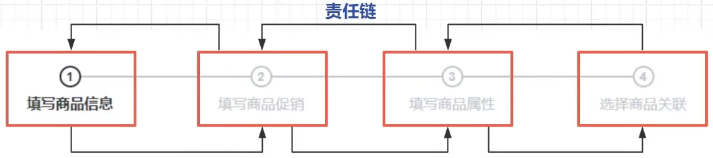

# 责任链模式

> - 开闭原则：可以通过添加新的处理类来扩展处理链，而不需要修改现有处理类的代码
> - 单一职责原则：每个处理类只处理自己负责的那部分请求，处理类之间的职责是清晰的
> - 控制反转：责任链模式将请求的处理者之间的控制关系进行了反转，请求的发送者并不直接指定接收者，而是由链来决定

## 示例代码

> 
>
> 如果需要新增一个策略，只需要继承`IHandlerClass`并重写`handler`方法，再指定`@Order`的值即可

IHandler.java

```java
/**
 * 责任链抽象节点逻辑处理接口
 *
 * @param <T> 方法参数
 * @param <R> 方法返回值
 */
public interface IHandler<T, R> {

    /**
     * 节点处理逻辑接口
     *
     * @param t 方法参数
     * @return 方法返回值
     */
    R handler(T t) throws Exception;
}
```

IHandlerClass.java

```java
/**
 * 责任链抽象类
 *
 * @param <T> 方法参数
 * @param <R> 方法返回值
 */
public abstract class IHandlerClass<T, R> implements IHandler<T, R> {

    /**
     * 下一个节点对象
     */
    public IHandlerClass<T, R> nextHandler;

    /**
     * 设置下一个节点
     *
     * @param nextHandler 下一个节点对象
     */
    public void setNextHandler(IHandlerClass<T, R> nextHandler) {
        this.nextHandler = nextHandler;
    }

    /**
     * 判断是否还有下一个节点
     *
     * @return 返回判断结果
     */
    public boolean hasNext() {
        return this.nextHandler != null;
    }

    /**
     * 节点连接逻辑
     *
     * @param t 方法参数
     * @return 方法执行结果
     */
    public R next(T t) throws Exception {
        // 执行节点逻辑
        R handler = this.handler(t);
        // 判断是否具有下一个节点
        if (hasNext()) {
            return nextHandler.next(t);
        } else {
            return handler;
        }
    }
}
```

HandlerChainFactory.java

```java
import com.cbec.chain.IHandlerClass;
import io.jsonwebtoken.lang.Assert;
import org.springframework.beans.factory.annotation.Autowired;
import org.springframework.stereotype.Component;

import java.util.List;

/**
 * 责任链工厂
 *
 * @param <T> 方法参数
 * @param <R> 方法返回值
 */
@Component
public class HandlerChainFactory<T, R> {

    private final IHandlerClass<T, R> first;

    @Autowired
    public HandlerChainFactory(List<IHandlerClass<T, R>> iHandlerList) {
        Assert.notEmpty(iHandlerList, "无责任实现bean");
        this.first = iHandlerList.get(0);
        for (int i = 0; i < iHandlerList.size() - 1; i++) {
            iHandlerList.get(i).setNextHandler(iHandlerList.get(i + 1));
        }
    }

    /**
     * 执行责任链处理逻辑
     *
     * @param t 方法参数
     * @return 方法返回值
     */
    public R executeHandler(T t) {
        try {
            return first.next(t);
        } catch (Exception e) {
            System.out.println("执行出错：" + e.getMessage());
        }
        return null;
    }
}
```

责任链节点1`ProductNameHandler.java`

```java
import com.cbec.chain.IHandlerClass;
import com.cbec.pojo.ProductDto;
import org.springframework.core.annotation.Order;
import org.springframework.stereotype.Component;

@Component
@Order(1)
public class ProductNameHandler extends IHandlerClass<ProductDto, Boolean> {
    @Override
    public Boolean handler(ProductDto productDto) throws Exception {
        String goodsName = productDto.getGoodsName();
        System.out.println("商品名称：" + goodsName + "----");
        if (goodsName.length() > 3) {
            throw new Exception("商品名称过长");
        }
        return true;
    }
}
```

责任链节点2`ProductPriceHandler.java`

```java
import com.cbec.chain.IHandlerClass;
import com.cbec.pojo.ProductDto;
import org.springframework.core.annotation.Order;
import org.springframework.stereotype.Component;

@Component
@Order(2)
public class ProductPriceHandler extends IHandlerClass<ProductDto, Boolean> {
    @Override
    public Boolean handler(ProductDto productDto) throws Exception {
        String goodsPrice = productDto.getGoodsPrice();
        System.out.println("商品价格：" + goodsPrice + "----");
        if (goodsPrice.length() > 2) {
            throw new Exception("商品价格过高");
        }
        return true;
    }
}
```

ProductDto.java

```java
public class ProductDto {
    private String goodsName;
    private String goodsPrice;

    public ProductDto(String goodsName, String goodsPrice) {
        this.goodsName = goodsName;
        this.goodsPrice = goodsPrice;
    }

    public String getGoodsName() {
        return goodsName;
    }

    public void setGoodsName(String goodsName) {
        this.goodsName = goodsName;
    }

    public String getGoodsPrice() {
        return goodsPrice;
    }

    public void setGoodsPrice(String goodsPrice) {
        this.goodsPrice = goodsPrice;
    }
}
```

ChainTestController.java

```java
@Controller
public class ChainTestController {

    @Autowired
    private HandlerChainFactory<ProductDto, Boolean> handlerChainFactory;

    @PostConstruct
    public void chainTest() {
        ProductDto productDto1 = new ProductDto("测试", "20");
        Boolean result1 = handlerChainFactory.executeHandler(productDto1);
        System.out.println("责任链执行结果：" + result1 + "\n");
        ProductDto productDto2 = new ProductDto("测试商品", "20");
        Boolean result2 = handlerChainFactory.executeHandler(productDto2);
        System.out.println("责任链执行结果：" + result2 + "\n");
        ProductDto productDto3 = new ProductDto("测试", "200");
        Boolean result3 = handlerChainFactory.executeHandler(productDto3);
        System.out.println("责任链执行结果：" + result3 + "\n");
    }
}
```

> ```
> 商品名称：测试----
> 商品价格：20----
> 责任链执行结果：true
> 
> 商品名称：测试商品----
> 执行出错：商品名称过长
> 责任链执行结果：null
> 
> 商品名称：测试----
> 商品价格：200----
> 执行出错：商品价格过高
> 责任链执行结果：null
> 
> ```