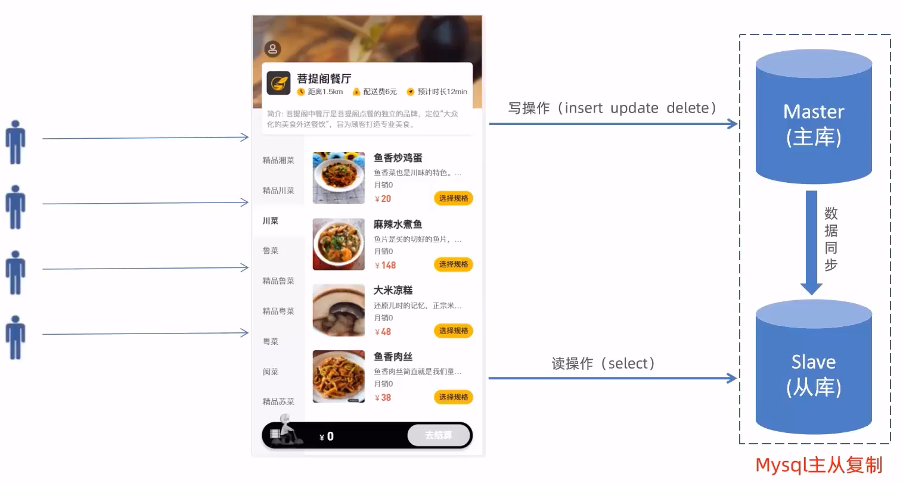
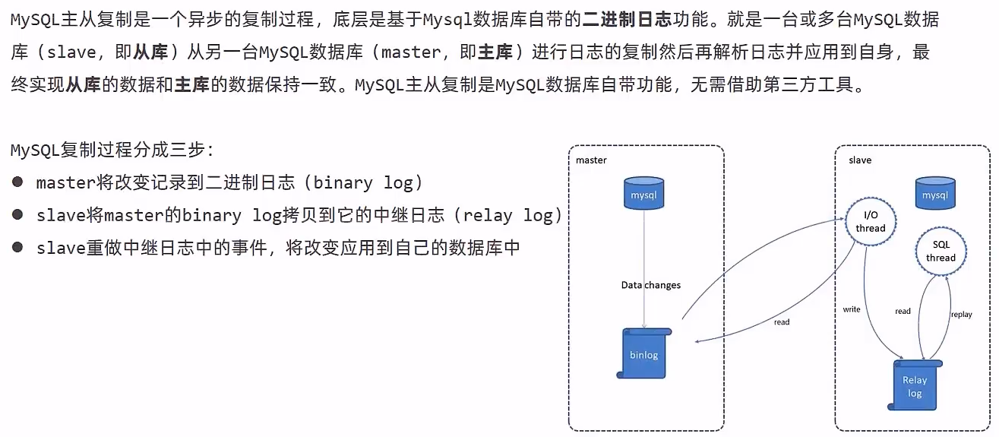
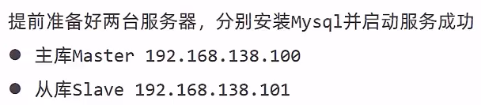
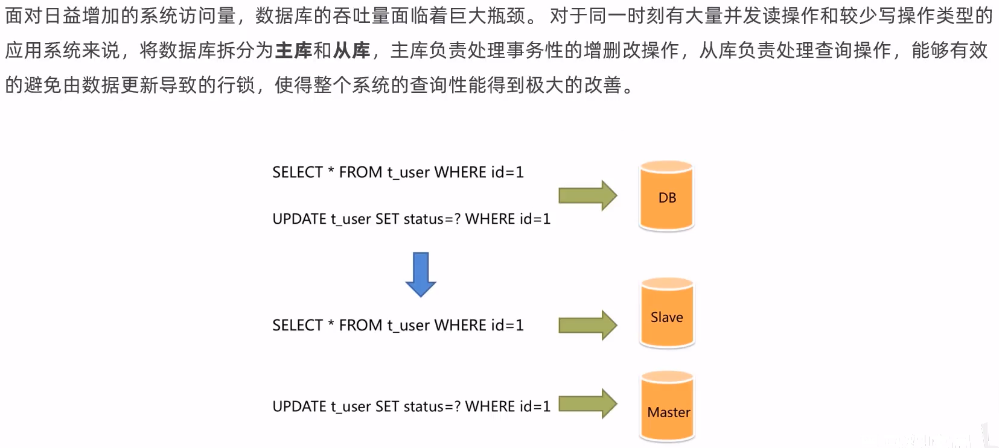
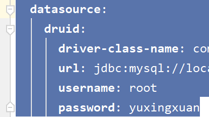
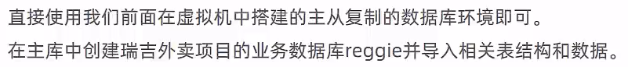
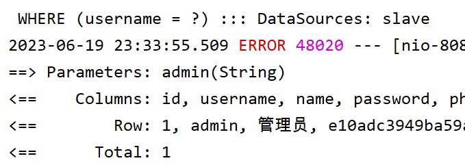
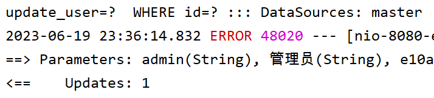

# 读写分离



## Mysql主从复制



复制一个虚拟机，依次配置好主库和从库，用于主从复制



## 读写分离案例



## 项目实现读写分离

> 创建分支v1.1用于测试，功能正常后合并到主分支

配置maven

```xml
        <!-- 读写分离 -->
        <dependency>
            <groupId>org.apache.shardingsphere</groupId>
            <artifactId>sharding-jdbc-spring-boot-starter</artifactId>
            <version>4.0.0-RC1</version>
        </dependency>
```

配置application.yml

```yaml
spring:
  shardingsphere:
    datasource:
      names:
        master,slave
      # 主数据源
      master:
        type: com.alibaba.druid.pool.DruidDataSource
        driver-class-name: com.mysql.cj.jdbc.Driver
        url: jdbc:mysql://192.168.138.100:3306/reggie?characterEncoding=utf-8
        username: root
        password: root
      # 从数据源
      slave:
        type: com.alibaba.druid.pool.DruidDataSource
        driver-class-name: com.mysql.cj.jdbc.Driver
        url: jdbc:mysql://192.168.138.101:3306/reggie?characterEncoding=utf-8
        username: root
        password: root
    masterslave:
      # 读写分离配置
      load-balance-algorithm-type: round_robin #从库轮询
      # 最终的数据源名称
      name: dataSource
      # 主库数据源名称
      master-data-source-name: master
      # 从库数据源名称列表，多个逗号分隔
      slave-data-source-names: slave
    props:
      sql:
        show: true #开启SQL显示，默认false
  main:
    allow-bean-definition-overriding: true
```

删除application.yml原本的datesource



配置数据库



> 对于查询操作
>
> 
>
> 对于写操作
>
> 
