# 前后端分离

## 存在的问题

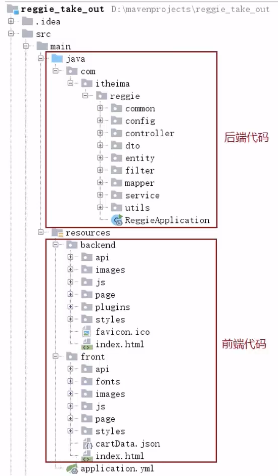


## 前后端分离开发


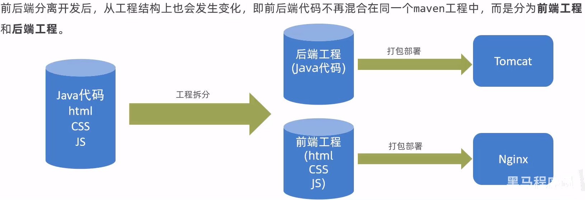

开发流程

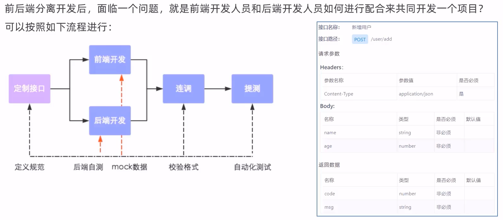

> 接口(API接口)就是一个http的请求地址，主要就是去定义：请求路径、请求方式、请求参数、响应数据等内容

前端技术栈

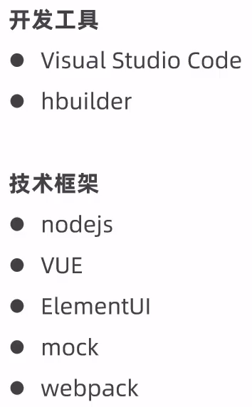

## Yapi

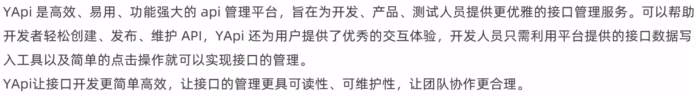

部署方式

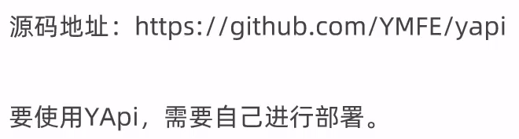

使用方式


## Swagger

> 创建新的分支v1.2，在1.2版本上面进行测试，功能无误后合并到主分支

添加注解后运行效果

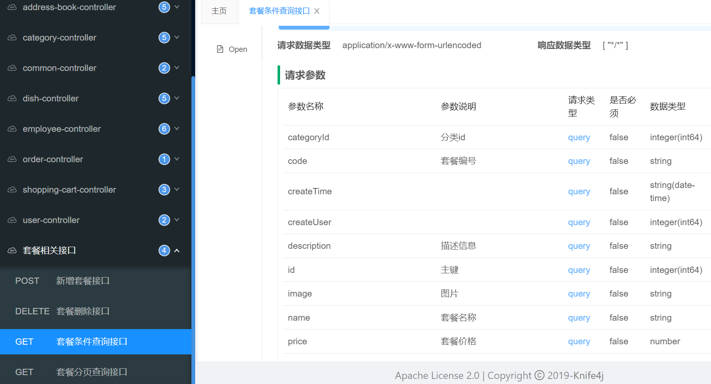

## 项目部署

### 部署结构

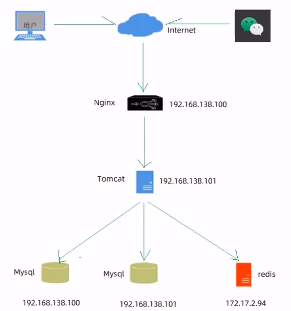

> 这里用的是远程的Redis，自己部署时Redis就用本地的

### 部署环境说明

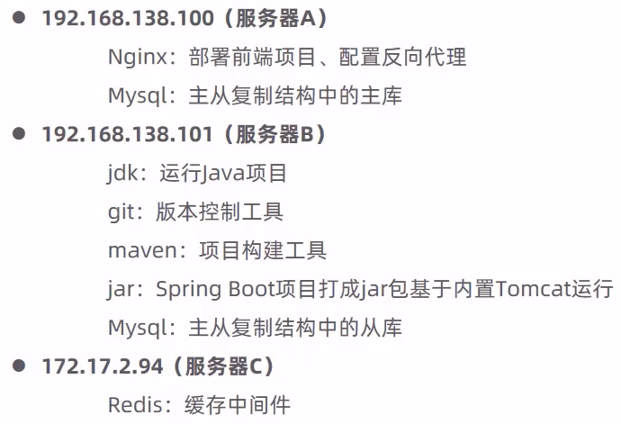

### 部署前端项目(100)

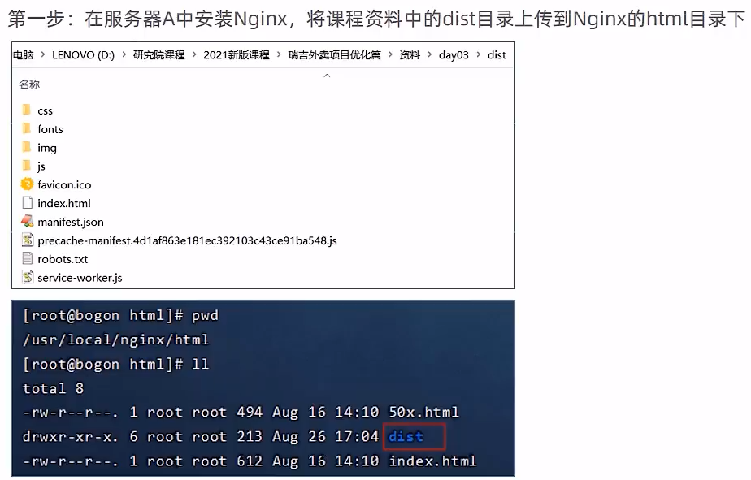

```
cd /usr/local/nginx/html
```

修改Nginx配置文件nginx.conf

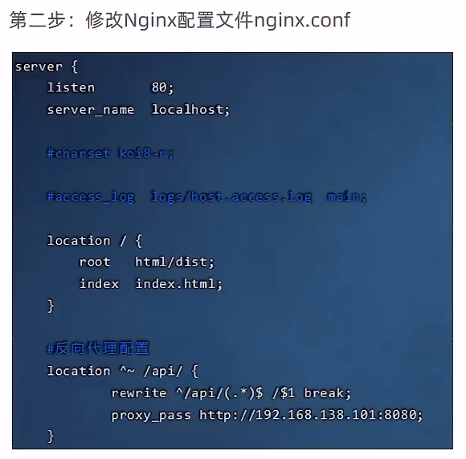

```
vim /usr/local/nginx/conf/nginx.conf


        location / {
            root  html/dist;
            index index.html;
        }

        # 反向代理配置
        location ^~ /api/ {
            rewrite ^/api/(.*)$ /$1 break;
            proxy_pass http://192.168.138.101:8080;
        }

nginx
```

### 部署后端项目(101)

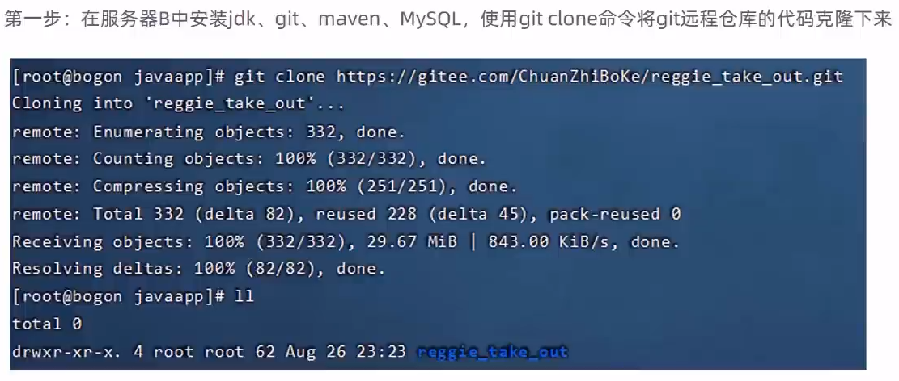

```
mkdir /usr/local/javaapp
cd /usr/local/javaapp

git clone https://gitee.com/yxx7318/reggie_take_out.git
```

> 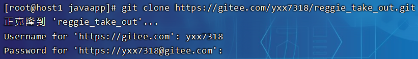

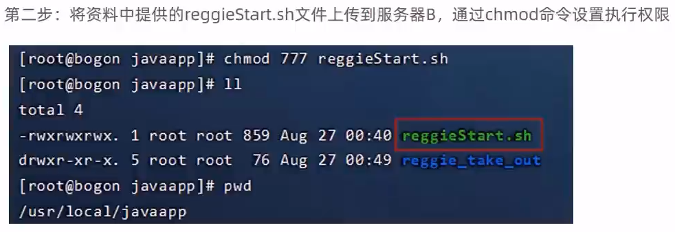

```
cd /usr/local/javaapp
```

```sh
#!/bin/sh
echo =================================
echo  自动化部署脚本启动
echo =================================

echo 停止原来运行中的工程
APP_NAME=reggie_take_out

tpid=`ps -ef|grep $APP_NAME|grep -v grep|grep -v kill|awk '{print $2}'`
if [ ${tpid} ]; then
    echo 'Stop Process...'
    kill -15 $tpid
fi
sleep 2
tpid=`ps -ef|grep $APP_NAME|grep -v grep|grep -v kill|awk '{print $2}'`
if [ ${tpid} ]; then
    echo 'Kill Process!'
    kill -9 $tpid
else
    echo 'Stop Success!'
fi

echo 准备从Git仓库拉取最新代码
cd /usr/local/javaapp/reggie_take_out

echo 开始从Git仓库拉取最新代码
git pull
echo 代码拉取完成

echo 开始打包
output=`mvn clean package -Dmaven.test.skip=true`

cd target

echo 启动项目
nohup java -jar reggie_take_out-1.0-SNAPSHOT.jar &> reggie_take_out.log &
echo 项目启动完成
```

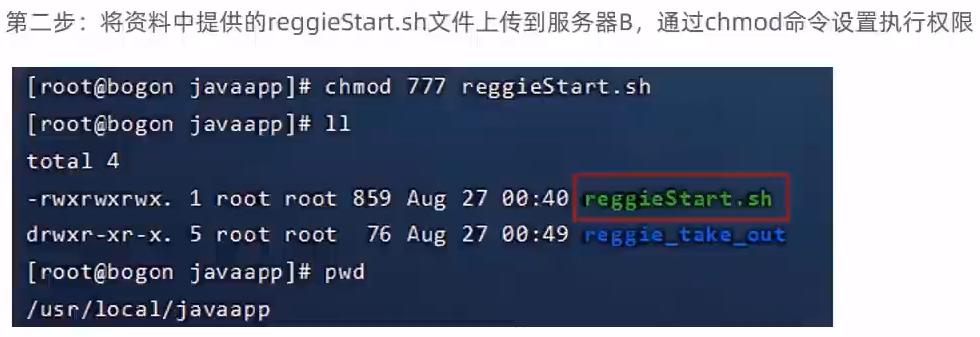

```
chmod 777 reggieStart.sh
```

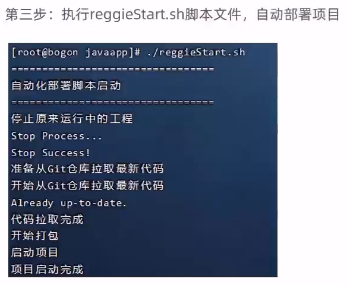

```
./reggieStart.sh

ps -ef | grep java
```

### 解决项目名称、图片异常和Redis问题

启动Redis(连接密码123456)

```
cd /usr/local/redis-4.0.0
src/redis-server ./redis.conf
```

修改pom.xml(决定最终的打成的jar包名称)

```xml
    <artifactId>reggie_take_out</artifactId>
```

修改applications.yml

```yaml


spring:
  application:
    #应用的名称，可选
    name: reggie_take_out
  redis:
    host: 127.0.0.1
    port: 6379
    password: 123456


reggie:
  path: "/usr/local/img/"
```

上传图片到对应目录下

```
mkdir /usr/local/img/
cd /usr/local/img/
```

重新启动

```
cd /usr/local/javaapp
./reggieStart.sh
```

> 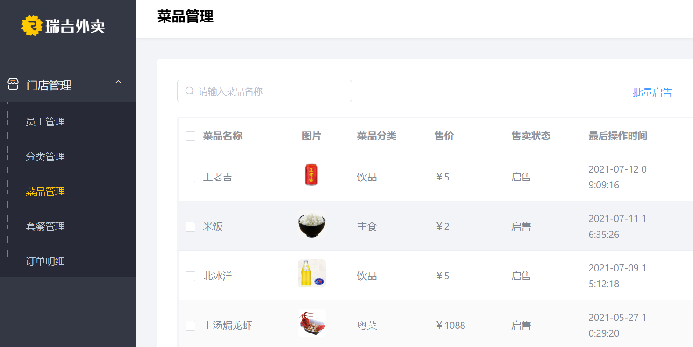
