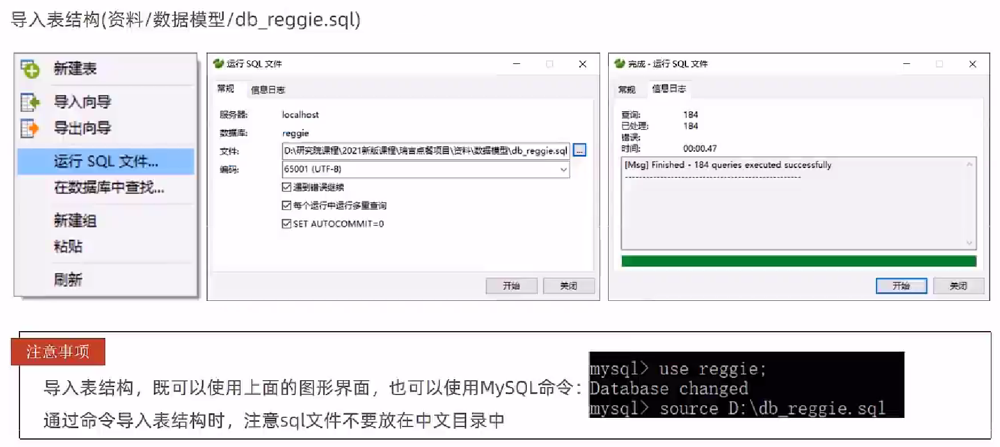
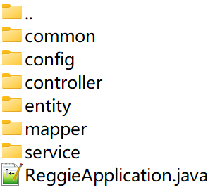

# 开发环境搭建

## 数据库环境搭建



建库后运行


### 数据表


## 创建IDEA项目

创建Maven项目，导入pom.xml和application.yml


打开pom.xml除了这里不要复制，其余拿过去


复制application.yml到resources目录下，将其中应用的name修改为项目名称，数据库连接为自己的


## 导入前端资源

将两个目录放在recourses目录下(**SpringMVC默认目录为recourses/static，后面会进行静态资源映射来生效**)


访问`http://localhost:8080/backend/index.html`


## 导入后端资源

在代码目录下导入day01里面的数据



创建主程序ReggieApplication.java


## 代码模板

### R.java

```java
package com.itheima.reggie.common;

import lombok.Data;
import java.util.HashMap;
import java.util.Map;

/**
 * 通用返回结果，服务端响应的数据最终都会封装成此对象
 * @param <T>
 */
@Data
public class R<T> {

    private Integer code; //编码：1成功，0和其它数字为失败

    private String msg; //错误信息

    private T data; //数据

    private Map map = new HashMap(); //动态数据

    public static <T> R<T> success(T object) {
        R<T> r = new R<T>();
        r.data = object;
        r.code = 1;
        return r;
    }

    public static <T> R<T> error(String msg) {
        R r = new R();
        r.msg = msg;
        r.code = 0;
        return r;
    }

    public R<T> add(String key, Object value) {
        this.map.put(key, value);
        return this;
    }

}
```

### WebMvcConfig.java

```java
package com.itheima.reggie.config;

import lombok.extern.slf4j.Slf4j;
import org.springframework.context.annotation.Configuration;
import org.springframework.web.servlet.config.annotation.ResourceHandlerRegistry;
import org.springframework.web.servlet.config.annotation.WebMvcConfigurationSupport;

@Slf4j
@Configuration
public class WebMvcConfig extends WebMvcConfigurationSupport {
    /**
     * 设置静态资源映射
     * @param registry
     */
    @Override
    protected void addResourceHandlers(ResourceHandlerRegistry registry) {
        log.info("开始进行静态资源映射...");
        registry.addResourceHandler("/backend/**").addResourceLocations("classpath:/backend/");
        registry.addResourceHandler("/front/**").addResourceLocations("classpath:/front/");
    }
}
```

