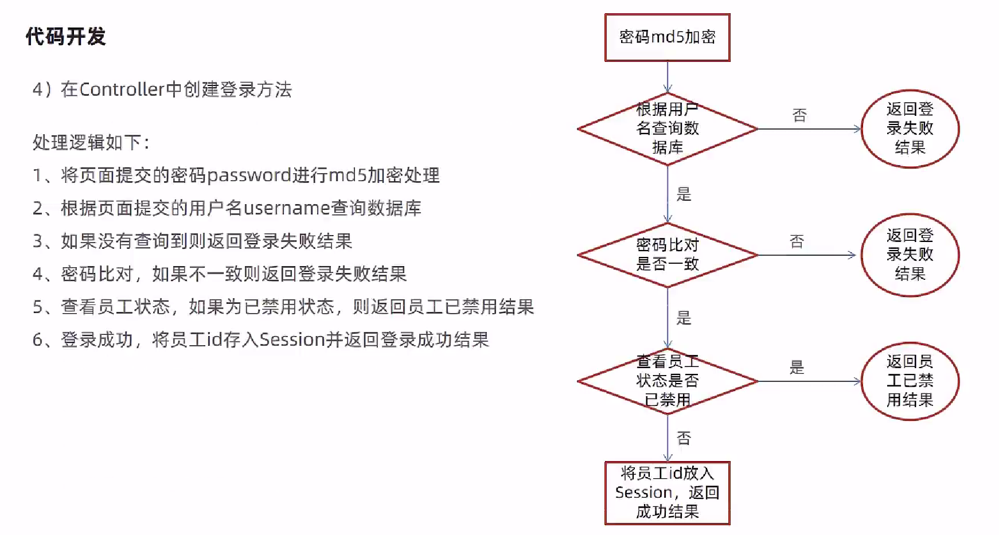
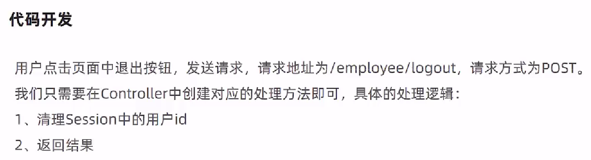
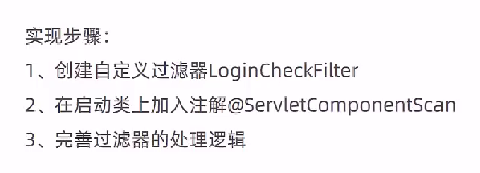
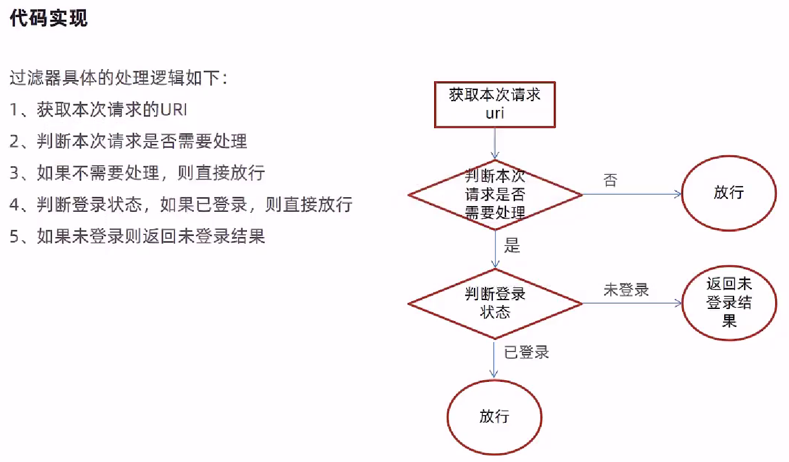

# 后台登录功能开发

## 登录功能开发思路



## 退出功能开发思路



EmployeeController.java

```java
package com.itheima.reggie.controller;

import com.baomidou.mybatisplus.core.conditions.query.LambdaQueryWrapper;
import com.itheima.reggie.common.R;
import com.itheima.reggie.entity.Employee;
import com.itheima.reggie.service.EmployeeService;
import lombok.extern.slf4j.Slf4j;
import org.springframework.beans.factory.annotation.Autowired;
import org.springframework.util.DigestUtils;
import org.springframework.web.bind.annotation.PostMapping;
import org.springframework.web.bind.annotation.RequestBody;
import org.springframework.web.bind.annotation.RequestMapping;
import org.springframework.web.bind.annotation.RestController;

import javax.servlet.http.HttpServletRequest;

@Slf4j
@RestController
@RequestMapping("/employee")
public class EmployeeController {

    @Autowired
    private EmployeeService employeeService;

    /**
     * 员工登录
     * @param request
     * @param employee
     * @return
     */
    @PostMapping("/login")
    public R<Employee> login(HttpServletRequest request,@RequestBody Employee employee){

        //1、将页面提交的密码password进行md5加密处理
        String password = employee.getPassword();
        password = DigestUtils.md5DigestAsHex(password.getBytes());

        //2、根据页面提交的用户名username查询数据库
        LambdaQueryWrapper<Employee> queryWrapper = new LambdaQueryWrapper<>();
        queryWrapper.eq(Employee::getUsername,employee.getUsername());
        Employee emp = employeeService.getOne(queryWrapper);

        //3、如果没有查询到则返回登录失败结果
        if(emp == null){
            return R.error("登录失败");
        }

        //4、密码比对，如果不一致则返回登录失败结果
        if(!emp.getPassword().equals(password)){
            return R.error("登录失败");
        }

        //5、查看员工状态，如果为已禁用状态，则返回员工已禁用结果
        if(emp.getStatus() == 0){
            return R.error("账号已禁用");
        }

        //6、登录成功，将员工id存入Session并返回登录成功结果
        request.getSession().setAttribute("employee",emp.getId());
        return R.success(emp);
    }

    /**
     * 员工退出
     * @param request
     * @return
     */
    @PostMapping("/logout")
    public R<String> logout(HttpServletRequest request){
        //清理Session中保存的当前登录员工的id
        request.getSession().removeAttribute("employee");
        return R.success("退出成功");
    }
}
```

## 完善登录功能

用户如果不登录，直接访问系统首页，照样可以正常访问，应该是在登录成功之后才跳转到登录页面





LoginCheckFilter.java

```java
package com.itheima.reggie.filter;

import com.alibaba.fastjson.JSON;
import com.itheima.reggie.common.R;
import lombok.extern.slf4j.Slf4j;
import org.springframework.util.AntPathMatcher;

import javax.servlet.*;
import javax.servlet.annotation.WebFilter;
import javax.servlet.http.HttpServletRequest;
import javax.servlet.http.HttpServletResponse;
import java.io.IOException;

/**
 * 检查用户是否已经完成登录
 */
@WebFilter(filterName = "loginCheckFilter",urlPatterns = "/*")
@Slf4j
public class LoginCheckFilter implements Filter{
    //路径匹配器，支持通配符
    public static final AntPathMatcher PATH_MATCHER = new AntPathMatcher();

    @Override
    public void doFilter(ServletRequest servletRequest, ServletResponse servletResponse, FilterChain filterChain) throws IOException, ServletException {
        HttpServletRequest request = (HttpServletRequest) servletRequest;
        HttpServletResponse response = (HttpServletResponse) servletResponse;

        //1、获取本次请求的URI
        String requestURI = request.getRequestURI();// /backend/index.html

        log.info("拦截到请求：{}",requestURI);

        //定义不需要处理的请求路径
        String[] urls = new String[]{
                "/employee/login",
                "/employee/logout",
                "/backend/**",
                "/front/**"
        };


        //2、判断本次请求是否需要处理
        boolean check = check(urls, requestURI);

        //3、如果不需要处理，则直接放行
        if(check){
            log.info("本次请求{}不需要处理",requestURI);
            filterChain.doFilter(request,response);
            return;
        }

        //4、判断登录状态，如果已登录，则直接放行
        if(request.getSession().getAttribute("employee") != null){
            log.info("用户已登录，用户id为：{}",request.getSession().getAttribute("employee"));
            filterChain.doFilter(request,response);
            return;
        }

        log.info("用户未登录");
        //5、如果未登录则返回未登录结果，通过输出流方式向客户端页面响应数据
        response.getWriter().write(JSON.toJSONString(R.error("NOTLOGIN")));
        return;

    }

    /**
     * 路径匹配，检查本次请求是否需要放行
     * @param urls
     * @param requestURI
     * @return
     */
    public boolean check(String[] urls,String requestURI){
        for (String url : urls) {
            boolean match = PATH_MATCHER.match(url, requestURI);
            if(match){
                return true;
            }
        }
        return false;
    }
}
```

> ReggieApplication.java主程序类需要添加`@ServletComponentScan`注解进行扫描

