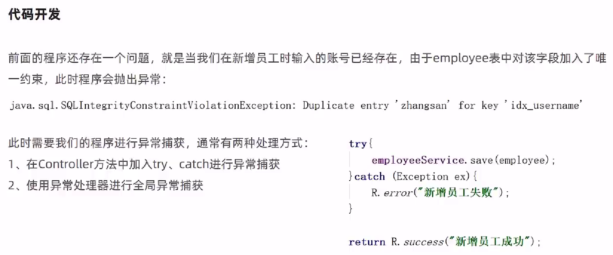

# 员工管理业务开发

## 添加员工


EmployeeController.java

```java
    /**
     * 新增员工
     * @param employee
     * @return
     */
    @PostMapping
    public R<String> save(HttpServletRequest request,@RequestBody Employee employee){
        log.info("新增员工，员工信息：{}",employee.toString());

        //设置初始密码123456，需要进行md5加密处理
        employee.setPassword(DigestUtils.md5DigestAsHex("123456".getBytes()));

        employee.setCreateTime(LocalDateTime.now());
        employee.setUpdateTime(LocalDateTime.now());

        //获得当前登录用户的id
        Long empId = (Long) request.getSession().getAttribute("employee");

        employee.setCreateUser(empId);
        employee.setUpdateUser(empId);

        employeeService.save(employee);

        return R.success("新增员工成功");
    }
```

### 异常处理

如果会存在"账户"相同会因为数据库主键值冲突而无法插入，可以使用异常处理器进行全局异常捕获



在common下创建GlobalExceptionHandler.java

```java
package com.itheima.reggie.common;

import lombok.extern.slf4j.Slf4j;
import org.springframework.stereotype.Controller;
import org.springframework.web.bind.annotation.ControllerAdvice;
import org.springframework.web.bind.annotation.ExceptionHandler;
import org.springframework.web.bind.annotation.ResponseBody;
import org.springframework.web.bind.annotation.RestController;

import java.sql.SQLIntegrityConstraintViolationException;

/**
 * 全局异常处理
 */
@ControllerAdvice(annotations = {RestController.class, Controller.class})
@ResponseBody
@Slf4j
public class GlobalExceptionHandler {

    /**
     * 异常处理方法
     * @return
     */
    @ExceptionHandler(SQLIntegrityConstraintViolationException.class)
    public R<String> exceptionHandler(SQLIntegrityConstraintViolationException ex){
        log.error(ex.getMessage());

        if(ex.getMessage().contains("Duplicate entry")){
            String[] split = ex.getMessage().split(" ");
            String msg = split[2] + "已存在";
            return R.error(msg);
        }

        return R.error("未知错误");
    }
}
```

## 分页查询


MybatisPlusConfig.java

```java
package com.itheima.reggie.config;

import com.baomidou.mybatisplus.extension.plugins.MybatisPlusInterceptor;
import com.baomidou.mybatisplus.extension.plugins.inner.PaginationInnerInterceptor;
import org.springframework.context.annotation.Bean;
import org.springframework.context.annotation.Configuration;

/**
 * 配置MP的分页插件
 */
@Configuration
public class MybatisPlusConfig {

    @Bean
    public MybatisPlusInterceptor mybatisPlusInterceptor(){
        MybatisPlusInterceptor mybatisPlusInterceptor = new MybatisPlusInterceptor();
        mybatisPlusInterceptor.addInnerInterceptor(new PaginationInnerInterceptor());
        return mybatisPlusInterceptor;
    }
}
```

EmployeeController.java

```java
    /**
     * 员工信息分页查询
     * @param page
     * @param pageSize
     * @param name
     * @return
     */
    @GetMapping("/page")
    public R<Page> page(int page,int pageSize,String name){
        log.info("page = {},pageSize = {},name = {}" ,page,pageSize,name);

        //构造分页构造器
        Page pageInfo = new Page(page,pageSize);

        //构造条件构造器
        LambdaQueryWrapper<Employee> queryWrapper = new LambdaQueryWrapper();
        //添加过滤条件
        queryWrapper.like(StringUtils.isNotEmpty(name),Employee::getName,name);
        //添加排序条件
        queryWrapper.orderByDesc(Employee::getUpdateTime);

        //执行查询
        employeeService.page(pageInfo,queryWrapper);

        return R.success(pageInfo);
    }
```

> 如果显示的条数异常，需要使用Maven重新进行打包再启动即可

## 启用/禁用员工账号


功能测试


代码修复


解决方式


复制对象映射器到commen目录下


然后在WebMvcConfig.java中开启

```java
    /**
     * 扩展mvc框架的消息转换器
     * @param converters
     */
    @Override
    protected void extendMessageConverters(List<HttpMessageConverter<?>> converters) {
        log.info("扩展消息转换器...");
        //创建消息转换器对象
        MappingJackson2HttpMessageConverter messageConverter = new MappingJackson2HttpMessageConverter();
        //设置对象转换器，底层使用Jackson将Java对象转为json
        messageConverter.setObjectMapper(new JacksonObjectMapper());
        //将上面的消息转换器对象追加到mvc框架的转换器集合中
        converters.add(0,messageConverter);
    }
```

> 如果重启无法打开网页，则使用Maven重新打包

### JacksonObjectMapper.java

```java
package com.itheima.reggie.common;

import com.fasterxml.jackson.databind.DeserializationFeature;
import com.fasterxml.jackson.databind.ObjectMapper;
import com.fasterxml.jackson.databind.module.SimpleModule;
import com.fasterxml.jackson.databind.ser.std.ToStringSerializer;
import com.fasterxml.jackson.datatype.jsr310.deser.LocalDateDeserializer;
import com.fasterxml.jackson.datatype.jsr310.deser.LocalDateTimeDeserializer;
import com.fasterxml.jackson.datatype.jsr310.deser.LocalTimeDeserializer;
import com.fasterxml.jackson.datatype.jsr310.ser.LocalDateSerializer;
import com.fasterxml.jackson.datatype.jsr310.ser.LocalDateTimeSerializer;
import com.fasterxml.jackson.datatype.jsr310.ser.LocalTimeSerializer;
import java.math.BigInteger;
import java.time.LocalDate;
import java.time.LocalDateTime;
import java.time.LocalTime;
import java.time.format.DateTimeFormatter;
import static com.fasterxml.jackson.databind.DeserializationFeature.FAIL_ON_UNKNOWN_PROPERTIES;

/**
 * 对象映射器:基于jackson将Java对象转为json，或者将json转为Java对象
 * 将JSON解析为Java对象的过程称为 [从JSON反序列化Java对象]
 * 从Java对象生成JSON的过程称为 [序列化Java对象到JSON]
 */
public class JacksonObjectMapper extends ObjectMapper {

    public static final String DEFAULT_DATE_FORMAT = "yyyy-MM-dd";
    public static final String DEFAULT_DATE_TIME_FORMAT = "yyyy-MM-dd HH:mm:ss";
    public static final String DEFAULT_TIME_FORMAT = "HH:mm:ss";

    public JacksonObjectMapper() {
        super();
        //收到未知属性时不报异常
        this.configure(FAIL_ON_UNKNOWN_PROPERTIES, false);

        //反序列化时，属性不存在的兼容处理
        this.getDeserializationConfig().withoutFeatures(DeserializationFeature.FAIL_ON_UNKNOWN_PROPERTIES);


        SimpleModule simpleModule = new SimpleModule()
                .addDeserializer(LocalDateTime.class, new LocalDateTimeDeserializer(DateTimeFormatter.ofPattern(DEFAULT_DATE_TIME_FORMAT)))
                .addDeserializer(LocalDate.class, new LocalDateDeserializer(DateTimeFormatter.ofPattern(DEFAULT_DATE_FORMAT)))
                .addDeserializer(LocalTime.class, new LocalTimeDeserializer(DateTimeFormatter.ofPattern(DEFAULT_TIME_FORMAT)))

                .addSerializer(BigInteger.class, ToStringSerializer.instance)
                .addSerializer(Long.class, ToStringSerializer.instance)
                .addSerializer(LocalDateTime.class, new LocalDateTimeSerializer(DateTimeFormatter.ofPattern(DEFAULT_DATE_TIME_FORMAT)))
                .addSerializer(LocalDate.class, new LocalDateSerializer(DateTimeFormatter.ofPattern(DEFAULT_DATE_FORMAT)))
                .addSerializer(LocalTime.class, new LocalTimeSerializer(DateTimeFormatter.ofPattern(DEFAULT_TIME_FORMAT)));

        //注册功能模块 例如，可以添加自定义序列化器和反序列化器
        this.registerModule(simpleModule);
    }
}
```

## 编辑员工信息


EmployeeController.java

```java
    /**
     * 根据id查询员工信息
     * @param id
     * @return
     */
    @GetMapping("/{id}")
    public R<Employee> getById(@PathVariable Long id){
        log.info("根据id查询员工信息...");
        Employee employee = employeeService.getById(id);
        if(employee != null){
            return R.success(employee);
        }
        return R.error("没有查询到对应员工信息");
    }
```

