# 分类管理

## 公共字段填充

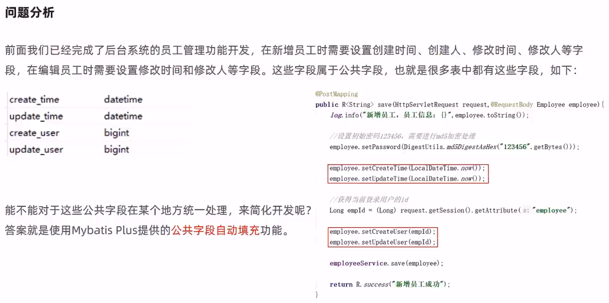

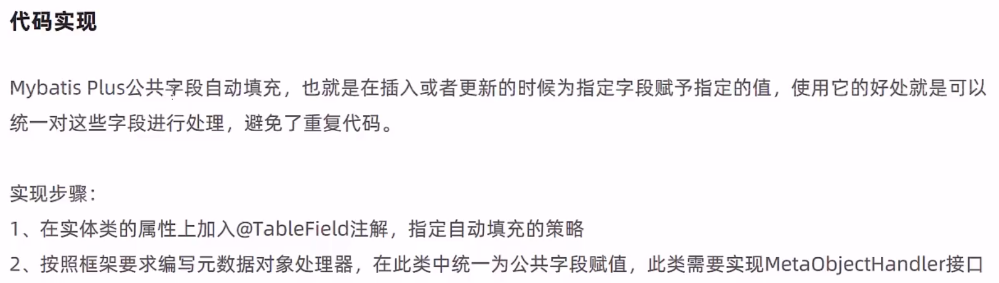

Employee.java

```java
package com.itheima.reggie.entity;

import com.baomidou.mybatisplus.annotation.FieldFill;
import com.baomidou.mybatisplus.annotation.TableField;
import lombok.Data;
import java.io.Serializable;
import java.time.LocalDateTime;

/**
 * 员工实体
 */
@Data
public class Employee implements Serializable {

    private static final long serialVersionUID = 1L;

    private Long id;

    private String username;

    private String name;

    private String password;

    private String phone;

    private String sex;

    private String idNumber;//身份证号码

    private Integer status;

    @TableField(fill = FieldFill.INSERT) //插入时填充字段
    private LocalDateTime createTime;	

    @TableField(fill = FieldFill.INSERT_UPDATE) //插入和更新时填充字段
    private LocalDateTime updateTime;

    @TableField(fill = FieldFill.INSERT) //插入时填充字段
    private Long createUser;

    @TableField(fill = FieldFill.INSERT_UPDATE) //插入和更新时填充字段
    private Long updateUser;

}
```

> 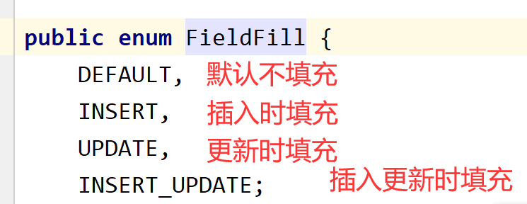

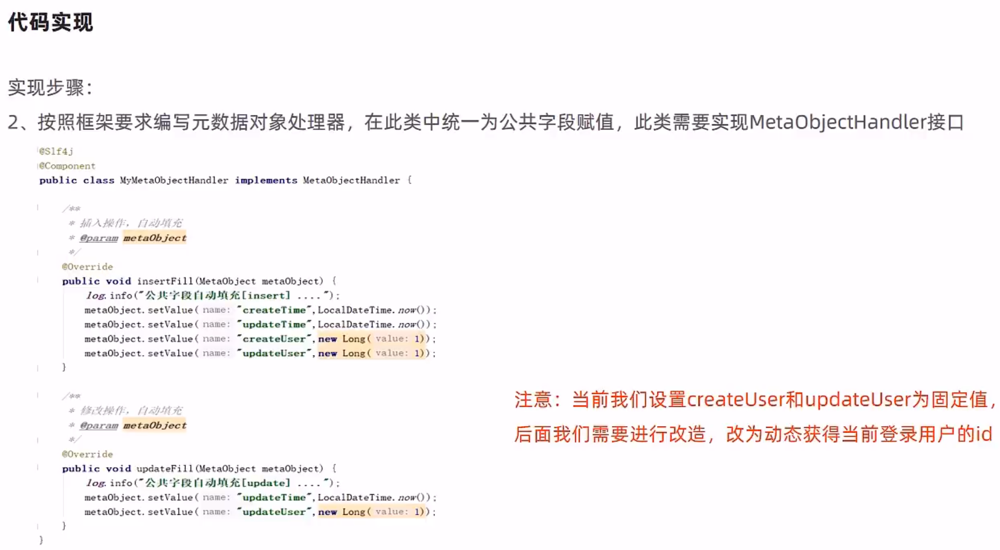

功能测试

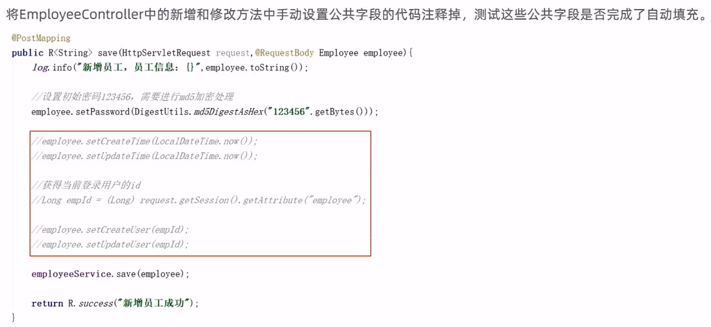

功能完善

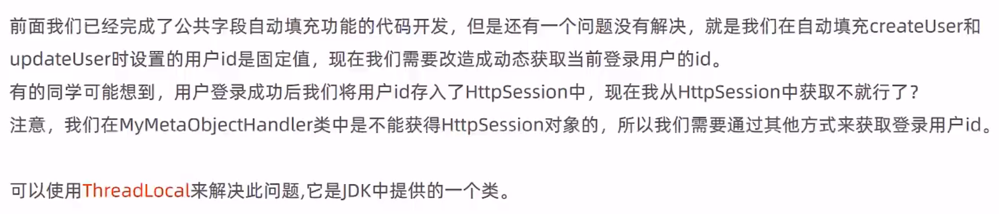

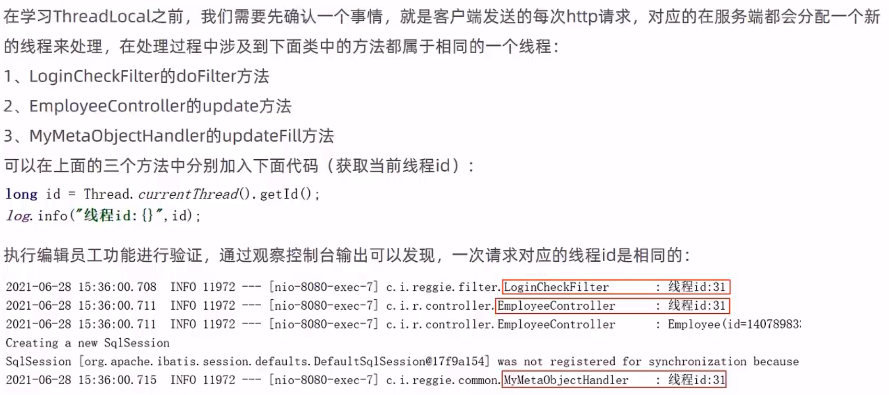

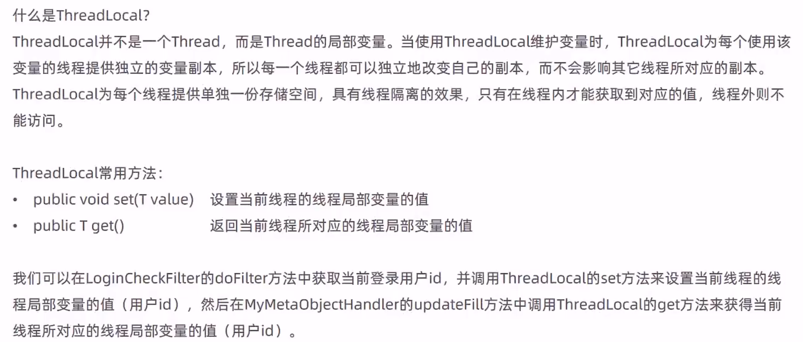

实现步骤

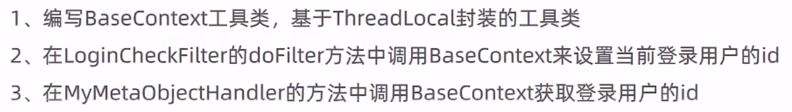

BaseContext.java

```java
package com.itheima.reggie.common;

/**
 * 基于ThreadLocal封装工具类，用户保存和获取当前登录用户id
 */
public class BaseContext {
    private static ThreadLocal<Long> threadLocal = new ThreadLocal<>();

    /**
     * 设置值
     * @param id
     */
    public static void setCurrentId(Long id){
        threadLocal.set(id);
    }

    /**
     * 获取值
     * @return
     */
    public static Long getCurrentId(){
        return threadLocal.get();
    }

    /**
     * 移除值
     */
    public static void removeCurrentId(){
        threadLocal.remove();
    }
}
```

> 因为Tomcat是通过线程池的方式去处理请求的，所以会存在线程复用的情况，也就可能会出现线程复用时数据共享到其它线程，所以最好在使用后清空数据。对于控制层方法使用，可以在拦截器的`afterCompletion(HttpServletRequest request, HttpServletResponse response, Object handler, Exception ex) throws Exception`方法(视图渲染完后)中去清除数据

MyMetaObjecthandler.java

```java
package com.itheima.reggie.common;

import com.baomidou.mybatisplus.core.handlers.MetaObjectHandler;
import lombok.extern.slf4j.Slf4j;
import org.apache.ibatis.reflection.MetaObject;
import org.springframework.stereotype.Component;
import java.time.LocalDateTime;

/**
 * 自定义元数据对象处理器
 */
@Component
@Slf4j
public class MyMetaObjecthandler implements MetaObjectHandler {
    /**
     * 插入操作，自动填充
     * @param metaObject
     */
    @Override
    public void insertFill(MetaObject metaObject) {
        log.info("公共字段自动填充[insert]...");
        log.info(metaObject.toString());
        metaObject.setValue("createTime",LocalDateTime.now());
        metaObject.setValue("updateTime",LocalDateTime.now());
        metaObject.setValue("createUser",BaseContext.getCurrentId());
        metaObject.setValue("updateUser",BaseContext.getCurrentId());
    }

    /**
     * 更新操作，自动填充
     * @param metaObject
     */
    @Override
    public void updateFill(MetaObject metaObject) {
        log.info("公共字段自动填充[update]...");
        log.info(metaObject.toString());

        long id = Thread.currentThread().getId();
        log.info("线程id为：{}",id);

        metaObject.setValue("updateTime",LocalDateTime.now());
        metaObject.setValue("updateUser",BaseContext.getCurrentId());
    }
}
```

修改LoginCheckFilter.java

```java
        //4、判断登录状态，如果已登录，则直接放行
        if(request.getSession().getAttribute("employee") != null){
            log.info("用户已登录，用户id为：{}",request.getSession().getAttribute("employee"));

            Long empId = (Long) request.getSession().getAttribute("employee");
            BaseContext.setCurrentId(empId);

            filterChain.doFilter(request,response);
            return;
        }
```

修改EmployeeController.java

```java
    /**
     * 新增员工
     * @param employee
     * @return
     */
    @PostMapping
    public R<String> save(HttpServletRequest request,@RequestBody Employee employee){
        log.info("新增员工，员工信息：{}",employee.toString());

        //设置初始密码123456，需要进行md5加密处理
        employee.setPassword(DigestUtils.md5DigestAsHex("123456".getBytes()));

        //employee.setCreateTime(LocalDateTime.now());
        //employee.setUpdateTime(LocalDateTime.now());

        //获得当前登录用户的id
        //Long empId = (Long) request.getSession().getAttribute("employee");

        //employee.setCreateUser(empId);
        //employee.setUpdateUser(empId);

        employeeService.save(employee);

        return R.success("新增员工成功");
    }


    /**
     * 根据id修改员工信息
     * @param employee
     * @return
     */
    @PutMapping
    public R<String> update(HttpServletRequest request,@RequestBody Employee employee){
        log.info(employee.toString());

        long id = Thread.currentThread().getId();
        log.info("线程id为：{}",id);
        //Long empId = (Long)request.getSession().getAttribute("employee");
        //employee.setUpdateTime(LocalDateTime.now());
        //employee.setUpdateUser(empId);
        employeeService.updateById(employee);

        return R.success("员工信息修改成功");
    }
```

## 新增分类

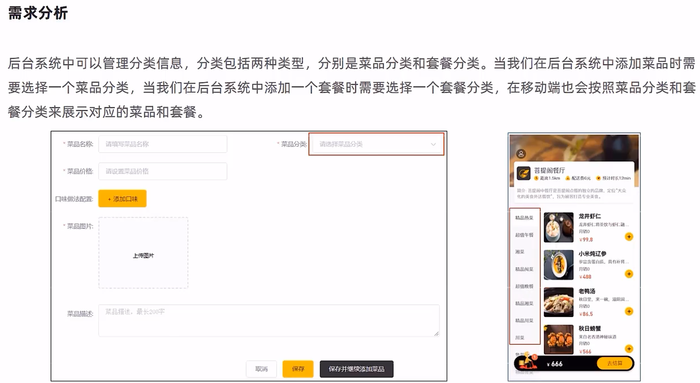

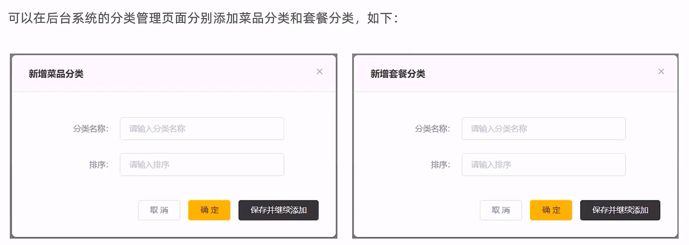

数据模型

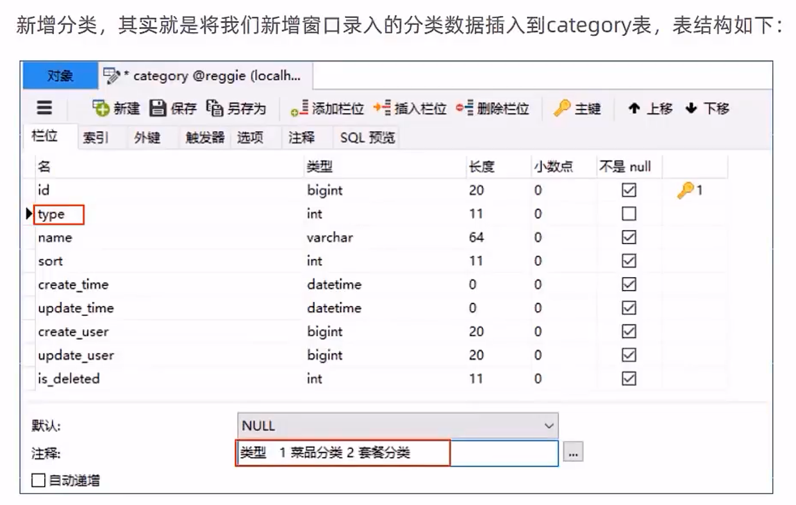

代码开发

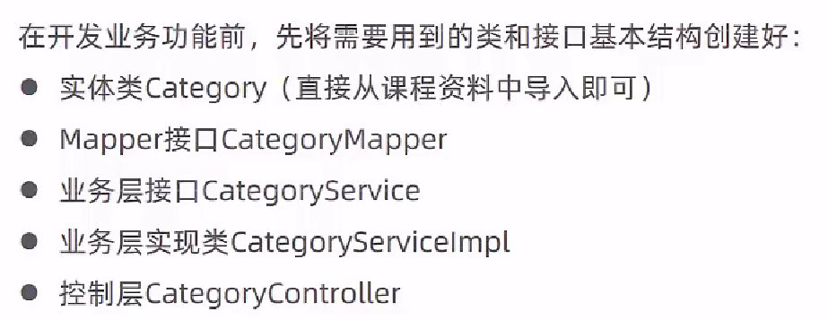

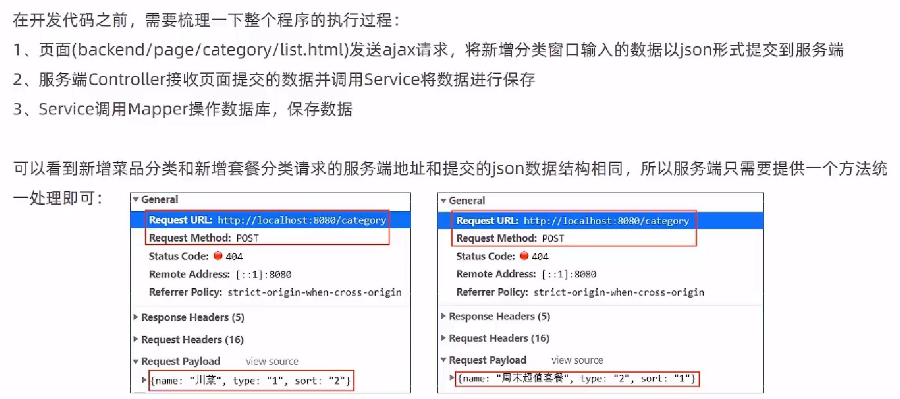

CategoryController.java

```java
/**
 * 分类管理
 */
@RestController
@RequestMapping("/category")
@Slf4j
public class CategoryController {
    @Autowired
    private CategoryService categoryService;

    /**
     * 新增分类
     * @param category
     * @return
     */
    @PostMapping
    public R<String> save(@RequestBody Category category){
        log.info("category:{}",category);
        categoryService.save(category);
        return R.success("新增分类成功");
    }
```

## 分类信息的分页查询

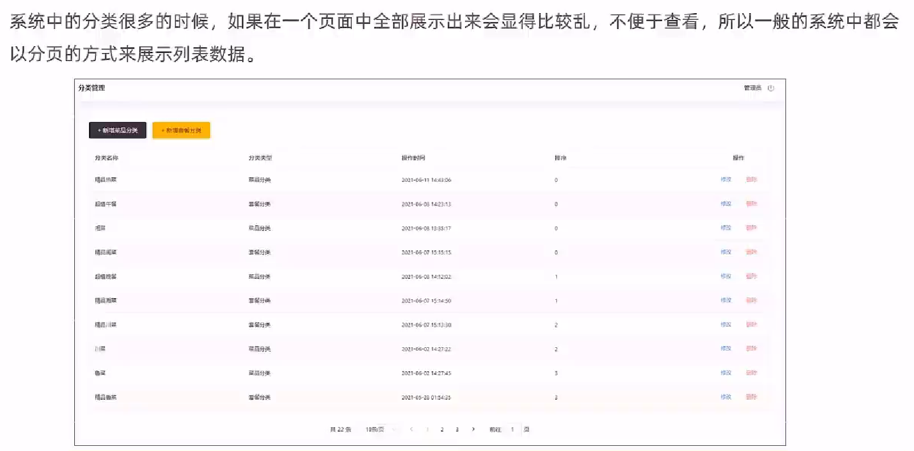

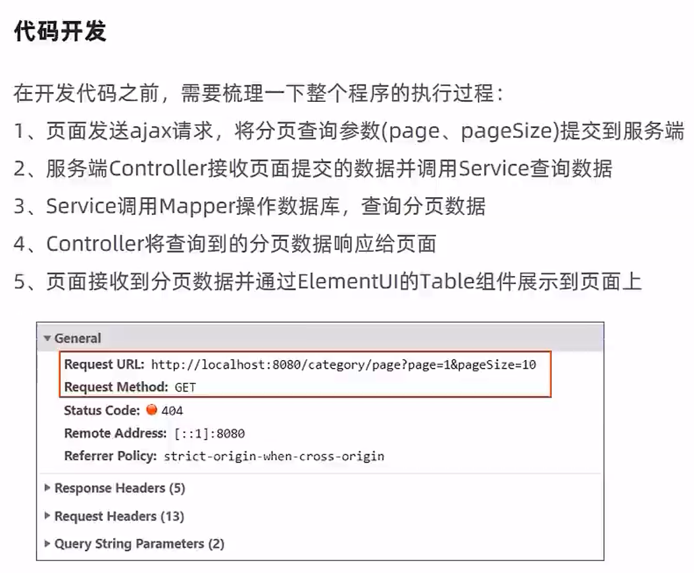

Category.java

```java
package com.itheima.reggie.entity;

import com.baomidou.mybatisplus.annotation.FieldFill;
import com.baomidou.mybatisplus.annotation.IdType;
import com.baomidou.mybatisplus.annotation.TableField;
import com.baomidou.mybatisplus.annotation.TableId;
import lombok.Data;
import lombok.Getter;
import lombok.Setter;
import java.io.Serializable;
import java.time.LocalDateTime;

/**
 * 分类
 */
@Data
public class Category implements Serializable {

    private static final long serialVersionUID = 1L;

    private Long id;


    //类型 1 菜品分类 2 套餐分类
    private Integer type;


    //分类名称
    private String name;


    //顺序
    private Integer sort;


    //创建时间
    @TableField(fill = FieldFill.INSERT)
    private LocalDateTime createTime;


    //更新时间
    @TableField(fill = FieldFill.INSERT_UPDATE)
    private LocalDateTime updateTime;


    //创建人
    @TableField(fill = FieldFill.INSERT)
    private Long createUser;


    //修改人
    @TableField(fill = FieldFill.INSERT_UPDATE)
    private Long updateUser;

}
```

CategoryController.java

```java
    /**
     * 分页查询
     * @param page
     * @param pageSize
     * @return
     */
    @GetMapping("/page")
    public R<Page> page(int page,int pageSize){
        //分页构造器
        Page<Category> pageInfo = new Page<>(page,pageSize);
        //条件构造器
        LambdaQueryWrapper<Category> queryWrapper = new LambdaQueryWrapper<>();
        //添加排序条件，根据sort进行排序
        queryWrapper.orderByAsc(Category::getSort);

        //分页查询
        categoryService.page(pageInfo,queryWrapper);
        return R.success(pageInfo);
    }
```

## 删除分类

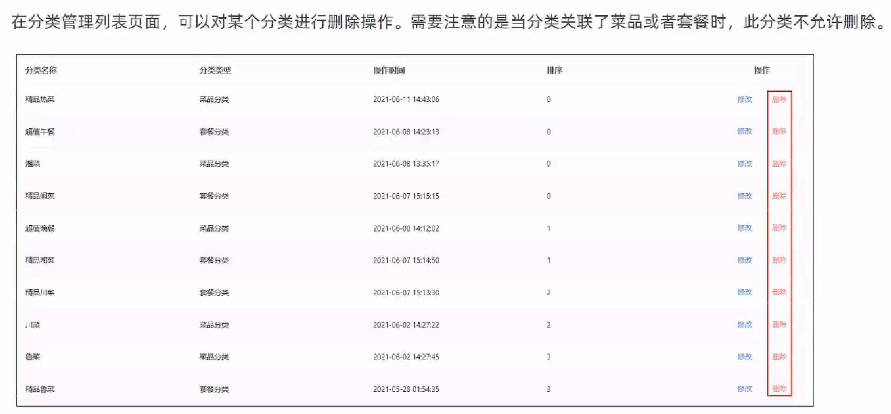

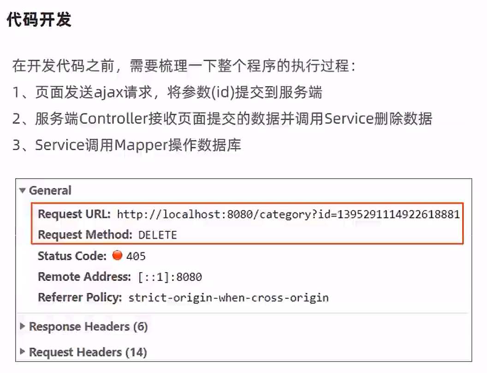

CategoryController.java

```java
    /**
     * 根据id删除分类
     * @param ids
     * @return
     */
    @DeleteMapping
    public R<String> delete(Long ids){
        log.info("删除分类，id为：{}",ids);

        //categoryService.removeById(id);
        categoryService.remove(ids);

        return R.success("分类信息删除成功");
    }
```

> 前端发送参数有误，需要将"id"改为"ids"

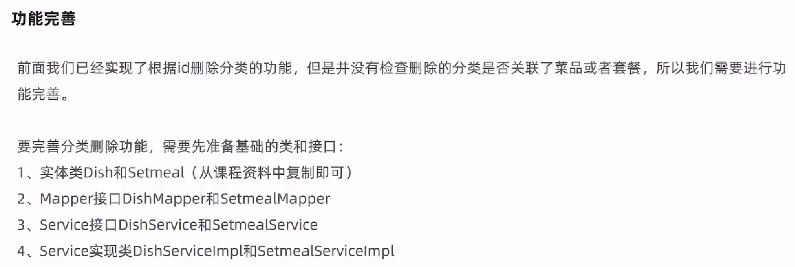

CategoryServiceImpl.java

```java
package com.itheima.reggie.service.impl;

import com.baomidou.mybatisplus.core.conditions.query.LambdaQueryWrapper;
import com.baomidou.mybatisplus.extension.service.impl.ServiceImpl;
import com.itheima.reggie.common.CustomException;
import com.itheima.reggie.entity.Category;
import com.itheima.reggie.entity.Dish;
import com.itheima.reggie.entity.Setmeal;
import com.itheima.reggie.mapper.CategoryMapper;
import com.itheima.reggie.service.CategoryService;
import com.itheima.reggie.service.DishService;
import com.itheima.reggie.service.SetmealService;
import org.springframework.beans.factory.annotation.Autowired;
import org.springframework.stereotype.Service;

@Service
public class CategoryServiceImpl extends ServiceImpl<CategoryMapper,Category> implements CategoryService{

    @Autowired
    private DishService dishService;

    @Autowired
    private SetmealService setmealService;

    /**
     * 根据id删除分类，删除之前需要进行判断
     * @param id
     */
    @Override
    public void remove(Long id) {
        LambdaQueryWrapper<Dish> dishLambdaQueryWrapper = new LambdaQueryWrapper<>();
        //添加查询条件，根据分类id进行查询
        dishLambdaQueryWrapper.eq(Dish::getCategoryId,id);
        int count1 = dishService.count(dishLambdaQueryWrapper);

        //查询当前分类是否关联了菜品，如果已经关联，抛出一个业务异常
        if(count1 > 0){
            //已经关联菜品，抛出一个业务异常
            throw new CustomException("当前分类下关联了菜品，不能删除");
        }

        //查询当前分类是否关联了套餐，如果已经关联，抛出一个业务异常
        LambdaQueryWrapper<Setmeal> setmealLambdaQueryWrapper = new LambdaQueryWrapper<>();
        //添加查询条件，根据分类id进行查询
        setmealLambdaQueryWrapper.eq(Setmeal::getCategoryId,id);
        int count2 = setmealService.count(setmealLambdaQueryWrapper);
        if(count2 > 0){
            //已经关联套餐，抛出一个业务异常
            throw new CustomException("当前分类下关联了套餐，不能删除");
        }

        //正常删除分类
        super.removeById(id);
    }
}
```

> 资料中的代码忘记将条件放进去了，第46行资料中是`int count2 = setmealService.count()`

## 修改分类

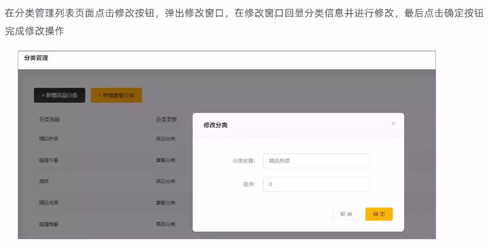

CategoryController.java

```java
    /**
     * 根据id修改分类信息
     * @param category
     * @return
     */
    @PutMapping
    public R<String> update(@RequestBody Category category){
        log.info("修改分类信息：{}",category);

        categoryService.updateById(category);

        return R.success("修改分类信息成功");
    }
```

> Category.java中加了@TableField注解的属性，会在满足条件时自动更新
