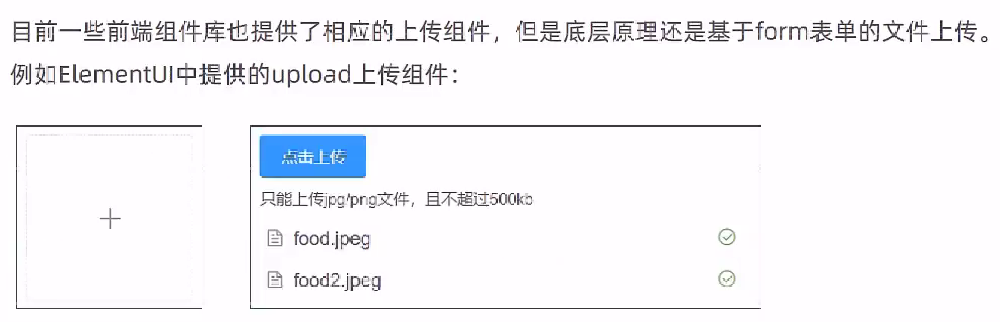

# 菜品管理

## 文件上传下载

### 介绍

文件上传介绍：





文件下载介绍：


### 具体实现


将测试用页面放入resources/backend/page/demo目录下


在过滤器LoginCheckFilter.java中添加白名单

```java
"/common/**"
```

在application.yml中添加

```yaml
reggie:
  path: "D:/img/"
```

访问`http://localhost:8080/backend/page/demo/upload.html`


CommonController.java

```java
package com.itheima.reggie.controller;

import com.itheima.reggie.common.R;
import lombok.extern.slf4j.Slf4j;
import org.springframework.beans.factory.annotation.Value;
import org.springframework.web.bind.annotation.*;
import org.springframework.web.multipart.MultipartFile;

import javax.servlet.ServletOutputStream;
import javax.servlet.http.HttpServletResponse;
import java.io.File;
import java.io.FileInputStream;
import java.io.FileNotFoundException;
import java.io.IOException;
import java.util.UUID;

/**
 * 文件上传和下载
 */
@RestController
@RequestMapping("/common")
@Slf4j
public class CommonController {

    @Value("${reggie.path}")
    private String basePath;

    /**
     * 文件上传
     * @param file
     * @return
     */
    @PostMapping("/upload")
    public R<String> upload(MultipartFile file){
        //file是一个临时文件，需要转存到指定位置，否则本次请求完成后临时文件会删除
        log.info(file.toString());

        //原始文件名
        String originalFilename = file.getOriginalFilename();//abc.jpg
        String suffix = originalFilename.substring(originalFilename.lastIndexOf("."));

        //使用UUID重新生成文件名，防止文件名称重复造成文件覆盖
        String fileName = UUID.randomUUID().toString() + suffix;//dfsdfdfd.jpg

        //创建一个目录对象
        File dir = new File(basePath);
        //判断当前目录是否存在
        if(!dir.exists()){
            //目录不存在，需要创建
            dir.mkdirs();
        }

        try {
            //将临时文件转存到指定位置
            file.transferTo(new File(basePath + fileName));
        } catch (IOException e) {
            e.printStackTrace();
        }
        return R.success(fileName);
    }

    /**
     * 文件下载
     * @param name
     * @param response
     */
    @GetMapping("/download")
    public void download(String name, HttpServletResponse response){

        try {
            //输入流，通过输入流读取文件内容
            FileInputStream fileInputStream = new FileInputStream(new File(basePath + name));

            //输出流，通过输出流将文件写回浏览器
            ServletOutputStream outputStream = response.getOutputStream();

            response.setContentType("image/jpeg");

            int len = 0;
            byte[] bytes = new byte[1024];
            while ((len = fileInputStream.read(bytes)) != -1){
                outputStream.write(bytes,0,len);
                outputStream.flush();
            }

            //关闭资源
            outputStream.close();
            fileInputStream.close();
        } catch (Exception e) {
            e.printStackTrace();
        }

    }
}
```

> 
>
> 上传的文件会被保存到D盘的img目录，这里会显示是因为上传过去后又下载了下来

## 新增菜品


开启事务管理ReggieApplication.java

```
@EnableTransactionManagement
```

用于给前端发送菜品分类：CategoryController.java

```java
    /**
     * 根据条件查询分类数据
     * @param category
     * @return
     */
    @GetMapping("/list")
    public R<List<Category>> list(Category category){
        //条件构造器
        LambdaQueryWrapper<Category> queryWrapper = new LambdaQueryWrapper<>();
        //添加条件
        queryWrapper.eq(category.getType() != null,Category::getType,category.getType());
        //添加排序条件
        queryWrapper.orderByAsc(Category::getSort).orderByDesc(Category::getUpdateTime);

        List<Category> list = categoryService.list(queryWrapper);
        return R.success(list);
    }
```


> vo是后端往前端发送的数据封装成对象传输，dto是前端给后端发送的数据封装成对象

DishController.java

```java
@RestController
@RequestMapping("/dish")
@Slf4j
public class DishController {
    @Autowired
    private DishService dishService;

    @Autowired
    private DishFlavorService dishFlavorService;

    @Autowired
    private CategoryService categoryService;

    /**
     * 新增菜品
     * @param dishDto
     * @return
     */
    @PostMapping
    public R<String> save(@RequestBody DishDto dishDto){
        log.info(dishDto.toString());

        dishService.saveWithFlavor(dishDto);

        return R.success("新增菜品成功");
    }
```

DishServiceImpl.java

```java
@Service
@Slf4j
public class DishServiceImpl extends ServiceImpl<DishMapper,Dish> implements DishService {

    @Autowired
    private DishFlavorService dishFlavorService;

    /**
     * 新增菜品，同时保存对应的口味数据
     * @param dishDto
     */
    @Transactional
    public void saveWithFlavor(DishDto dishDto) {
        //保存菜品的基本信息到菜品表dish
        this.save(dishDto);

        Long dishId = dishDto.getId();//菜品id

        //菜品口味
        List<DishFlavor> flavors = dishDto.getFlavors();
        flavors = flavors.stream().map((item) -> {
            item.setDishId(dishId);
            return item;
        }).collect(Collectors.toList());

        //保存菜品口味数据到菜品口味表dish_flavor
        dishFlavorService.saveBatch(flavors);

    }
```

> 这里使用的是Stream API对flavors进行操作：调用map方法(map()方法接受一个函数作为参数，该函数将集合中的每个元素转换为另一个元素，并将转换后的元素添加到新的集合中)，对flavors中的每个DishFlavor对象执行一个Lambda表达式，将其dishId属性设置为指定的dishId，并将修改后的DishFlavor对象返回。最后，使用collect方法将修改后的DishFlavor对象列表收集到一个新的List中，并将其返回
>
> > 正常的for循环写法
> >
> > ```java
> > List<DishFlavor> flavors = dishDto.getFlavors();
> > for (DishFlavor item : flavors) {
> >     item.setDishId(dishId);
> > }
> > ```
> >
> > 对于数据量较小、数据处理过程简单的场景，可以选择for循环的方式，而对于数据量较大、数据处理过程复杂的场景，可以选择Stream API的方式
>
> 主应用类ReggieApplication.java上开启事务`@ServletComponentScan`使得`@Transactional`生效
>
> 注意：如果在添加图片后并未保存菜品信息，图片也会被保存到对应目录下

## 菜品信息分页查询


**将项目当中的图片资源放到服务器访问的对应图片资源目录下，就可以显示已有菜品的所有图片了**

DishController.java

```java
    /**
     * 菜品信息分页查询
     * @param page
     * @param pageSize
     * @param name
     * @return
     */
    @GetMapping("/page")
    public R<Page> page(int page,int pageSize,String name){

        //构造分页构造器对象
        Page<Dish> pageInfo = new Page<>(page,pageSize);
        Page<DishDto> dishDtoPage = new Page<>();

        //条件构造器
        LambdaQueryWrapper<Dish> queryWrapper = new LambdaQueryWrapper<>();
        //添加过滤条件
        queryWrapper.like(name != null,Dish::getName,name);
        //添加排序条件
        queryWrapper.orderByDesc(Dish::getUpdateTime);

        //执行分页查询
        dishService.page(pageInfo,queryWrapper);

        //对象拷贝
        BeanUtils.copyProperties(pageInfo,dishDtoPage,"records");

        List<Dish> records = pageInfo.getRecords();

        List<DishDto> list = records.stream().map((item) -> {
            DishDto dishDto = new DishDto();

            BeanUtils.copyProperties(item,dishDto);

            Long categoryId = item.getCategoryId();//分类id
            //根据id查询分类对象
            Category category = categoryService.getById(categoryId);

            if(category != null){
                String categoryName = category.getName();
                dishDto.setCategoryName(categoryName);
            }
            return dishDto;
        }).collect(Collectors.toList());

        dishDtoPage.setRecords(list);

        return R.success(dishDtoPage);
    }
```

> `BeanUtils.copyProperties(pageInfo,dishDtoPage,"records")`是pageInfo的值拷贝到dishDtoPage，排除属性"records"

## 修改菜品


DishServiceImpl.java

```java
    /**
     * 根据id查询菜品信息和对应的口味信息
     * @param id
     * @return
     */
    public DishDto getByIdWithFlavor(Long id) {
        //查询菜品基本信息，从dish表查询
        Dish dish = this.getById(id);

        DishDto dishDto = new DishDto();
        BeanUtils.copyProperties(dish,dishDto);

        //查询当前菜品对应的口味信息，从dish_flavor表查询
        LambdaQueryWrapper<DishFlavor> queryWrapper = new LambdaQueryWrapper<>();
        queryWrapper.eq(DishFlavor::getDishId,dish.getId());
        List<DishFlavor> flavors = dishFlavorService.list(queryWrapper);
        dishDto.setFlavors(flavors);

        return dishDto;
    }

    @Override
    @Transactional
    public void updateWithFlavor(DishDto dishDto) {
        //更新dish表基本信息
        this.updateById(dishDto);

        //清理当前菜品对应口味数据---dish_flavor表的delete操作
        LambdaQueryWrapper<DishFlavor> queryWrapper = new LambdaQueryWrapper();
        queryWrapper.eq(DishFlavor::getDishId,dishDto.getId());

        dishFlavorService.remove(queryWrapper);

        //添加当前提交过来的口味数据---dish_flavor表的insert操作
        List<DishFlavor> flavors = dishDto.getFlavors();

        flavors = flavors.stream().map((item) -> {
            item.setDishId(dishDto.getId());
            return item;
        }).collect(Collectors.toList());

        dishFlavorService.saveBatch(flavors);
    }
```

DishController.java

```java
    /**
     * 根据id查询菜品信息和对应的口味信息
     * @param id
     * @return
     */
    @GetMapping("/{id}")
    public R<DishDto> get(@PathVariable Long id){

        DishDto dishDto = dishService.getByIdWithFlavor(id);

        return R.success(dishDto);
    }

    /**
     * 修改菜品
     * @param dishDto
     * @return
     */
    @PutMapping
    public R<String> update(@RequestBody DishDto dishDto){
        log.info(dishDto.toString());

        dishService.updateWithFlavor(dishDto);

        return R.success("修改菜品成功");
    }
```

> 资料勘误：将原本25行的"新增菜品成功"修改为"修改菜品成功"
