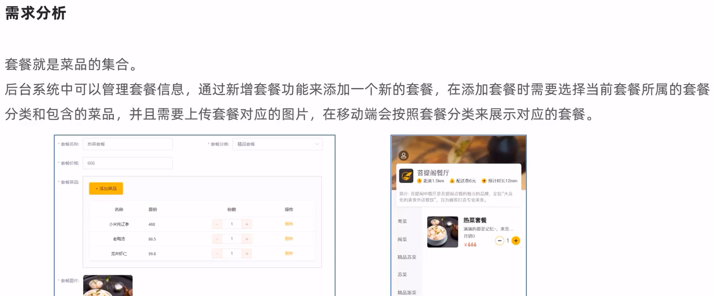
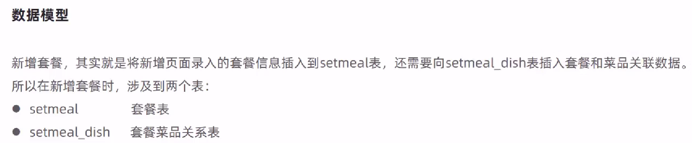
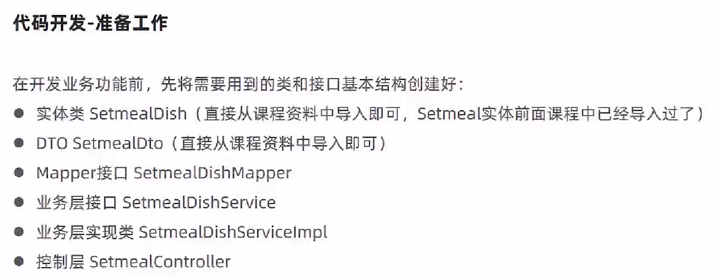
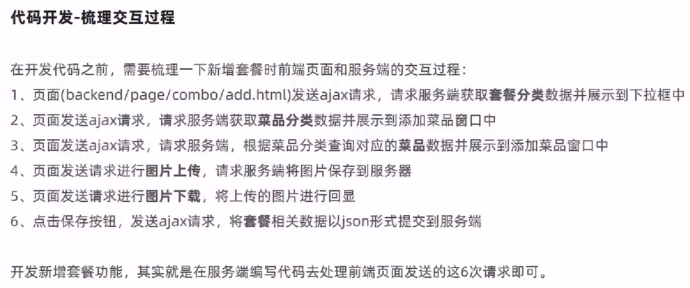
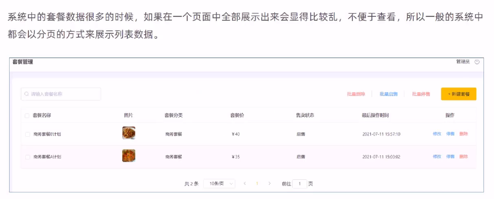
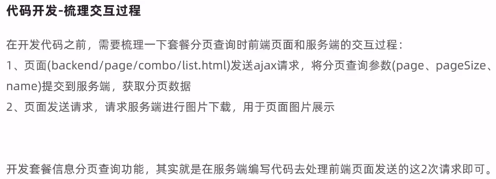
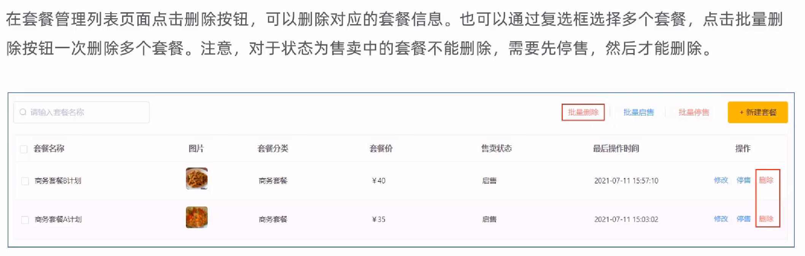
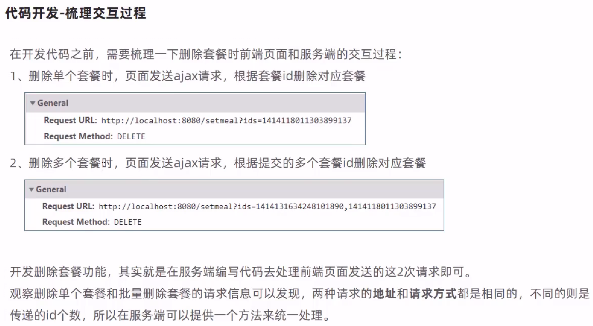

# 套餐管理业务开发

## 新增套餐









SetmealServiceImpl.java

```java
@Service
@Slf4j
public class SetmealServiceImpl extends ServiceImpl<SetmealMapper,Setmeal> implements SetmealService {

    @Autowired
    private SetmealDishService setmealDishService;

    /**
     * 新增套餐，同时需要保存套餐和菜品的关联关系
     * @param setmealDto
     */
    @Transactional
    public void saveWithDish(SetmealDto setmealDto) {
        //保存套餐的基本信息，操作setmeal，执行insert操作
        this.save(setmealDto);

        List<SetmealDish> setmealDishes = setmealDto.getSetmealDishes();
        setmealDishes.stream().map((item) -> {
            item.setSetmealId(setmealDto.getId());
            return item;
        }).collect(Collectors.toList());

        //保存套餐和菜品的关联信息，操作setmeal_dish,执行insert操作
        setmealDishService.saveBatch(setmealDishes);
    }
```

SetmealController.java

```java
/**
 * 套餐管理
 */

@RestController
@RequestMapping("/setmeal")
@Slf4j
public class SetmealController {

    @Autowired
    private SetmealService setmealService;

    @Autowired
    private CategoryService categoryService;

    @Autowired
    private SetmealDishService setmealDishService;

    /**
     * 新增套餐
     * @param setmealDto
     * @return
     */
    @PostMapping
    public R<String> save(@RequestBody SetmealDto setmealDto){
        log.info("套餐信息：{}",setmealDto);

        setmealService.saveWithDish(setmealDto);

        return R.success("新增套餐成功");
    }
```

## 套餐分页查询





SetmealController.java

```java
    /**
     * 套餐分页查询
     * @param page
     * @param pageSize
     * @param name
     * @return
     */
    @GetMapping("/page")
    public R<Page> page(int page,int pageSize,String name){
        //分页构造器对象
        Page<Setmeal> pageInfo = new Page<>(page,pageSize);
        Page<SetmealDto> dtoPage = new Page<>();

        LambdaQueryWrapper<Setmeal> queryWrapper = new LambdaQueryWrapper<>();
        //添加查询条件，根据name进行like模糊查询
        queryWrapper.like(name != null,Setmeal::getName,name);
        //添加排序条件，根据更新时间降序排列
        queryWrapper.orderByDesc(Setmeal::getUpdateTime);

        setmealService.page(pageInfo,queryWrapper);

        //对象拷贝
        BeanUtils.copyProperties(pageInfo,dtoPage,"records");
        List<Setmeal> records = pageInfo.getRecords();

        List<SetmealDto> list = records.stream().map((item) -> {
            SetmealDto setmealDto = new SetmealDto();
            //对象拷贝
            BeanUtils.copyProperties(item,setmealDto);
            //分类id
            Long categoryId = item.getCategoryId();
            //根据分类id查询分类对象
            Category category = categoryService.getById(categoryId);
            if(category != null){
                //分类名称
                String categoryName = category.getName();
                setmealDto.setCategoryName(categoryName);
            }
            return setmealDto;
        }).collect(Collectors.toList());

        dtoPage.setRecords(list);
        return R.success(dtoPage);
    }
```

## 删除套餐





SetmealServiceImpl.java

```java
    /**
     * 删除套餐，同时需要删除套餐和菜品的关联数据
     * @param ids
     */
    @Transactional
    public void removeWithDish(List<Long> ids) {
        //select count(*) from setmeal where id in (1,2,3) and status = 1
        //查询套餐状态，确定是否可用删除
        LambdaQueryWrapper<Setmeal> queryWrapper = new LambdaQueryWrapper();
        queryWrapper.in(Setmeal::getId,ids);
        queryWrapper.eq(Setmeal::getStatus,1);

        int count = this.count(queryWrapper);
        if(count > 0){
            //如果不能删除，抛出一个业务异常
            throw new CustomException("套餐正在售卖中，不能删除");
        }

        //如果可以删除，先删除套餐表中的数据---setmeal
        this.removeByIds(ids);

        //delete from setmeal_dish where setmeal_id in (1,2,3)
        LambdaQueryWrapper<SetmealDish> lambdaQueryWrapper = new LambdaQueryWrapper<>();
        lambdaQueryWrapper.in(SetmealDish::getSetmealId,ids);
        //删除关系表中的数据----setmeal_dish
        setmealDishService.remove(lambdaQueryWrapper);
    }
```

SetmealController.java

```java
    /**
     * 删除套餐
     * @param ids
     * @return
     */
    @DeleteMapping
    public R<String> delete(@RequestParam List<Long> ids){
        log.info("ids:{}",ids);

        setmealService.removeWithDish(ids);

        return R.success("套餐数据删除成功");
    }
```

> 方便测试，手动将数据库中套餐的字段"status"的值改为0