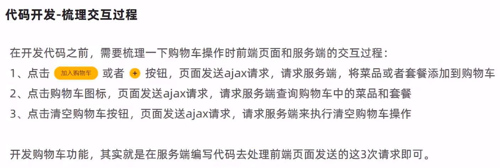

# 用户端开发


AddressBookController.java

```java
/**
 * 地址簿管理
 */
@Slf4j
@RestController
@RequestMapping("/addressBook")
public class AddressBookController {

    @Autowired
    private AddressBookService addressBookService;

    /**
     * 新增
     */
    @PostMapping
    public R<AddressBook> save(@RequestBody AddressBook addressBook) {
        addressBook.setUserId(BaseContext.getCurrentId());
        log.info("addressBook:{}", addressBook);
        addressBookService.save(addressBook);
        return R.success(addressBook);
    }

    /**
     * 设置默认地址
     */
    @PutMapping("default")
    public R<AddressBook> setDefault(@RequestBody AddressBook addressBook) {
        log.info("addressBook:{}", addressBook);
        LambdaUpdateWrapper<AddressBook> wrapper = new LambdaUpdateWrapper<>();
        wrapper.eq(AddressBook::getUserId, BaseContext.getCurrentId());
        wrapper.set(AddressBook::getIsDefault, 0);
        //SQL:update address_book set is_default = 0 where user_id = ?
        addressBookService.update(wrapper);

        addressBook.setIsDefault(1);
        //SQL:update address_book set is_default = 1 where id = ?
        addressBookService.updateById(addressBook);
        return R.success(addressBook);
    }

    /**
     * 根据id查询地址
     */
    @GetMapping("/{id}")
    public R get(@PathVariable Long id) {
        AddressBook addressBook = addressBookService.getById(id);
        if (addressBook != null) {
            return R.success(addressBook);
        } else {
            return R.error("没有找到该对象");
        }
    }

    /**
     * 查询默认地址
     */
    @GetMapping("default")
    public R<AddressBook> getDefault() {
        LambdaQueryWrapper<AddressBook> queryWrapper = new LambdaQueryWrapper<>();
        queryWrapper.eq(AddressBook::getUserId, BaseContext.getCurrentId());
        queryWrapper.eq(AddressBook::getIsDefault, 1);

        //SQL:select * from address_book where user_id = ? and is_default = 1
        AddressBook addressBook = addressBookService.getOne(queryWrapper);

        if (null == addressBook) {
            return R.error("没有找到该对象");
        } else {
            return R.success(addressBook);
        }
    }

    /**
     * 查询指定用户的全部地址
     */
    @GetMapping("/list")
    public R<List<AddressBook>> list(AddressBook addressBook) {
        addressBook.setUserId(BaseContext.getCurrentId());
        log.info("addressBook:{}", addressBook);

        //条件构造器
        LambdaQueryWrapper<AddressBook> queryWrapper = new LambdaQueryWrapper<>();
        queryWrapper.eq(null != addressBook.getUserId(), AddressBook::getUserId, addressBook.getUserId());
        queryWrapper.orderByDesc(AddressBook::getUpdateTime);

        //SQL:select * from address_book where user_id = ? order by update_time desc
        return R.success(addressBookService.list(queryWrapper));
    }
}
```

> 导入后进行测试无误即可

## 菜品展示


导入cartData.json


修改DishController.java以获取到口味数据

```java
    /**
     * 根据条件查询对应的菜品数据
     * @param dish
     * @return
     */
    /*@GetMapping("/list")
    public R<List<Dish>> list(Dish dish){
        //构造查询条件
        LambdaQueryWrapper<Dish> queryWrapper = new LambdaQueryWrapper<>();
        queryWrapper.eq(dish.getCategoryId() != null ,Dish::getCategoryId,dish.getCategoryId());
        //添加条件，查询状态为1（起售状态）的菜品
        queryWrapper.eq(Dish::getStatus,1);

        //添加排序条件
        queryWrapper.orderByAsc(Dish::getSort).orderByDesc(Dish::getUpdateTime);

        List<Dish> list = dishService.list(queryWrapper);

        return R.success(list);
    }*/

    @GetMapping("/list")
    public R<List<DishDto>> list(Dish dish) {
        log.info("dish:{}", dish);
        //条件构造器
        LambdaQueryWrapper<Dish> queryWrapper = new LambdaQueryWrapper<>();
        queryWrapper.like(StringUtils.isNotEmpty(dish.getName()), Dish::getName, dish.getName());
        queryWrapper.eq(null != dish.getCategoryId(), Dish::getCategoryId, dish.getCategoryId());
        //添加条件，查询状态为1（起售状态）的菜品
        queryWrapper.eq(Dish::getStatus,1);
        queryWrapper.orderByDesc(Dish::getUpdateTime);

        List<Dish> dishs = dishService.list(queryWrapper);

        List<DishDto> dishDtos = dishs.stream().map(item -> {
            DishDto dishDto = new DishDto();
            BeanUtils.copyProperties(item, dishDto);
            Category category = categoryService.getById(item.getCategoryId());
            if (category != null) {
                dishDto.setCategoryName(category.getName());
            }
            LambdaQueryWrapper<DishFlavor> wrapper = new LambdaQueryWrapper<>();
            wrapper.eq(DishFlavor::getDishId, item.getId());

            dishDto.setFlavors(dishFlavorService.list(wrapper));
            return dishDto;
        }).collect(Collectors.toList());

        return R.success(dishDtos);
    }
```

## 购物车





将main.js中方法cartListApi的请求url改回来

导入ShoppingCartController.java以及对应的Service、Mapper、entity

```java
/**
 * 购物车
 */
@Slf4j
@RestController
@RequestMapping("/shoppingCart")
public class ShoppingCartController {

    @Autowired
    private ShoppingCartService shoppingCartService;

    /**
     * 添加购物车
     * @param shoppingCart
     * @return
     */
    @PostMapping("/add")
    public R<ShoppingCart> add(@RequestBody ShoppingCart shoppingCart){
        log.info("购物车数据:{}",shoppingCart);

        //设置用户id，指定当前是哪个用户的购物车数据
        Long currentId = BaseContext.getCurrentId();
        shoppingCart.setUserId(currentId);

        Long dishId = shoppingCart.getDishId();

        LambdaQueryWrapper<ShoppingCart> queryWrapper = new LambdaQueryWrapper<>();
        queryWrapper.eq(ShoppingCart::getUserId,currentId);

        if(dishId != null){
            //添加到购物车的是菜品
            queryWrapper.eq(ShoppingCart::getDishId,dishId);

        }else{
            //添加到购物车的是套餐
            queryWrapper.eq(ShoppingCart::getSetmealId,shoppingCart.getSetmealId());
        }

        //查询当前菜品或者套餐是否在购物车中
        //SQL:select * from shopping_cart where user_id = ? and dish_id/setmeal_id = ?
        ShoppingCart cartServiceOne = shoppingCartService.getOne(queryWrapper);

        if(cartServiceOne != null){
            //如果已经存在，就在原来数量基础上加一
            Integer number = cartServiceOne.getNumber();
            cartServiceOne.setNumber(number + 1);
            shoppingCartService.updateById(cartServiceOne);
        }else{
            //如果不存在，则添加到购物车，数量默认就是一
            shoppingCart.setNumber(1);
            shoppingCart.setCreateTime(LocalDateTime.now());
            shoppingCartService.save(shoppingCart);
            cartServiceOne = shoppingCart;
        }

        return R.success(cartServiceOne);
    }

    /**
     * 查看购物车
     * @return
     */
    @GetMapping("/list")
    public R<List<ShoppingCart>> list(){
        log.info("查看购物车...");

        LambdaQueryWrapper<ShoppingCart> queryWrapper = new LambdaQueryWrapper<>();
        queryWrapper.eq(ShoppingCart::getUserId,BaseContext.getCurrentId());
        queryWrapper.orderByAsc(ShoppingCart::getCreateTime);

        List<ShoppingCart> list = shoppingCartService.list(queryWrapper);

        return R.success(list);
    }

    /**
     * 清空购物车
     * @return
     */
    @DeleteMapping("/clean")
    public R<String> clean(){
        //SQL:delete from shopping_cart where user_id = ?

        LambdaQueryWrapper<ShoppingCart> queryWrapper = new LambdaQueryWrapper<>();
        queryWrapper.eq(ShoppingCart::getUserId,BaseContext.getCurrentId());

        shoppingCartService.remove(queryWrapper);

        return R.success("清空购物车成功");
    }
}
```

## 用户下单


导入OrderController.java、OrderDetailController.java和对应的Servcie、Mapper、entity

```java
/**
 * 订单
 */
@Slf4j
@RestController
@RequestMapping("/order")
public class OrderController {

    @Autowired
    private OrderService orderService;

    /**
     * 用户下单
     * @param orders
     * @return
     */
    @PostMapping("/submit")
    public R<String> submit(@RequestBody Orders orders){
        log.info("订单数据：{}",orders);
        orderService.submit(orders);
        return R.success("下单成功");
    }
}
```

```java
/**
 * 订单明细
 */
@Slf4j
@RestController
@RequestMapping("/orderDetail")
public class OrderDetailController {

    @Autowired
    private OrderDetailService orderDetailService;

}
```

OrderServiceImpl.java

```java
package com.itheima.reggie.service.impl;

import com.baomidou.mybatisplus.core.conditions.query.LambdaQueryWrapper;
import com.baomidou.mybatisplus.core.toolkit.IdWorker;
import com.baomidou.mybatisplus.extension.service.impl.ServiceImpl;
import com.itheima.reggie.common.BaseContext;
import com.itheima.reggie.common.CustomException;
import com.itheima.reggie.entity.*;
import com.itheima.reggie.mapper.OrderMapper;
import com.itheima.reggie.service.*;
import lombok.extern.slf4j.Slf4j;
import org.springframework.beans.factory.annotation.Autowired;
import org.springframework.stereotype.Service;
import org.springframework.transaction.annotation.Transactional;

import java.math.BigDecimal;
import java.time.LocalDateTime;
import java.util.List;
import java.util.concurrent.atomic.AtomicInteger;
import java.util.stream.Collectors;

@Service
@Slf4j
public class OrderServiceImpl extends ServiceImpl<OrderMapper, Orders> implements OrderService {

    @Autowired
    private ShoppingCartService shoppingCartService;

    @Autowired
    private UserService userService;

    @Autowired
    private AddressBookService addressBookService;

    @Autowired
    private OrderDetailService orderDetailService;

    /**
     * 用户下单
     * @param orders
     */
    @Transactional
    public void submit(Orders orders) {
        //获得当前用户id
        Long userId = BaseContext.getCurrentId();

        //查询当前用户的购物车数据
        LambdaQueryWrapper<ShoppingCart> wrapper = new LambdaQueryWrapper<>();
        wrapper.eq(ShoppingCart::getUserId,userId);
        List<ShoppingCart> shoppingCarts = shoppingCartService.list(wrapper);

        if(shoppingCarts == null || shoppingCarts.size() == 0){
            throw new CustomException("购物车为空，不能下单");
        }

        //查询用户数据
        User user = userService.getById(userId);

        //查询地址数据
        Long addressBookId = orders.getAddressBookId();
        AddressBook addressBook = addressBookService.getById(addressBookId);
        if(addressBook == null){
            throw new CustomException("用户地址信息有误，不能下单");
        }

        long orderId = IdWorker.getId();//订单号

        AtomicInteger amount = new AtomicInteger(0);

        List<OrderDetail> orderDetails = shoppingCarts.stream().map((item) -> {
            OrderDetail orderDetail = new OrderDetail();
            orderDetail.setOrderId(orderId);
            orderDetail.setNumber(item.getNumber());
            orderDetail.setDishFlavor(item.getDishFlavor());
            orderDetail.setDishId(item.getDishId());
            orderDetail.setSetmealId(item.getSetmealId());
            orderDetail.setName(item.getName());
            orderDetail.setImage(item.getImage());
            orderDetail.setAmount(item.getAmount());
            amount.addAndGet(item.getAmount().multiply(new BigDecimal(item.getNumber())).intValue());
            return orderDetail;
        }).collect(Collectors.toList());


        orders.setId(orderId);
        orders.setOrderTime(LocalDateTime.now());
        orders.setCheckoutTime(LocalDateTime.now());
        orders.setStatus(2);
        orders.setAmount(new BigDecimal(amount.get()));//总金额
        orders.setUserId(userId);
        orders.setNumber(String.valueOf(orderId));
        orders.setUserName(user.getName());
        orders.setConsignee(addressBook.getConsignee());
        orders.setPhone(addressBook.getPhone());
        orders.setAddress((addressBook.getProvinceName() == null ? "" : addressBook.getProvinceName())
                + (addressBook.getCityName() == null ? "" : addressBook.getCityName())
                + (addressBook.getDistrictName() == null ? "" : addressBook.getDistrictName())
                + (addressBook.getDetail() == null ? "" : addressBook.getDetail()));
        //向订单表插入数据，一条数据
        this.save(orders);

        //向订单明细表插入数据，多条数据
        orderDetailService.saveBatch(orderDetails);

        //清空购物车数据
        shoppingCartService.remove(wrapper);
    }
}
```

