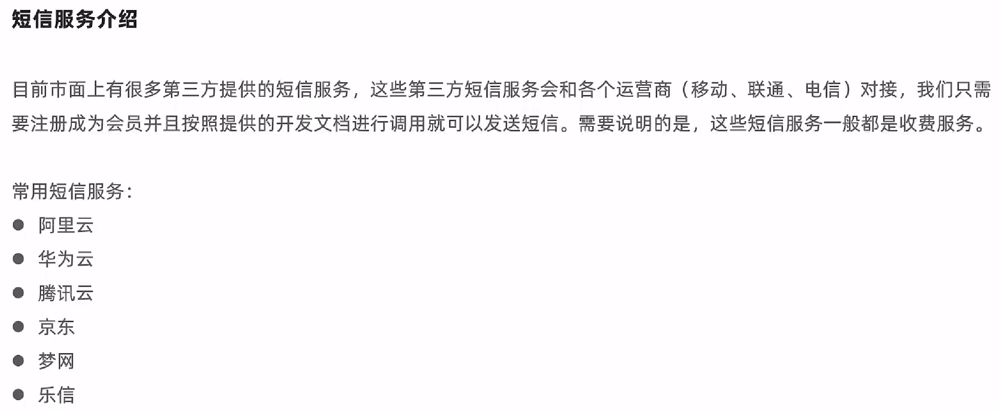
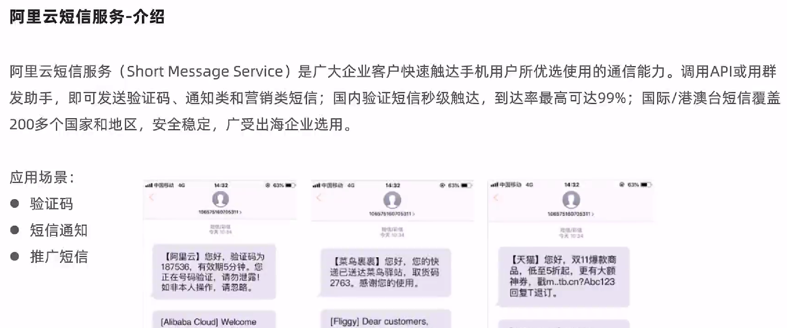
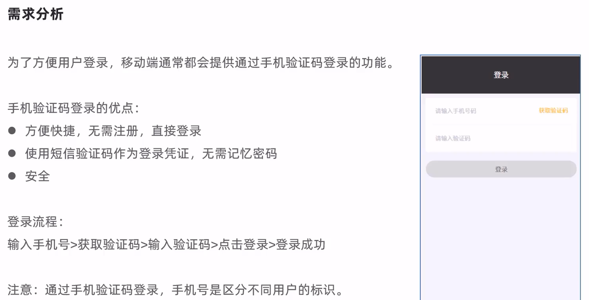
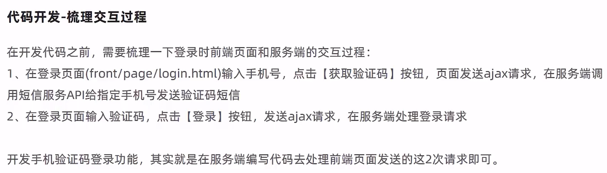
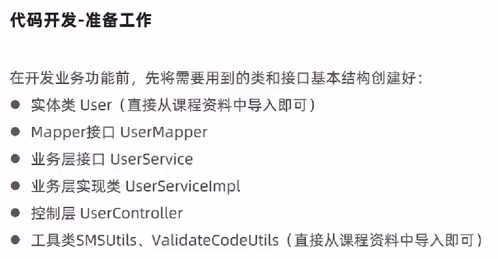
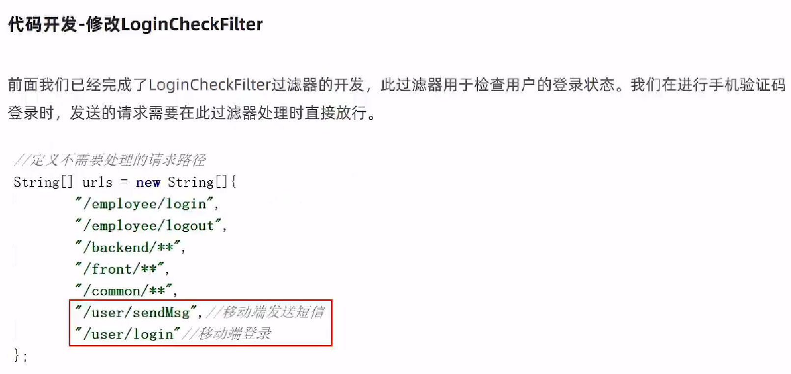
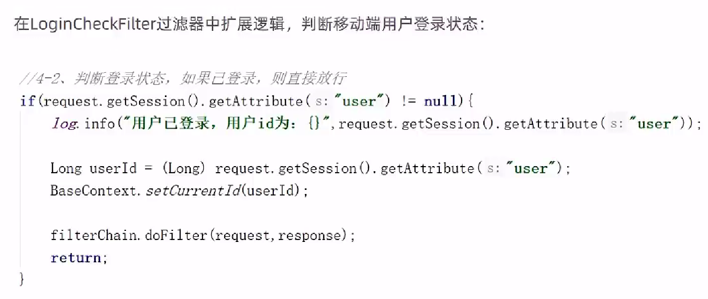
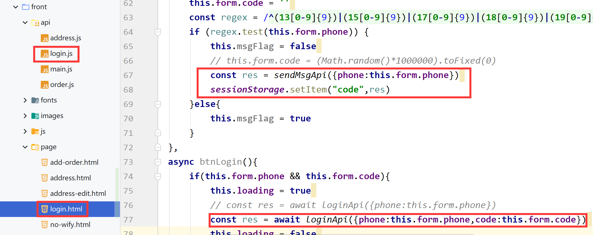
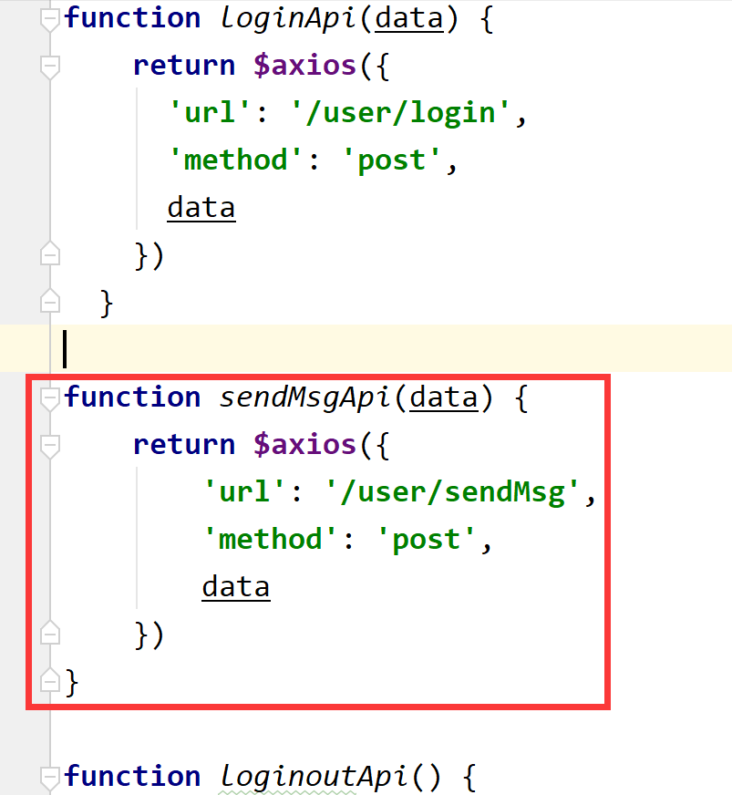

# 短信发送















pom.xml

```xml
        <!--阿里云短信服务-->
        <dependency>
            <groupId>com.aliyun</groupId>
            <artifactId>aliyun-java-sdk-core</artifactId>
            <version>4.5.16</version>
        </dependency>
        <dependency>
            <groupId>com.aliyun</groupId>
            <artifactId>aliyun-java-sdk-dysmsapi</artifactId>
            <version>2.1.0</version>
        </dependency>
```

> 导入对应utils目录下的工具类SMSUtils.java和ValidateCodeUtils.java

前端资源勘误





> 如果重新Maven重新打包上传还未生效，可能是浏览器缓存问题，使用Shift + Ctrl + Delete键快速清理缓存即可

导入User.java到entity目录下

```java
package com.itheima.reggie.entity;

import lombok.Data;
import java.time.LocalDateTime;
import java.util.Date;
import java.util.List;
import java.io.Serializable;
import com.baomidou.mybatisplus.annotation.IdType;
import com.baomidou.mybatisplus.annotation.TableId;
/**
 * 用户信息
 */
@Data
public class User implements Serializable {

    private static final long serialVersionUID = 1L;

    private Long id;


    //姓名
    private String name;


    //手机号
    private String phone;


    //性别 0 女 1 男
    private String sex;


    //身份证号
    private String idNumber;


    //头像
    private String avatar;


    //状态 0:禁用，1:正常
    private Integer status;
}
```

> 对应的Service和Mapper省略了

UserController.java

```java
package com.itheima.reggie.controller;

import com.baomidou.mybatisplus.core.conditions.query.LambdaQueryWrapper;
import com.itheima.reggie.common.R;
import com.itheima.reggie.entity.User;
import com.itheima.reggie.service.UserService;
import com.itheima.reggie.utils.SMSUtils;
import com.itheima.reggie.utils.ValidateCodeUtils;
import lombok.extern.slf4j.Slf4j;
import org.apache.commons.lang.StringUtils;
import org.springframework.beans.factory.annotation.Autowired;
import org.springframework.web.bind.annotation.PostMapping;
import org.springframework.web.bind.annotation.RequestBody;
import org.springframework.web.bind.annotation.RequestMapping;
import org.springframework.web.bind.annotation.RestController;

import javax.servlet.http.HttpSession;
import java.util.Map;

@RestController
@RequestMapping("/user")
@Slf4j
public class UserController {

    @Autowired
    private UserService userService;

    /**
     * 发送手机短信验证码
     * @param user
     * @return
     */
    @PostMapping("/sendMsg")
    public R<String> sendMsg(@RequestBody User user, HttpSession session){
        //获取手机号
        String phone = user.getPhone();

        if(StringUtils.isNotEmpty(phone)){
            //生成随机的4位验证码
            String code = ValidateCodeUtils.generateValidateCode(4).toString();
            log.info("code={}",code);

            //调用阿里云提供的短信服务API完成发送短信
            //SMSUtils.sendMessage("瑞吉外卖","",phone,code);

            //需要将生成的验证码保存到Session
            session.setAttribute(phone,code);

            return R.success("手机验证码短信发送成功");
        }

        return R.error("短信发送失败");
    }

    /**
     * 移动端用户登录
     * @param map
     * @param session
     * @return
     */
    @PostMapping("/login")
    public R<User> login(@RequestBody Map map, HttpSession session){
        log.info(map.toString());

        //获取手机号
        String phone = map.get("phone").toString();

        //获取验证码
        String code = map.get("code").toString();

        //从Session中获取保存的验证码
        Object codeInSession = session.getAttribute(phone);

        //进行验证码的比对（页面提交的验证码和Session中保存的验证码比对）
        if(codeInSession != null && codeInSession.equals(code)){
            //如果能够比对成功，说明登录成功

            LambdaQueryWrapper<User> queryWrapper = new LambdaQueryWrapper<>();
            queryWrapper.eq(User::getPhone,phone);

            User user = userService.getOne(queryWrapper);
            if(user == null){
                //判断当前手机号对应的用户是否为新用户，如果是新用户就自动完成注册
                user = new User();
                user.setPhone(phone);
                user.setStatus(1);
                userService.save(user);
            }
            session.setAttribute("user",user.getId());
            return R.success(user);
        }
        return R.error("登录失败");
    }

}
```

> 因为个人申请难度，这里并未真正使用阿里云短信服务，而是由前端发送请求，后端生成的随机验证码，然后再通过此验证码进行登录
>
> 如果需要使用阿里云服务，只需要将此验证码通过阿里云服务发送给用户，在用户点击时，与前端发送过来的验证码进行比对即可，一致就通过，可以登录