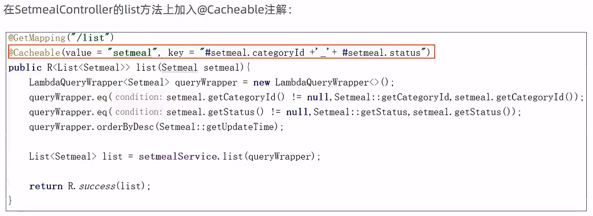

# 缓存优化


## 目录


## 环境搭建

将项目创建Git仓库，推送到远程仓库


创建分支v1.0


### maven坐标


```xml
        <dependency>
            <groupId>org.springframework.boot</groupId>
            <artifactId>spring-boot-starter-data-redis</artifactId>
        </dependency>
```

### 配置类


### 配置application.yml


> 这里不使用远程或者linux上面的redis，如果使用，需要添加连接密码
>
> 

### 提交到远程仓库


## 缓存短信验证码


修改UserController.java

```java
    @Autowired
    private RedisTemplate redisTemplate;


            //需要将生成的验证码保存到Session
            //session.setAttribute(phone,code);

            //将生成的验证码缓存到Redis中，并且设置有效期为5分钟
            redisTemplate.opsForValue().set(phone,code,5,TimeUnit.MINUTES);


        //从Session中获取保存的验证码
        //Object codeInSession = session.getAttribute(phone);

        //从Redis中获取缓存的验证码
        Object codeInSession = redisTemplate.opsForValue().get(phone);


            //如果用户登录成功，删除Redis中缓存的验证码
            redisTemplate.delete(phone);
```

在发送验证码请求后


登录成功后


## 缓存菜品数据


修改DishController.java

```java
    @GetMapping("/list")
    public R<List<DishDto>> list(Dish dish){
        List<DishDto> dishDtoList = null;

        //动态构造key
        String key = "dish_" + dish.getCategoryId() + "_" + dish.getStatus();//dish_1397844391040167938_1

        //先从redis中获取缓存数据
        dishDtoList = (List<DishDto>) redisTemplate.opsForValue().get(key);

        if(dishDtoList != null){
            //如果存在，直接返回，无需查询数据库
            return R.success(dishDtoList);
        }


        //如果不存在，需要查询数据库，将查询到的菜品数据缓存到Redis
        redisTemplate.opsForValue().set(key,dishDtoList,60, TimeUnit.MINUTES);

        return R.success(dishDtoList);


    @PutMapping
    public R<String> update(@RequestBody DishDto dishDto){
        log.info(dishDto.toString());

        dishService.updateWithFlavor(dishDto);

        //清理所有菜品的缓存数据
        //Set keys = redisTemplate.keys("dish_*");
        //redisTemplate.delete(keys);

        //清理某个分类下面的菜品缓存数据
        String key = "dish_" + dishDto.getCategoryId() + "_1";
        redisTemplate.delete(key);
```


## 缓存套餐数据


添加maven坐标

```xml
        <!-- 引入缓存 -->
        <dependency>
            <groupId>org.springframework.boot</groupId>
            <artifactId>spring-boot-starter-cache</artifactId>
        </dependency>
```

配置application.yml


```yaml
  cache:
    redis:
      time-to-live: 1800000
```

启动类中加入@EnableCaching注解


在控制层添加对应注解



将返回数据类型R.java实现序列化接口

```java
public class R<T> implements Serializable
```

修改SetmealController.java

```java
    /**
     * 新增套餐
     * @param setmealDto
     * @return
     */
    @PostMapping
    @CacheEvict(value = "setmealCache",allEntries = true) // allEntries代表清理value分类下的所有缓存
    public R<String> save(@RequestBody SetmealDto setmealDto){
        log.info("套餐信息：{}",setmealDto);

        setmealService.saveWithDish(setmealDto);

        return R.success("新增套餐成功");
    }


    /**
     * 删除套餐
     * @param ids
     * @return
     */
    @DeleteMapping
    @CacheEvict(value = "setmealCache",allEntries = true)
    public R<String> delete(@RequestParam List<Long> ids){
        log.info("ids:{}",ids);

        setmealService.removeWithDish(ids);

        return R.success("套餐数据删除成功");
    }

    @GetMapping("/list")
    @Cacheable(value = "setmealCache",key = "#setmeal.categoryId + '_' + #setmeal.status")
    public R<List<Setmeal>> list(Setmeal setmeal) {
        log.info("setmeal:{}", setmeal);
        //条件构造器
        LambdaQueryWrapper<Setmeal> queryWrapper = new LambdaQueryWrapper<>();
        queryWrapper.like(StringUtils.isNotEmpty(setmeal.getName()), Setmeal::getName, setmeal.getName());
        queryWrapper.eq(null != setmeal.getCategoryId(), Setmeal::getCategoryId, setmeal.getCategoryId());
        queryWrapper.eq(null != setmeal.getStatus(), Setmeal::getStatus, setmeal.getStatus());
        queryWrapper.orderByDesc(Setmeal::getUpdateTime);

        return R.success(setmealService.list(queryWrapper));
    }
```

