# 开发环境搭建

## 前端环境搭建

**将Nginx目录放到没有中文路径的目录下**，修改Nginx的端口号为81端口：

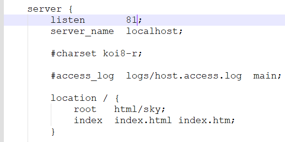

启动服务：

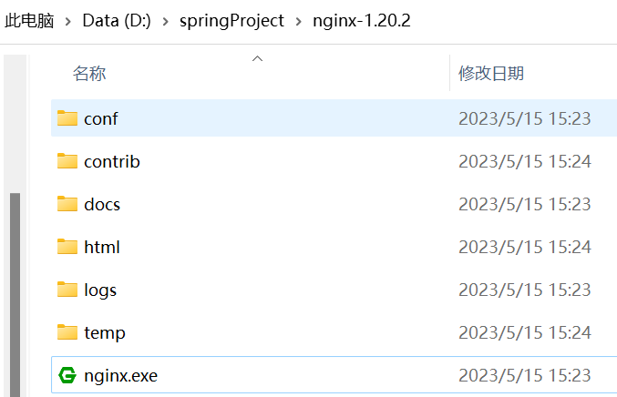

访问效果：

## 后端环境搭建

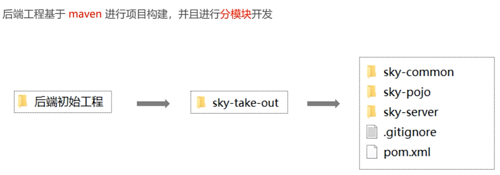

项目结构：

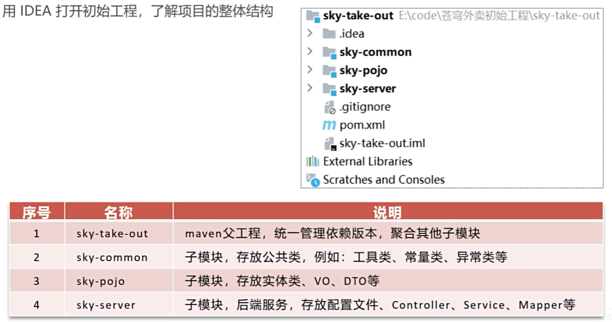

### sky-common

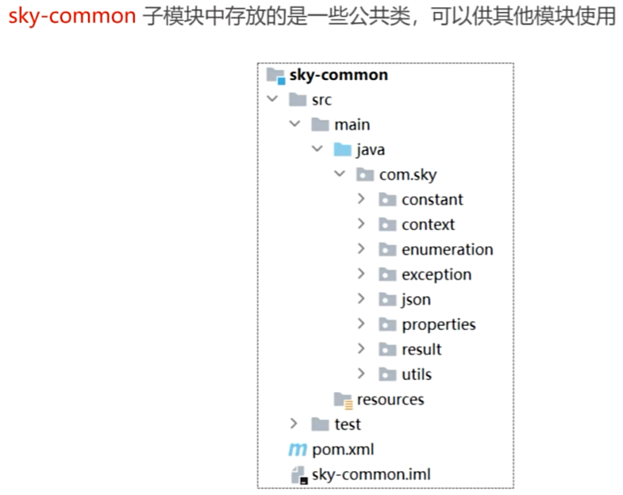

### sky-pojo

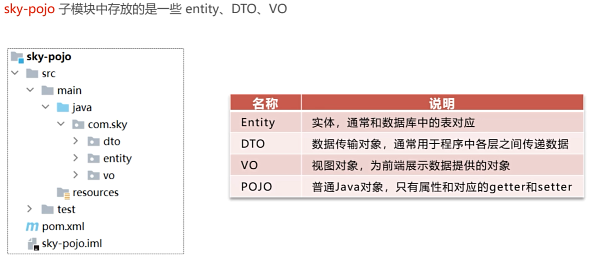

### sky-server

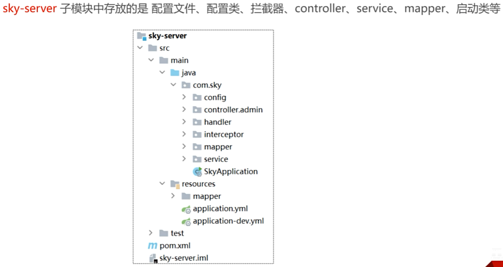

### 使用Git进行版本控制

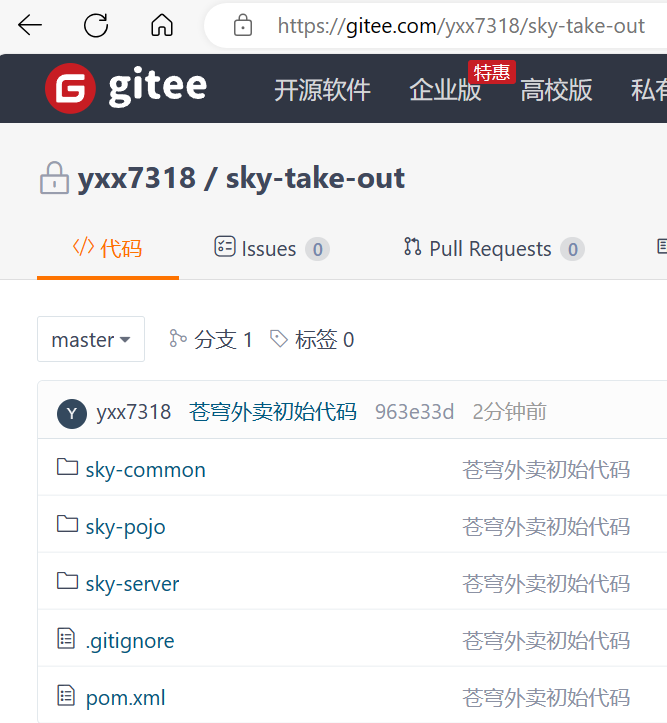

### 数据库环境搭建

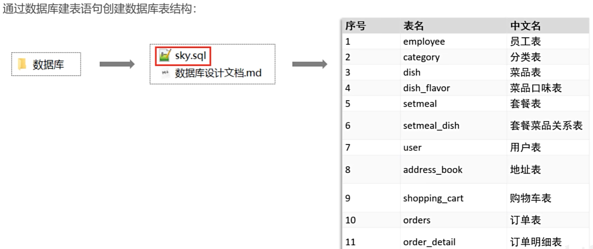

## 前后端联调测试

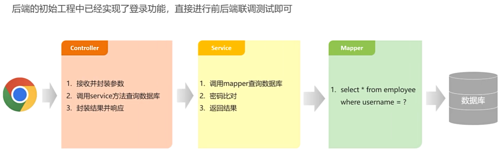

修改数据库连接：

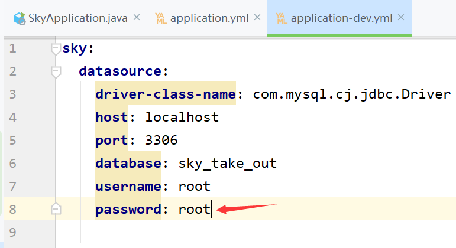

启动服务即可登录成功：

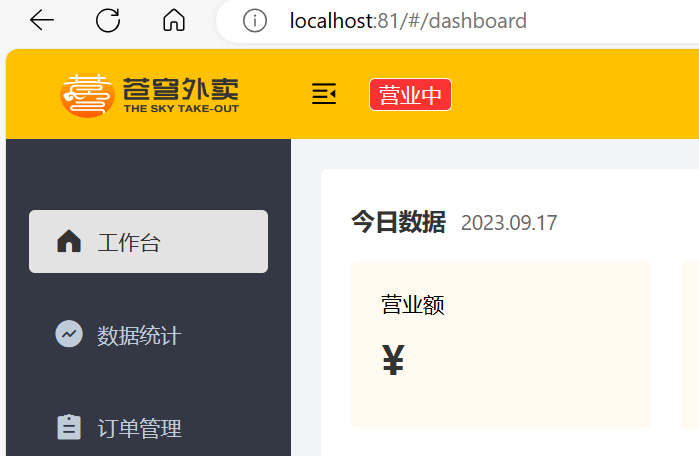

## 完善登录功能

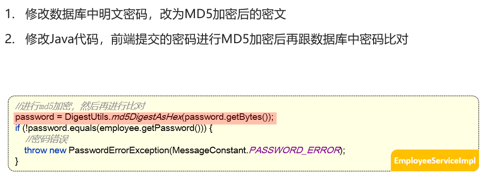

使用TODO功能

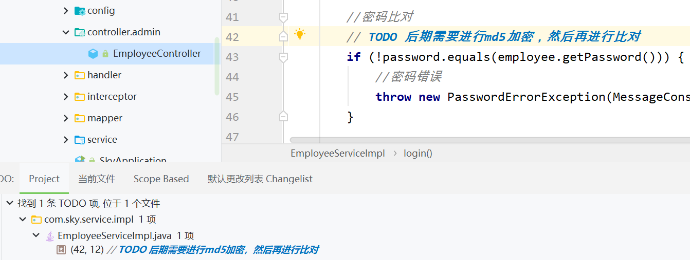